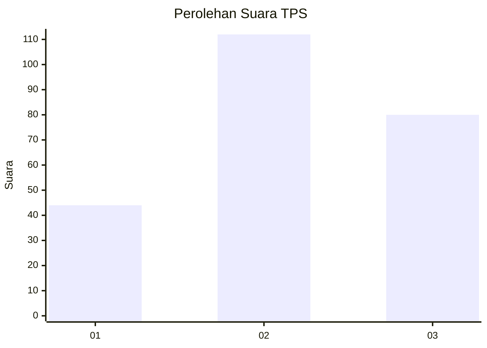
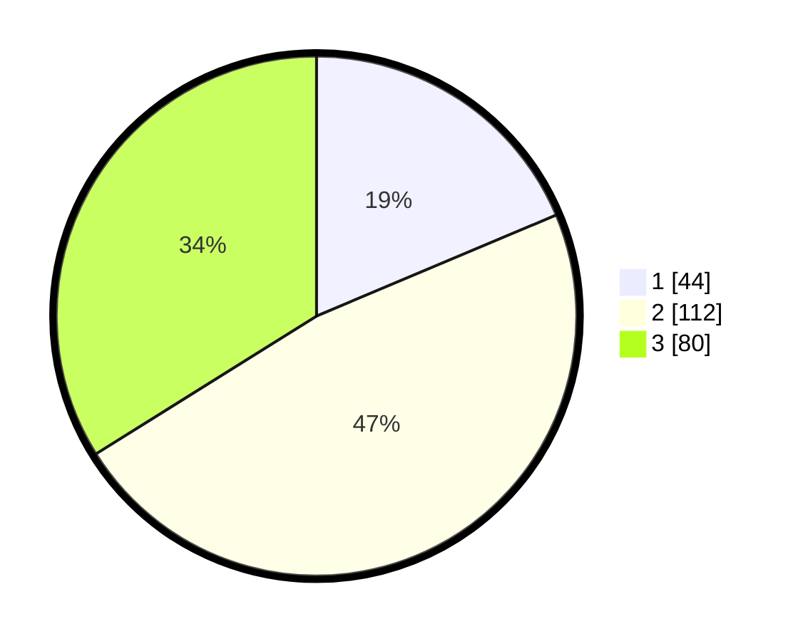

# Hasil

## Grafik

## Tabel

| No. | Nama Paslon    | Suara | Suara (raw) | Persentase |
|:--- |:-------------- | -----:| -----------:| ----------:|
| 1   | ANIES MUHAIMIN | 44    | [44][p-1]   | 18,64      |
| 2   | PRABOWO GIBRAN | 112   | [112][p-2]  | 47,46      |
| 3   | GANJAR MAHFUD  | 80    | [80][p-3]   | 33,90      |

[p-1]: https://github.com/gigit-pemilu/pemilu-2024-34-di-yogyakarta/blob/main/pilpres/hitung-suara/sub/34-di-yogyakarta/sub/01-kulon-progo/sub/02-wates/sub/2004-ngestiharjo/sub/005-tps/sub/paslon-1.txt
[p-2]: https://github.com/gigit-pemilu/pemilu-2024-34-di-yogyakarta/blob/main/pilpres/hitung-suara/sub/34-di-yogyakarta/sub/01-kulon-progo/sub/02-wates/sub/2004-ngestiharjo/sub/005-tps/sub/paslon-2.txt
[p-3]: https://github.com/gigit-pemilu/pemilu-2024-34-di-yogyakarta/blob/main/pilpres/hitung-suara/sub/34-di-yogyakarta/sub/01-kulon-progo/sub/02-wates/sub/2004-ngestiharjo/sub/005-tps/sub/paslon-3.txt

## Foto C Plano

https://sirekap-obj-formc.kpu.go.id/4360/pemilu/ppwp/34/01/02/20/04/3401022004005-20240214-191243--321f210b-5bd3-4571-b003-c7e12b28e71e.jpg

https://sirekap-obj-formc.kpu.go.id/4360/pemilu/ppwp/34/01/02/20/04/3401022004005-20240214-193612--f955df40-74cc-4f51-937e-7baf98361044.jpg

https://sirekap-obj-formc.kpu.go.id/4360/pemilu/ppwp/34/01/02/20/04/3401022004005-20240214-214026--0b3595a6-50d3-40c7-b010-e9a6d6f58659.jpg

## Metadata

| Key        | Value               |
| ---------- | ------------------- |
| Time Stamp | 2024-02-14 21:46:01 |

