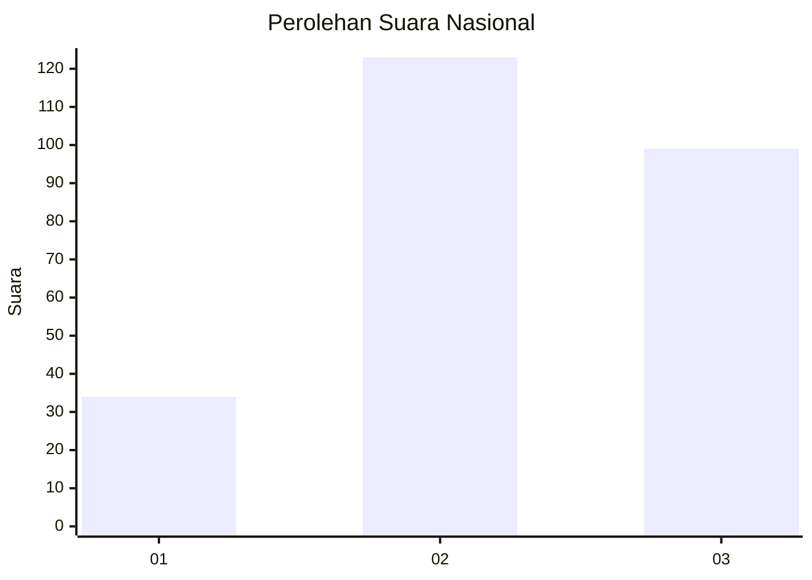
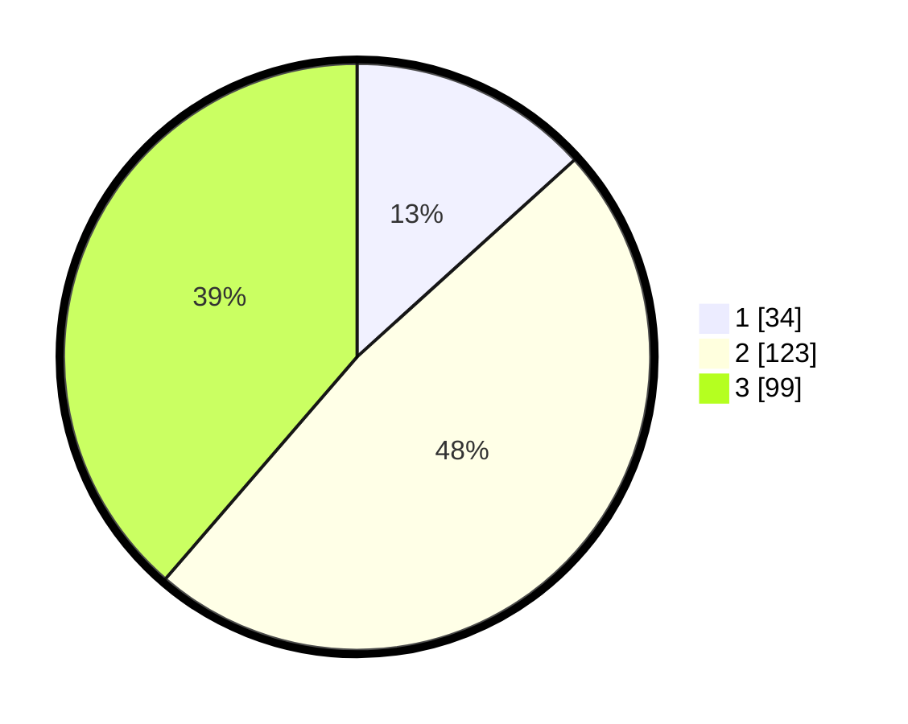

# Hasil

## Grafik

## Tabel

| No. | Nama Paslon    | Suara | Suara (raw) | Persentase |
|:--- |:-------------- | -----:| -----------:| ----------:|
| 1   | ANIES MUHAIMIN | 34    | [34][p-1]   | 13,28      |
| 2   | PRABOWO GIBRAN | 123   | [123][p-2]  | 48,05      |
| 3   | GANJAR MAHFUD  | 99    | [99][p-3]   | 38,67      |

[p-1]: https://github.com/gigit-pemilu/pemilu-2024/blob/main/pilpres/hitung-suara/sub/34-di-yogyakarta/sub/01-kulon-progo/sub/02-wates/sub/2004-ngestiharjo/sub/006-tps/sub/paslon-1.txt
[p-2]: https://github.com/gigit-pemilu/pemilu-2024/blob/main/pilpres/hitung-suara/sub/34-di-yogyakarta/sub/01-kulon-progo/sub/02-wates/sub/2004-ngestiharjo/sub/006-tps/sub/paslon-2.txt
[p-3]: https://github.com/gigit-pemilu/pemilu-2024/blob/main/pilpres/hitung-suara/sub/34-di-yogyakarta/sub/01-kulon-progo/sub/02-wates/sub/2004-ngestiharjo/sub/006-tps/sub/paslon-3.txt

## Foto C Plano

https://sirekap-obj-formc.kpu.go.id/35b2/pemilu/ppwp/34/01/02/20/04/3401022004006-20240215-002219--7d5e6e82-6a6a-4af2-a45a-8bd72f6d7562.jpg

https://sirekap-obj-formc.kpu.go.id/35b2/pemilu/ppwp/34/01/02/20/04/3401022004006-20240215-002318--71d32913-0dc8-4f04-a0c7-71c7faee8f6b.jpg

## Metadata

| Key        | Value               |
| ---------- | ------------------- |
| Time Stamp | 2024-02-15 18:30:25 |

