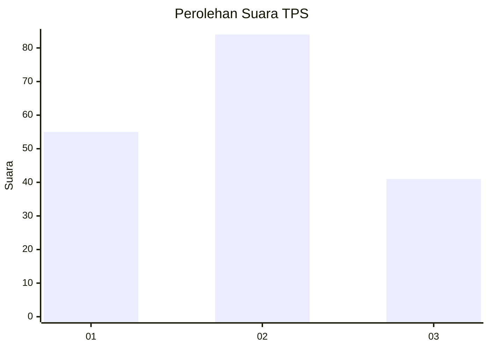
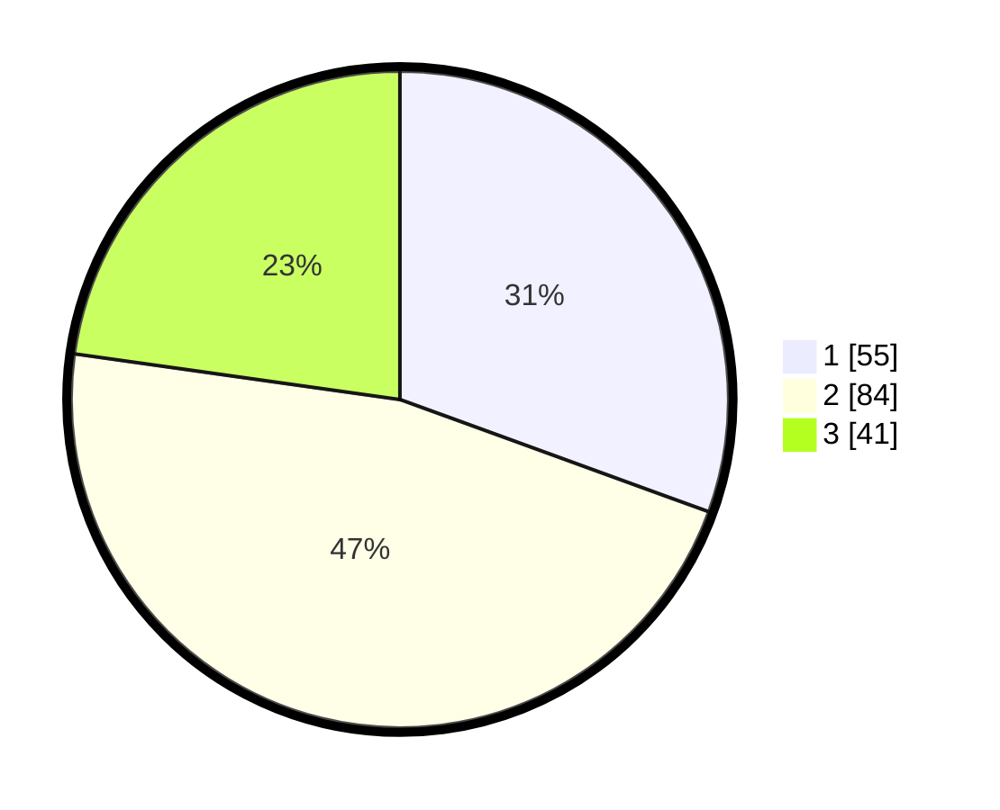

# Hasil

## Grafik

## Tabel

| No. | Nama Paslon    | Suara | Suara (raw) | Persentase |
|:--- |:-------------- | -----:| -----------:| ----------:|
| 1   | ANIES MUHAIMIN | 55    | [55][p-1]   | 30,56      |
| 2   | PRABOWO GIBRAN | 84    | [84][p-2]   | 46,67      |
| 3   | GANJAR MAHFUD  | 41    | [41][p-3]   | 22,78      |

[p-1]: https://github.com/gigit-pemilu/pemilu-2024-34-di-yogyakarta/blob/main/pilpres/hitung-suara/sub/34-di-yogyakarta/sub/01-kulon-progo/sub/02-wates/sub/2004-ngestiharjo/sub/010-tps/sub/paslon-1.txt
[p-2]: https://github.com/gigit-pemilu/pemilu-2024-34-di-yogyakarta/blob/main/pilpres/hitung-suara/sub/34-di-yogyakarta/sub/01-kulon-progo/sub/02-wates/sub/2004-ngestiharjo/sub/010-tps/sub/paslon-2.txt
[p-3]: https://github.com/gigit-pemilu/pemilu-2024-34-di-yogyakarta/blob/main/pilpres/hitung-suara/sub/34-di-yogyakarta/sub/01-kulon-progo/sub/02-wates/sub/2004-ngestiharjo/sub/010-tps/sub/paslon-3.txt

## Foto C Plano

https://sirekap-obj-formc.kpu.go.id/df52/pemilu/ppwp/34/01/02/20/04/3401022004010-20240214-224317--d7097369-beb1-4e4d-a115-8322ecbea8b9.jpg

https://sirekap-obj-formc.kpu.go.id/df52/pemilu/ppwp/34/01/02/20/04/3401022004010-20240214-224742--ea437b86-8f44-4d08-9c1b-c88ffe77f8fb.jpg

https://sirekap-obj-formc.kpu.go.id/df52/pemilu/ppwp/34/01/02/20/04/3401022004010-20240214-224912--3f01c542-b9b2-4e94-8f37-091f60e17954.jpg

## Metadata

| Key        | Value               |
| ---------- | ------------------- |
| Time Stamp | 2024-02-15 15:00:29 |

