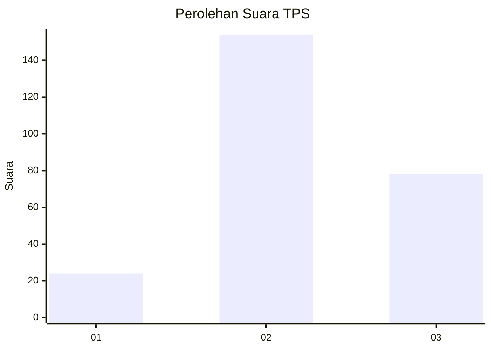
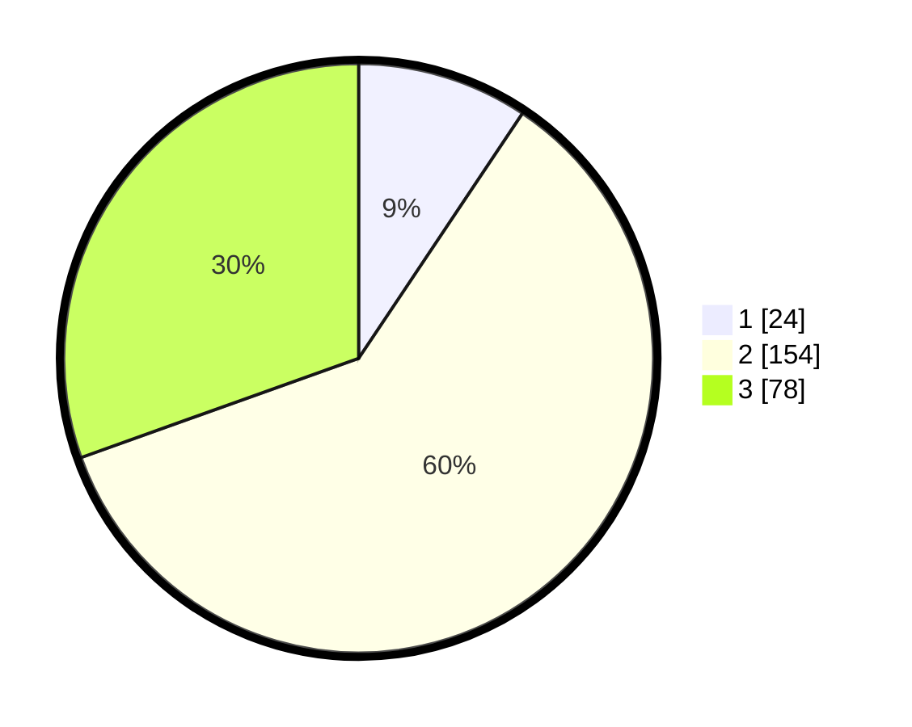

# Hasil

## Grafik

## Tabel

| No. | Nama Paslon    | Suara | Suara (raw) | Persentase |
|:--- |:-------------- | -----:| -----------:| ----------:|
| 1   | ANIES MUHAIMIN | 24    | [24][p-1]   | 9,38       |
| 2   | PRABOWO GIBRAN | 154   | [154][p-2]  | 60,16      |
| 3   | GANJAR MAHFUD  | 78    | [78][p-3]   | 30,47      |

[p-1]: https://github.com/gigit-pemilu/pemilu-2024-34-di-yogyakarta/blob/main/pilpres/hitung-suara/sub/34-di-yogyakarta/sub/01-kulon-progo/sub/02-wates/sub/2005-bendungan/sub/003-tps/sub/paslon-1.txt
[p-2]: https://github.com/gigit-pemilu/pemilu-2024-34-di-yogyakarta/blob/main/pilpres/hitung-suara/sub/34-di-yogyakarta/sub/01-kulon-progo/sub/02-wates/sub/2005-bendungan/sub/003-tps/sub/paslon-2.txt
[p-3]: https://github.com/gigit-pemilu/pemilu-2024-34-di-yogyakarta/blob/main/pilpres/hitung-suara/sub/34-di-yogyakarta/sub/01-kulon-progo/sub/02-wates/sub/2005-bendungan/sub/003-tps/sub/paslon-3.txt

## Foto C Plano

https://sirekap-obj-formc.kpu.go.id/eeae/pemilu/ppwp/34/01/02/20/05/3401022005003-20240214-231009--ed26dfea-9b10-4b51-8aa8-90a5d367ad4a.jpg

https://sirekap-obj-formc.kpu.go.id/eeae/pemilu/ppwp/34/01/02/20/05/3401022005003-20240214-231636--603c2968-6e0b-4736-bc89-be0e7c84a890.jpg

https://sirekap-obj-formc.kpu.go.id/eeae/pemilu/ppwp/34/01/02/20/05/3401022005003-20240214-231832--b9881ea0-9b61-49a3-a1ff-ea6b5f332c48.jpg

## Metadata

| Key        | Value               |
| ---------- | ------------------- |
| Time Stamp | 2024-02-24 22:31:28 |

