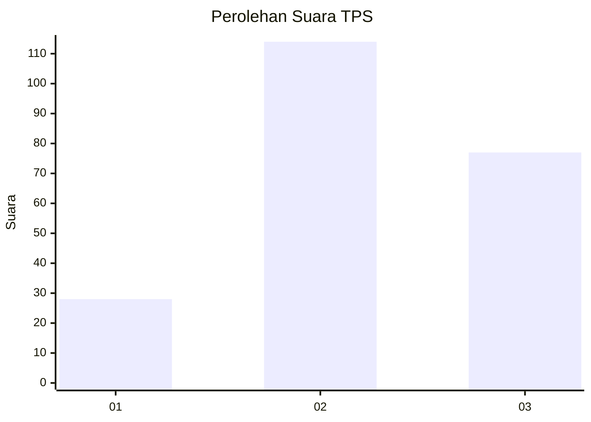
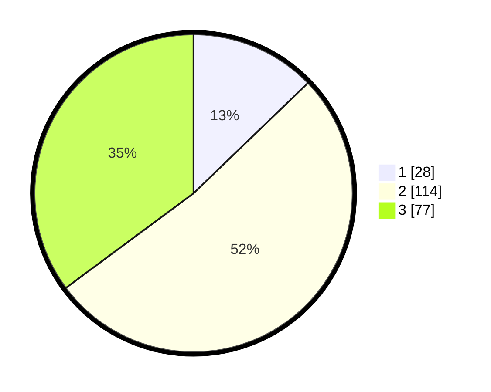

# Hasil

## Grafik

## Tabel

| No. | Nama Paslon    | Suara | Suara (raw) | Persentase |
|:--- |:-------------- | -----:| -----------:| ----------:|
| 1   | ANIES MUHAIMIN | 28    | [28][p-1]   | 12,79      |
| 2   | PRABOWO GIBRAN | 114   | [114][p-2]  | 52,05      |
| 3   | GANJAR MAHFUD  | 77    | [77][p-3]   | 35,16      |

[p-1]: https://github.com/gigit-pemilu/pemilu-2024-34-di-yogyakarta/blob/main/pilpres/hitung-suara/sub/34-di-yogyakarta/sub/01-kulon-progo/sub/02-wates/sub/2005-bendungan/sub/013-tps/sub/paslon-1.txt
[p-2]: https://github.com/gigit-pemilu/pemilu-2024-34-di-yogyakarta/blob/main/pilpres/hitung-suara/sub/34-di-yogyakarta/sub/01-kulon-progo/sub/02-wates/sub/2005-bendungan/sub/013-tps/sub/paslon-2.txt
[p-3]: https://github.com/gigit-pemilu/pemilu-2024-34-di-yogyakarta/blob/main/pilpres/hitung-suara/sub/34-di-yogyakarta/sub/01-kulon-progo/sub/02-wates/sub/2005-bendungan/sub/013-tps/sub/paslon-3.txt

## Foto C Plano

https://sirekap-obj-formc.kpu.go.id/bceb/pemilu/ppwp/34/01/02/20/05/3401022005013-20240214-234054--9ab2199e-f283-4bbd-ac30-640856c69abe.jpg

https://sirekap-obj-formc.kpu.go.id/bceb/pemilu/ppwp/34/01/02/20/05/3401022005013-20240215-002030--24c43509-984d-4f76-a8be-bc01a9dc8969.jpg

https://sirekap-obj-formc.kpu.go.id/bceb/pemilu/ppwp/34/01/02/20/05/3401022005013-20240215-002139--9eee89bb-2f3c-498e-b057-9266984133c6.jpg

## Metadata

| Key        | Value               |
| ---------- | ------------------- |
| Time Stamp | 2024-02-15 12:00:28 |

