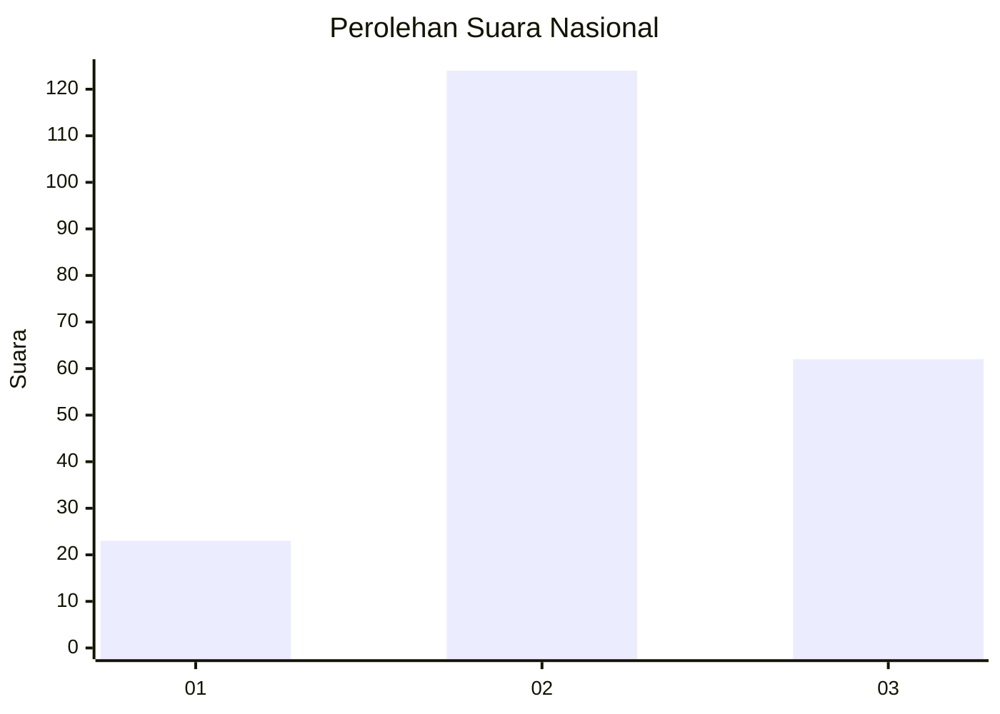
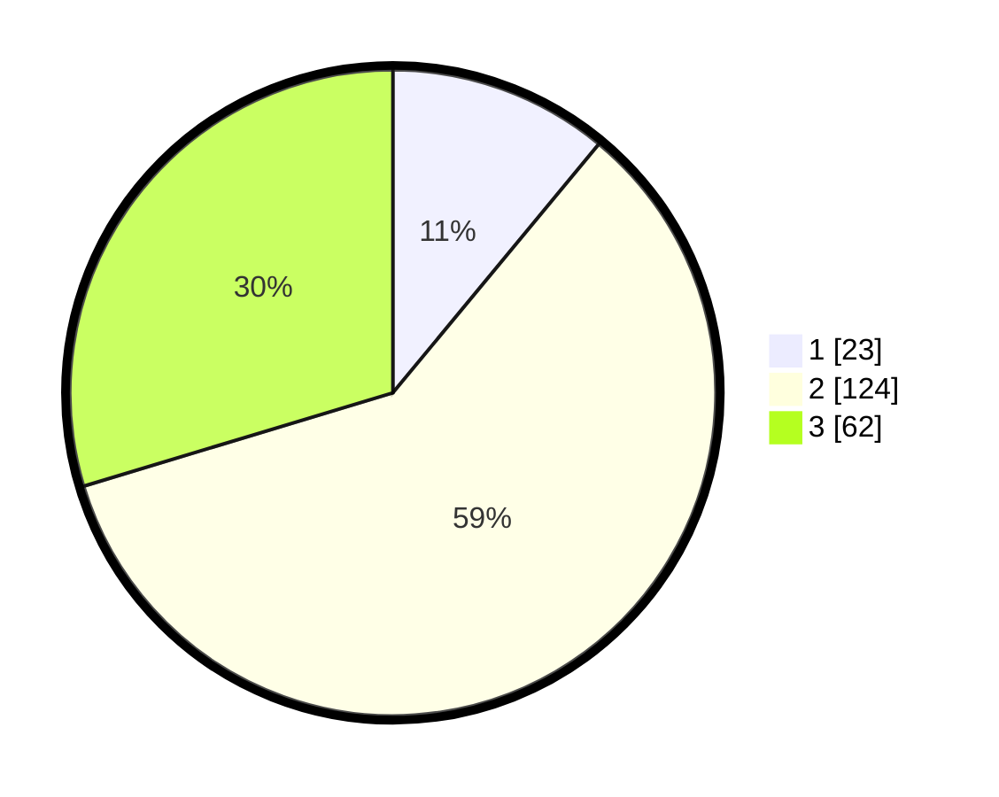

# Hasil

## Grafik

## Tabel

| No. | Nama Paslon    | Suara | Suara (raw) | Persentase |
|:--- |:-------------- | -----:| -----------:| ----------:|
| 1   | ANIES MUHAIMIN | 23    | [23][p-1]   | 11,00      |
| 2   | PRABOWO GIBRAN | 124   | [124][p-2]  | 59,33      |
| 3   | GANJAR MAHFUD  | 62    | [62][p-3]   | 29,67      |

[p-1]: https://github.com/gigit-pemilu/pemilu-2024/blob/main/pilpres/hitung-suara/sub/34-di-yogyakarta/sub/01-kulon-progo/sub/02-wates/sub/2005-bendungan/sub/016-tps/sub/paslon-1.txt
[p-2]: https://github.com/gigit-pemilu/pemilu-2024/blob/main/pilpres/hitung-suara/sub/34-di-yogyakarta/sub/01-kulon-progo/sub/02-wates/sub/2005-bendungan/sub/016-tps/sub/paslon-2.txt
[p-3]: https://github.com/gigit-pemilu/pemilu-2024/blob/main/pilpres/hitung-suara/sub/34-di-yogyakarta/sub/01-kulon-progo/sub/02-wates/sub/2005-bendungan/sub/016-tps/sub/paslon-3.txt

## Foto C Plano

https://sirekap-obj-formc.kpu.go.id/c80e/pemilu/ppwp/34/01/02/20/05/3401022005016-20240215-004530--099d0828-e793-48d8-8792-2b955bfd0ff5.jpg

https://sirekap-obj-formc.kpu.go.id/c80e/pemilu/ppwp/34/01/02/20/05/3401022005016-20240215-005708--f941992e-d181-4d97-b913-e749fc73d863.jpg

https://sirekap-obj-formc.kpu.go.id/c80e/pemilu/ppwp/34/01/02/20/05/3401022005016-20240215-010506--0fc6a3b5-5e43-4e58-9a96-7fecc4432d61.jpg

## Metadata

| Key        | Value               |
| ---------- | ------------------- |
| Time Stamp | 2024-02-24 22:31:28 |

