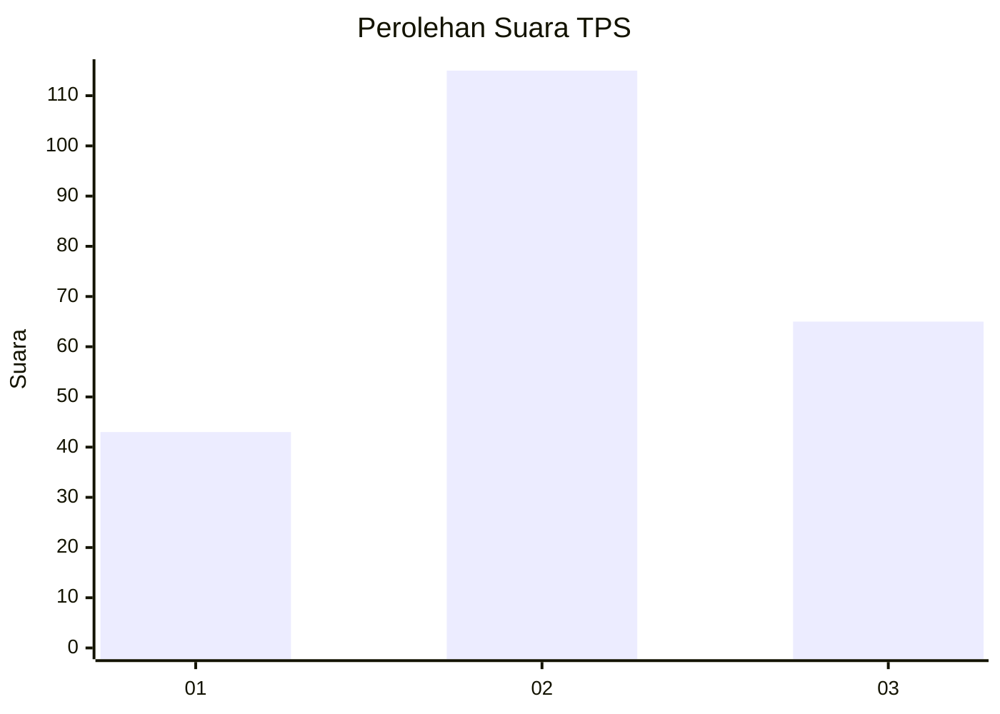
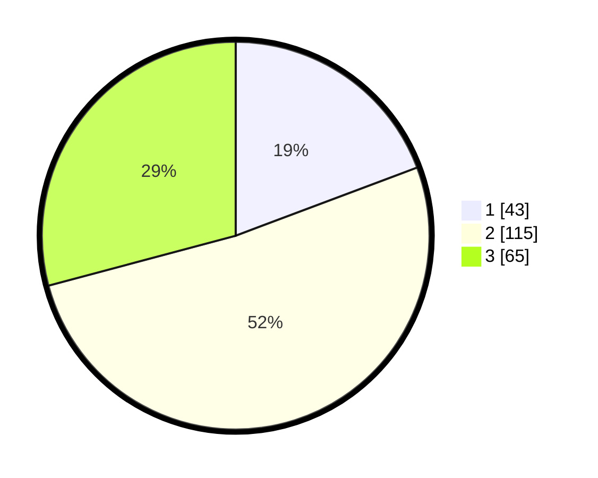

# Hasil

## Grafik

## Tabel

| No. | Nama Paslon    | Suara | Suara (raw) | Persentase |
|:--- |:-------------- | -----:| -----------:| ----------:|
| 1   | ANIES MUHAIMIN | 43    | [43][p-1]   | 19,28      |
| 2   | PRABOWO GIBRAN | 115   | [115][p-2]  | 51,57      |
| 3   | GANJAR MAHFUD  | 65    | [65][p-3]   | 29,15      |

[p-1]: https://github.com/gigit-pemilu/pemilu-2024-34-di-yogyakarta/blob/main/pilpres/hitung-suara/sub/34-di-yogyakarta/sub/01-kulon-progo/sub/02-wates/sub/2005-bendungan/sub/017-tps/sub/paslon-1.txt
[p-2]: https://github.com/gigit-pemilu/pemilu-2024-34-di-yogyakarta/blob/main/pilpres/hitung-suara/sub/34-di-yogyakarta/sub/01-kulon-progo/sub/02-wates/sub/2005-bendungan/sub/017-tps/sub/paslon-2.txt
[p-3]: https://github.com/gigit-pemilu/pemilu-2024-34-di-yogyakarta/blob/main/pilpres/hitung-suara/sub/34-di-yogyakarta/sub/01-kulon-progo/sub/02-wates/sub/2005-bendungan/sub/017-tps/sub/paslon-3.txt

## Foto C Plano

https://sirekap-obj-formc.kpu.go.id/08c1/pemilu/ppwp/34/01/02/20/05/3401022005017-20240214-201205--2d5ba46b-1e89-47d0-bc63-bffc22b2bf9b.jpg

https://sirekap-obj-formc.kpu.go.id/08c1/pemilu/ppwp/34/01/02/20/05/3401022005017-20240214-155834--c74a20d3-6255-42cb-a23f-4069ced64be3.jpg

https://sirekap-obj-formc.kpu.go.id/08c1/pemilu/ppwp/34/01/02/20/05/3401022005017-20240215-005124--61e0a1db-1f5f-4297-b7b2-6bfe5f266556.jpg

## Metadata

| Key        | Value               |
| ---------- | ------------------- |
| Time Stamp | 2024-02-15 00:56:54 |

