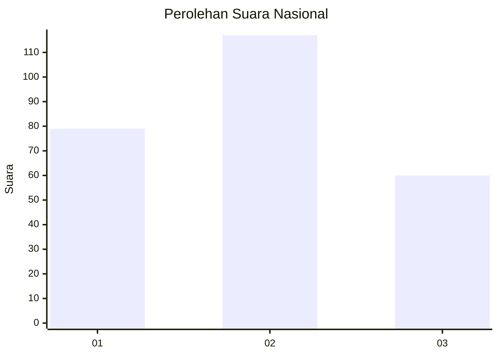
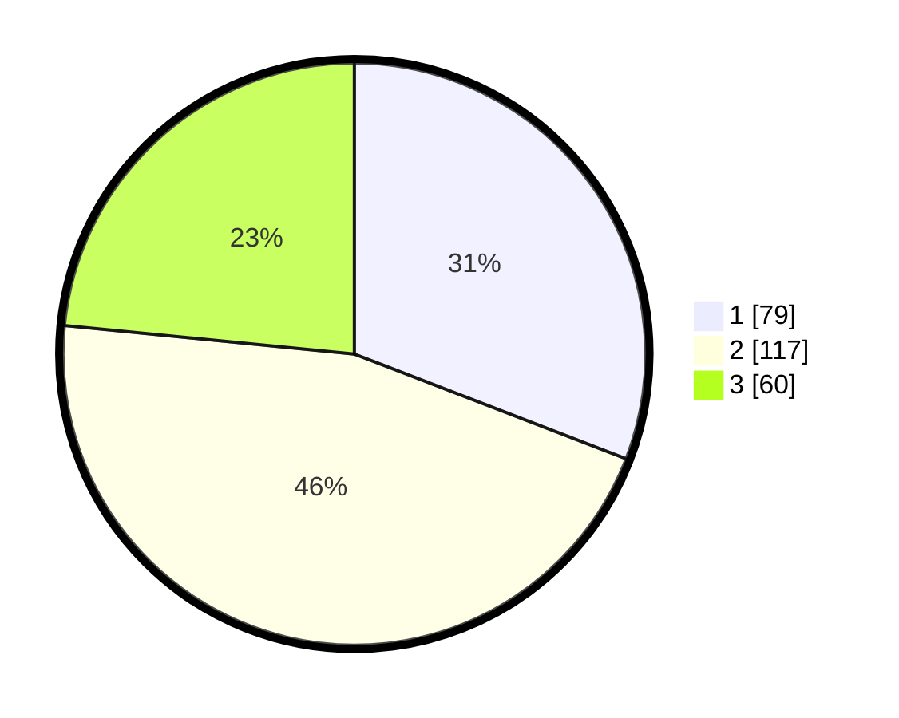

# Hasil

## Grafik

## Tabel

| No. | Nama Paslon    | Suara | Suara (raw) | Persentase |
|:--- |:-------------- | -----:| -----------:| ----------:|
| 1   | ANIES MUHAIMIN | 79    | [79][p-1]   | 30,86      |
| 2   | PRABOWO GIBRAN | 117   | [117][p-2]  | 45,70      |
| 3   | GANJAR MAHFUD  | 60    | [60][p-3]   | 23,44      |

[p-1]: https://github.com/gigit-pemilu/pemilu-2024/blob/main/pilpres/hitung-suara/sub/34-di-yogyakarta/sub/01-kulon-progo/sub/02-wates/sub/2006-triharjo/sub/002-tps/sub/paslon-1.txt
[p-2]: https://github.com/gigit-pemilu/pemilu-2024/blob/main/pilpres/hitung-suara/sub/34-di-yogyakarta/sub/01-kulon-progo/sub/02-wates/sub/2006-triharjo/sub/002-tps/sub/paslon-2.txt
[p-3]: https://github.com/gigit-pemilu/pemilu-2024/blob/main/pilpres/hitung-suara/sub/34-di-yogyakarta/sub/01-kulon-progo/sub/02-wates/sub/2006-triharjo/sub/002-tps/sub/paslon-3.txt

## Foto C Plano

https://sirekap-obj-formc.kpu.go.id/8ce8/pemilu/ppwp/34/01/02/20/06/3401022006002-20240215-053719--91d07f21-bcd7-49ab-b3c3-0bd416c5c497.jpg

https://sirekap-obj-formc.kpu.go.id/8ce8/pemilu/ppwp/34/01/02/20/06/3401022006002-20240215-053925--01f96d13-a4ec-45b7-81d8-b37d59040849.jpg

https://sirekap-obj-formc.kpu.go.id/8ce8/pemilu/ppwp/34/01/02/20/06/3401022006002-20240215-054225--e84d302b-b1a4-4742-9f3e-e96344047c13.jpg

## Metadata

| Key        | Value               |
| ---------- | ------------------- |
| Time Stamp | 2024-02-24 22:31:28 |

