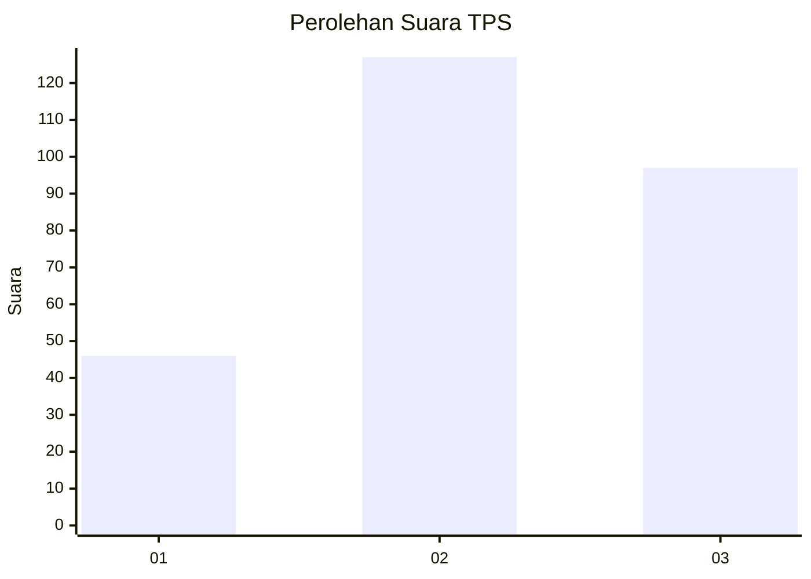
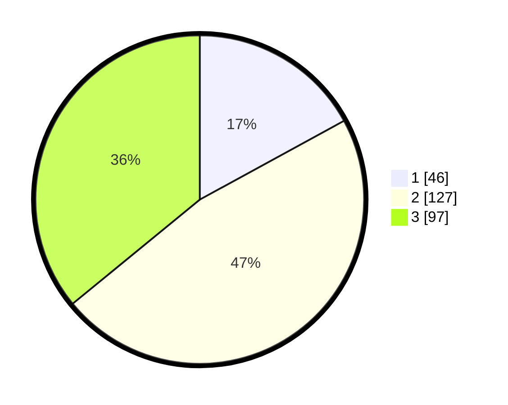

# Hasil

## Grafik

## Tabel

| No. | Nama Paslon    | Suara | Suara (raw) | Persentase |
|:--- |:-------------- | -----:| -----------:| ----------:|
| 1   | ANIES MUHAIMIN | 46    | [46][p-1]   | 17,04      |
| 2   | PRABOWO GIBRAN | 127   | [127][p-2]  | 47,04      |
| 3   | GANJAR MAHFUD  | 97    | [97][p-3]   | 35,93      |

[p-1]: https://github.com/gigit-pemilu/pemilu-2024-34-di-yogyakarta/blob/main/pilpres/hitung-suara/sub/34-di-yogyakarta/sub/01-kulon-progo/sub/02-wates/sub/2006-triharjo/sub/004-tps/sub/paslon-1.txt
[p-2]: https://github.com/gigit-pemilu/pemilu-2024-34-di-yogyakarta/blob/main/pilpres/hitung-suara/sub/34-di-yogyakarta/sub/01-kulon-progo/sub/02-wates/sub/2006-triharjo/sub/004-tps/sub/paslon-2.txt
[p-3]: https://github.com/gigit-pemilu/pemilu-2024-34-di-yogyakarta/blob/main/pilpres/hitung-suara/sub/34-di-yogyakarta/sub/01-kulon-progo/sub/02-wates/sub/2006-triharjo/sub/004-tps/sub/paslon-3.txt

## Foto C Plano

https://sirekap-obj-formc.kpu.go.id/0b5a/pemilu/ppwp/34/01/02/20/06/3401022006004-20240214-232838--21482682-d8d7-4fc3-b5c2-1d893ffd5e57.jpg

https://sirekap-obj-formc.kpu.go.id/0b5a/pemilu/ppwp/34/01/02/20/06/3401022006004-20240214-233123--6651d9ef-585a-48f9-a582-cac02734bd10.jpg

https://sirekap-obj-formc.kpu.go.id/0b5a/pemilu/ppwp/34/01/02/20/06/3401022006004-20240214-233319--f07d0210-4107-413d-802c-67bf761cdaf8.jpg

## Metadata

| Key        | Value               |
| ---------- | ------------------- |
| Time Stamp | 2024-02-15 18:30:25 |

