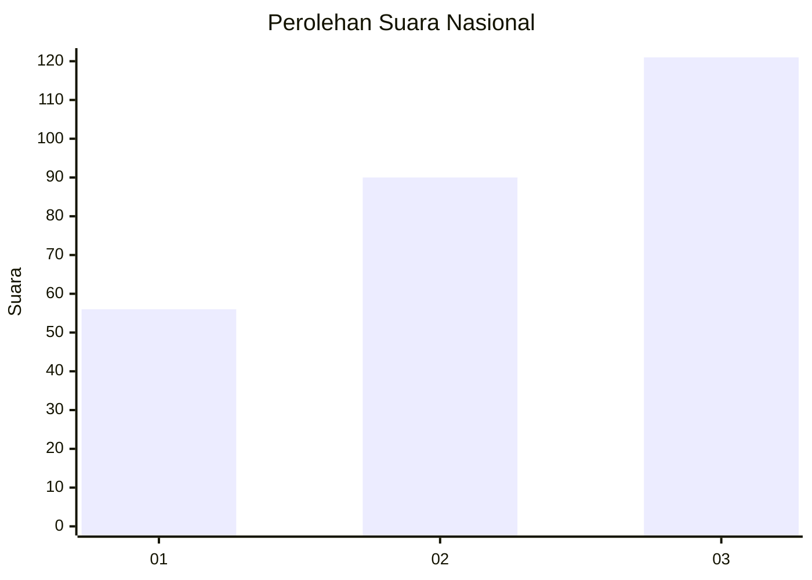
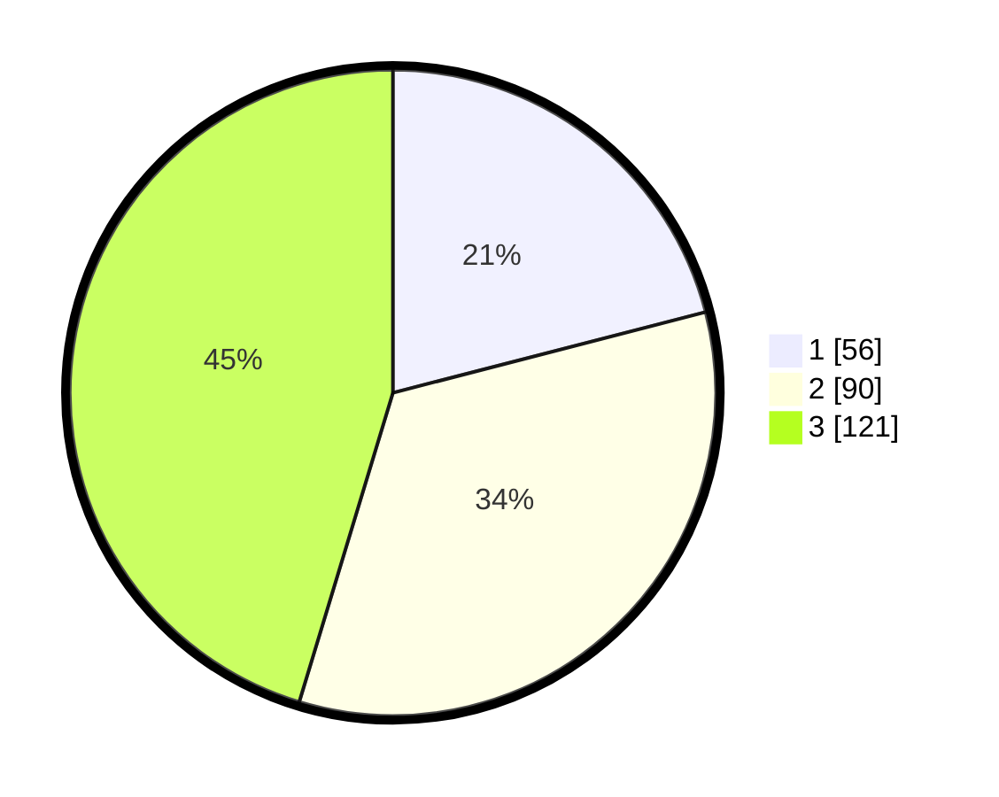

# Hasil

## Grafik

## Tabel

| No. | Nama Paslon    | Suara | Suara (raw) | Persentase |
|:--- |:-------------- | -----:| -----------:| ----------:|
| 1   | ANIES MUHAIMIN | 56    | [56][p-1]   | 20,97      |
| 2   | PRABOWO GIBRAN | 90    | [90][p-2]   | 33,71      |
| 3   | GANJAR MAHFUD  | 121   | [121][p-3]  | 45,32      |

[p-1]: https://github.com/gigit-pemilu/pemilu-2024/blob/main/pilpres/hitung-suara/sub/34-di-yogyakarta/sub/01-kulon-progo/sub/02-wates/sub/2006-triharjo/sub/005-tps/sub/paslon-1.txt
[p-2]: https://github.com/gigit-pemilu/pemilu-2024/blob/main/pilpres/hitung-suara/sub/34-di-yogyakarta/sub/01-kulon-progo/sub/02-wates/sub/2006-triharjo/sub/005-tps/sub/paslon-2.txt
[p-3]: https://github.com/gigit-pemilu/pemilu-2024/blob/main/pilpres/hitung-suara/sub/34-di-yogyakarta/sub/01-kulon-progo/sub/02-wates/sub/2006-triharjo/sub/005-tps/sub/paslon-3.txt

## Foto C Plano

https://sirekap-obj-formc.kpu.go.id/98ef/pemilu/ppwp/34/01/02/20/06/3401022006005-20240215-023745--407d1927-4e7e-4943-b8f4-63235e8cc4b4.jpg

https://sirekap-obj-formc.kpu.go.id/98ef/pemilu/ppwp/34/01/02/20/06/3401022006005-20240215-023945--308d95b2-97be-4e54-bd0a-a862918ff654.jpg

https://sirekap-obj-formc.kpu.go.id/98ef/pemilu/ppwp/34/01/02/20/06/3401022006005-20240215-024519--0ad4878b-8ca3-43a1-a45c-c5e9d857dad1.jpg

## Metadata

| Key        | Value               |
| ---------- | ------------------- |
| Time Stamp | 2024-02-15 18:30:25 |

