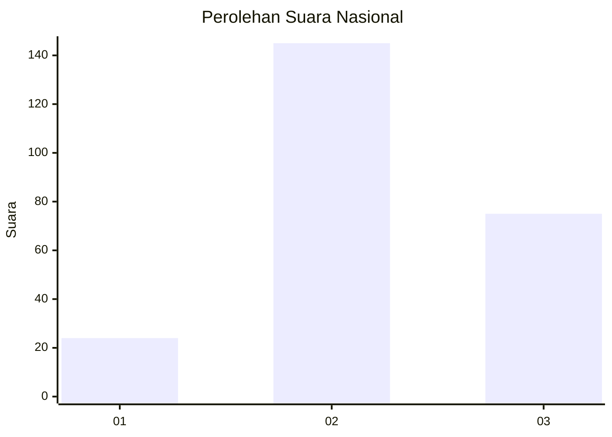
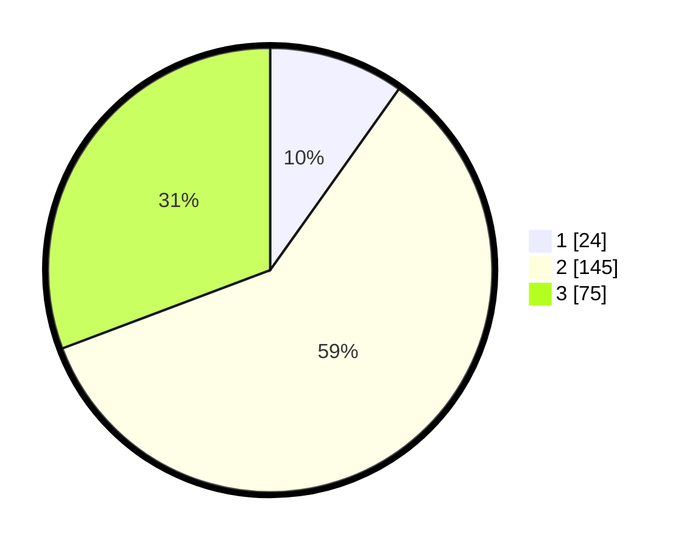

# Hasil

## Grafik

## Tabel

| No. | Nama Paslon    | Suara | Suara (raw) | Persentase |
|:--- |:-------------- | -----:| -----------:| ----------:|
| 1   | ANIES MUHAIMIN | 24    | [24][p-1]   | 9,84       |
| 2   | PRABOWO GIBRAN | 145   | [145][p-2]  | 59,43      |
| 3   | GANJAR MAHFUD  | 75    | [75][p-3]   | 30,74      |

[p-1]: https://github.com/gigit-pemilu/pemilu-2024/blob/main/pilpres/hitung-suara/sub/34-di-yogyakarta/sub/01-kulon-progo/sub/02-wates/sub/2006-triharjo/sub/009-tps/sub/paslon-1.txt
[p-2]: https://github.com/gigit-pemilu/pemilu-2024/blob/main/pilpres/hitung-suara/sub/34-di-yogyakarta/sub/01-kulon-progo/sub/02-wates/sub/2006-triharjo/sub/009-tps/sub/paslon-2.txt
[p-3]: https://github.com/gigit-pemilu/pemilu-2024/blob/main/pilpres/hitung-suara/sub/34-di-yogyakarta/sub/01-kulon-progo/sub/02-wates/sub/2006-triharjo/sub/009-tps/sub/paslon-3.txt

## Foto C Plano

https://sirekap-obj-formc.kpu.go.id/ece5/pemilu/ppwp/34/01/02/20/06/3401022006009-20240215-004934--5b24f150-9c78-493c-9f4b-605c68f158eb.jpg

https://sirekap-obj-formc.kpu.go.id/ece5/pemilu/ppwp/34/01/02/20/06/3401022006009-20240215-005046--3e0eb7e8-d713-4a76-afd2-d2ab79b65fd7.jpg

https://sirekap-obj-formc.kpu.go.id/ece5/pemilu/ppwp/34/01/02/20/06/3401022006009-20240215-005112--66887269-9231-460d-b75a-ec7ddbf461f1.jpg

## Metadata

| Key        | Value               |
| ---------- | ------------------- |
| Time Stamp | 2024-02-24 22:31:28 |

