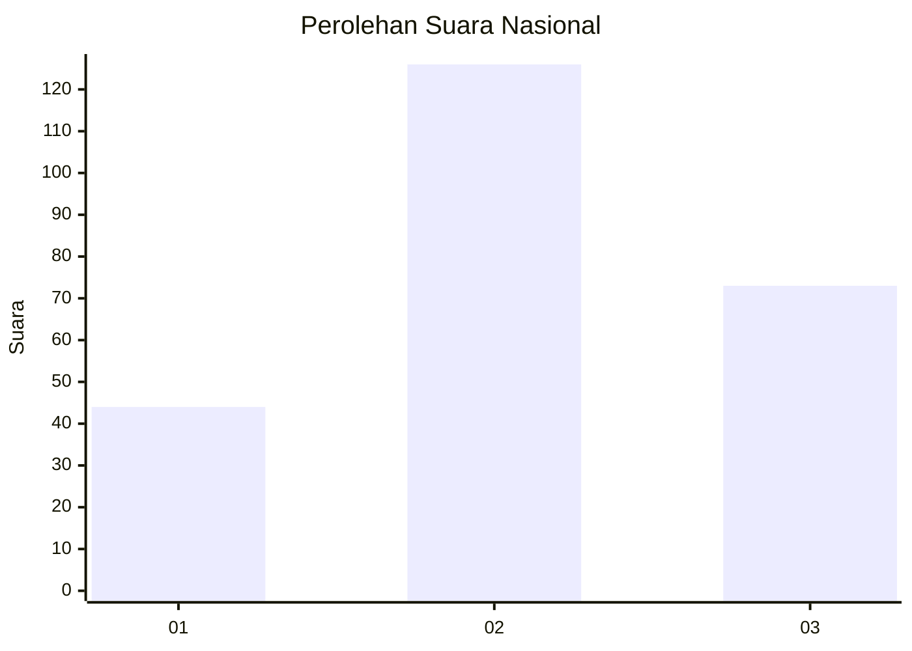
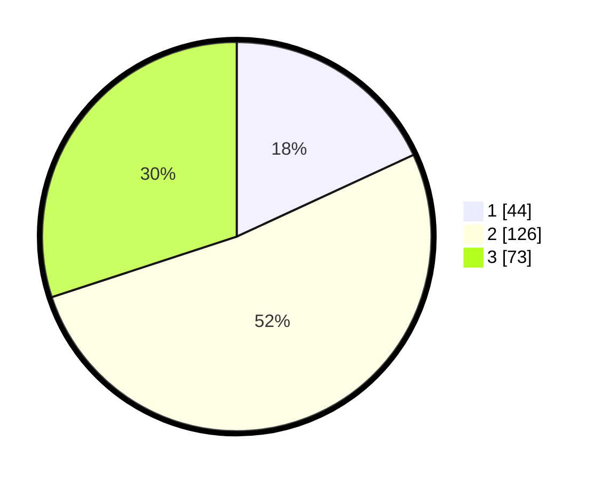

# Hasil

## Grafik

## Tabel

| No. | Nama Paslon    | Suara | Suara (raw) | Persentase |
|:--- |:-------------- | -----:| -----------:| ----------:|
| 1   | ANIES MUHAIMIN | 44    | [44][p-1]   | 18,11      |
| 2   | PRABOWO GIBRAN | 126   | [126][p-2]  | 51,85      |
| 3   | GANJAR MAHFUD  | 73    | [73][p-3]   | 30,04      |

[p-1]: https://github.com/gigit-pemilu/pemilu-2024/blob/main/pilpres/hitung-suara/sub/34-di-yogyakarta/sub/01-kulon-progo/sub/02-wates/sub/2006-triharjo/sub/011-tps/sub/paslon-1.txt
[p-2]: https://github.com/gigit-pemilu/pemilu-2024/blob/main/pilpres/hitung-suara/sub/34-di-yogyakarta/sub/01-kulon-progo/sub/02-wates/sub/2006-triharjo/sub/011-tps/sub/paslon-2.txt
[p-3]: https://github.com/gigit-pemilu/pemilu-2024/blob/main/pilpres/hitung-suara/sub/34-di-yogyakarta/sub/01-kulon-progo/sub/02-wates/sub/2006-triharjo/sub/011-tps/sub/paslon-3.txt

## Foto C Plano

https://sirekap-obj-formc.kpu.go.id/cb4a/pemilu/ppwp/34/01/02/20/06/3401022006011-20240214-155124--fb3ec16d-904a-4e56-93d8-406e9f6717c7.jpg

https://sirekap-obj-formc.kpu.go.id/cb4a/pemilu/ppwp/34/01/02/20/06/3401022006011-20240214-155203--2414fc7e-570d-4bac-9abc-e5d0ab1a91b4.jpg

https://sirekap-obj-formc.kpu.go.id/cb4a/pemilu/ppwp/34/01/02/20/06/3401022006011-20240215-003017--07e61a1a-29e4-41b6-9499-3b53440361a2.jpg

## Metadata

| Key        | Value               |
| ---------- | ------------------- |
| Time Stamp | 2024-02-15 00:41:44 |

