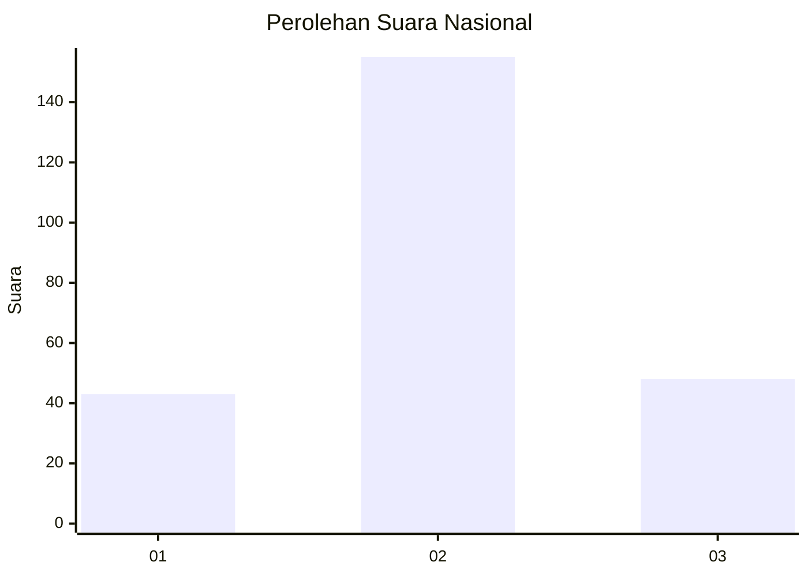
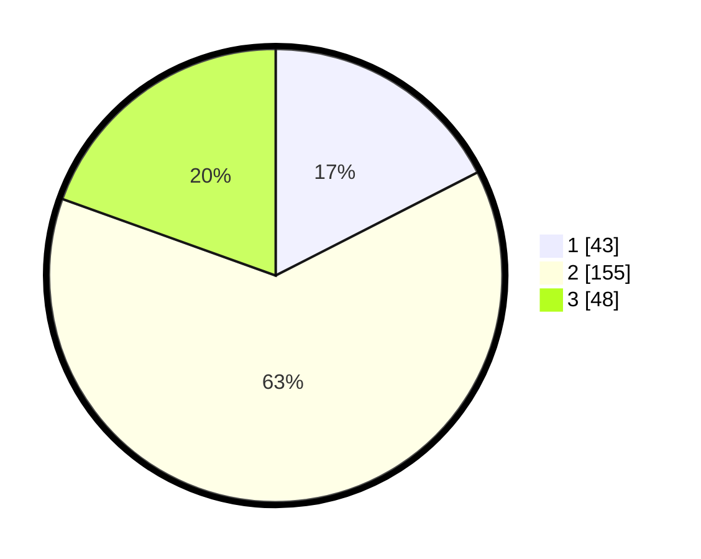

# Hasil

## Grafik

## Tabel

| No. | Nama Paslon    | Suara | Suara (raw) | Persentase |
|:--- |:-------------- | -----:| -----------:| ----------:|
| 1   | ANIES MUHAIMIN | 43    | [43][p-1]   | 17,48      |
| 2   | PRABOWO GIBRAN | 155   | [155][p-2]  | 63,01      |
| 3   | GANJAR MAHFUD  | 48    | [48][p-3]   | 19,51      |

[p-1]: https://github.com/gigit-pemilu/pemilu-2024/blob/main/pilpres/hitung-suara/sub/34-di-yogyakarta/sub/01-kulon-progo/sub/02-wates/sub/2006-triharjo/sub/013-tps/sub/paslon-1.txt
[p-2]: https://github.com/gigit-pemilu/pemilu-2024/blob/main/pilpres/hitung-suara/sub/34-di-yogyakarta/sub/01-kulon-progo/sub/02-wates/sub/2006-triharjo/sub/013-tps/sub/paslon-2.txt
[p-3]: https://github.com/gigit-pemilu/pemilu-2024/blob/main/pilpres/hitung-suara/sub/34-di-yogyakarta/sub/01-kulon-progo/sub/02-wates/sub/2006-triharjo/sub/013-tps/sub/paslon-3.txt

## Foto C Plano

https://sirekap-obj-formc.kpu.go.id/2314/pemilu/ppwp/34/01/02/20/06/3401022006013-20240215-001507--72bd7f7f-3ad6-4d1a-b7a8-3ed29bf48fd8.jpg

https://sirekap-obj-formc.kpu.go.id/2314/pemilu/ppwp/34/01/02/20/06/3401022006013-20240215-004419--caca97bc-c0c2-4fbf-b20e-d9d5e1352483.jpg

https://sirekap-obj-formc.kpu.go.id/2314/pemilu/ppwp/34/01/02/20/06/3401022006013-20240215-004447--dfa86da3-5b6e-4692-9c9e-6118198ef998.jpg

## Metadata

| Key        | Value               |
| ---------- | ------------------- |
| Time Stamp | 2024-02-15 16:00:26 |

