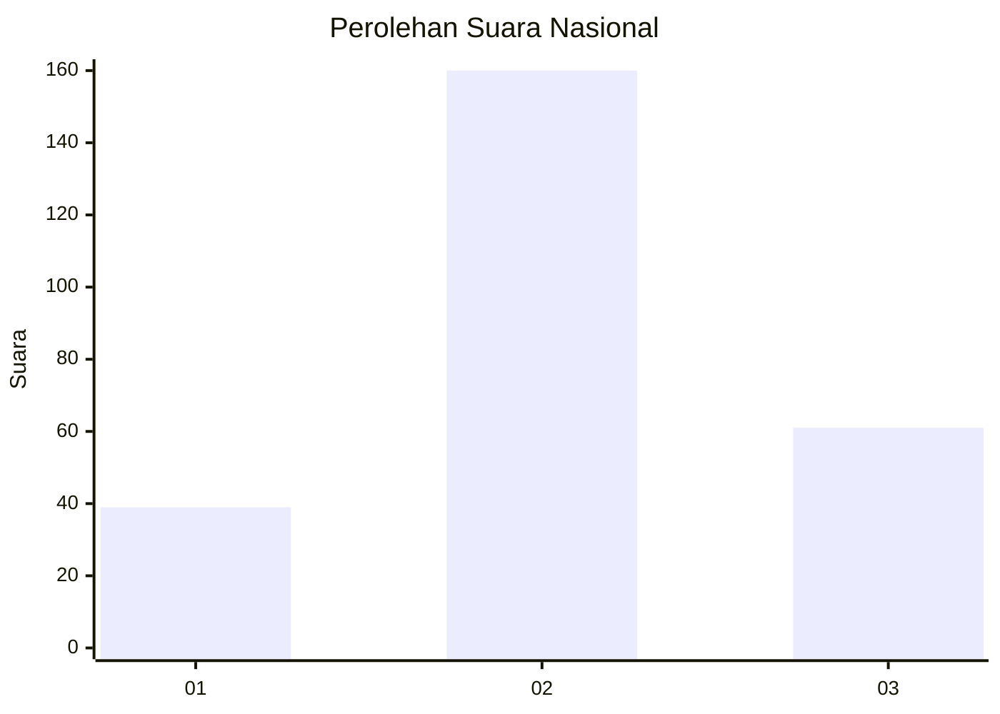
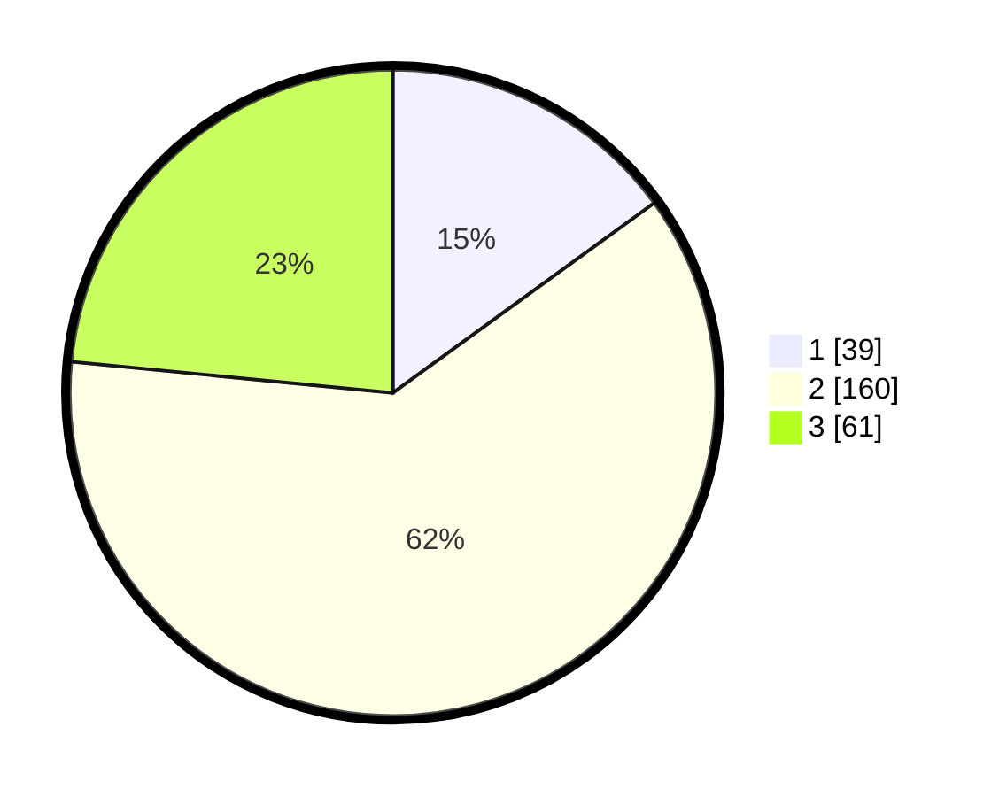

# Hasil

## Grafik

## Tabel

| No. | Nama Paslon    | Suara | Suara (raw) | Persentase |
|:--- |:-------------- | -----:| -----------:| ----------:|
| 1   | ANIES MUHAIMIN | 39    | [39][p-1]   | 15,00      |
| 2   | PRABOWO GIBRAN | 160   | [160][p-2]  | 61,54      |
| 3   | GANJAR MAHFUD  | 61    | [61][p-3]   | 23,46      |

[p-1]: https://github.com/gigit-pemilu/pemilu-2024/blob/main/pilpres/hitung-suara/sub/34-di-yogyakarta/sub/01-kulon-progo/sub/02-wates/sub/2006-triharjo/sub/016-tps/sub/paslon-1.txt
[p-2]: https://github.com/gigit-pemilu/pemilu-2024/blob/main/pilpres/hitung-suara/sub/34-di-yogyakarta/sub/01-kulon-progo/sub/02-wates/sub/2006-triharjo/sub/016-tps/sub/paslon-2.txt
[p-3]: https://github.com/gigit-pemilu/pemilu-2024/blob/main/pilpres/hitung-suara/sub/34-di-yogyakarta/sub/01-kulon-progo/sub/02-wates/sub/2006-triharjo/sub/016-tps/sub/paslon-3.txt

## Foto C Plano

https://sirekap-obj-formc.kpu.go.id/2a87/pemilu/ppwp/34/01/02/20/06/3401022006016-20240214-185928--42db4e17-2c43-42da-bc66-e44f93d9b2d4.jpg

https://sirekap-obj-formc.kpu.go.id/2a87/pemilu/ppwp/34/01/02/20/06/3401022006016-20240214-185932--85f5bd50-ff91-418f-99c8-64871aed7b33.jpg

## Metadata

| Key        | Value               |
| ---------- | ------------------- |
| Time Stamp | 2024-02-24 22:31:28 |

