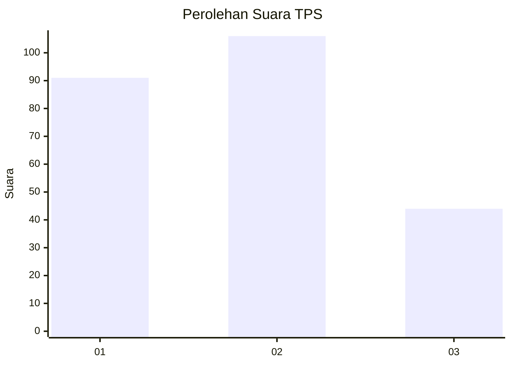
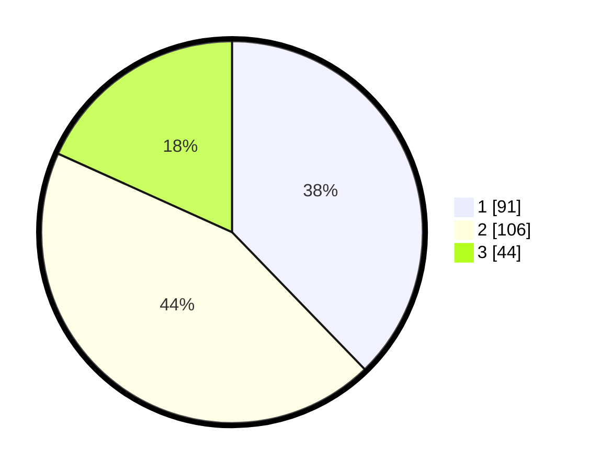

# Hasil

## Grafik

## Tabel

| No. | Nama Paslon    | Suara | Suara (raw) | Persentase |
|:--- |:-------------- | -----:| -----------:| ----------:|
| 1   | ANIES MUHAIMIN | 91    | [91][p-1]   | 37,76      |
| 2   | PRABOWO GIBRAN | 106   | [106][p-2]  | 43,98      |
| 3   | GANJAR MAHFUD  | 44    | [44][p-3]   | 18,26      |

[p-1]: https://github.com/gigit-pemilu/pemilu-2024-34-di-yogyakarta/blob/main/pilpres/hitung-suara/sub/34-di-yogyakarta/sub/01-kulon-progo/sub/02-wates/sub/2006-triharjo/sub/019-tps/sub/paslon-1.txt
[p-2]: https://github.com/gigit-pemilu/pemilu-2024-34-di-yogyakarta/blob/main/pilpres/hitung-suara/sub/34-di-yogyakarta/sub/01-kulon-progo/sub/02-wates/sub/2006-triharjo/sub/019-tps/sub/paslon-2.txt
[p-3]: https://github.com/gigit-pemilu/pemilu-2024-34-di-yogyakarta/blob/main/pilpres/hitung-suara/sub/34-di-yogyakarta/sub/01-kulon-progo/sub/02-wates/sub/2006-triharjo/sub/019-tps/sub/paslon-3.txt

## Foto C Plano

https://sirekap-obj-formc.kpu.go.id/9de0/pemilu/ppwp/34/01/02/20/06/3401022006019-20240214-160101--cd8bfcce-d661-48c5-82ce-eb4c2b341626.jpg

https://sirekap-obj-formc.kpu.go.id/9de0/pemilu/ppwp/34/01/02/20/06/3401022006019-20240214-155925--d048365e-e74e-495a-8de5-65fad08a7b74.jpg

## Metadata

| Key        | Value               |
| ---------- | ------------------- |
| Time Stamp | 2024-02-24 22:31:28 |

