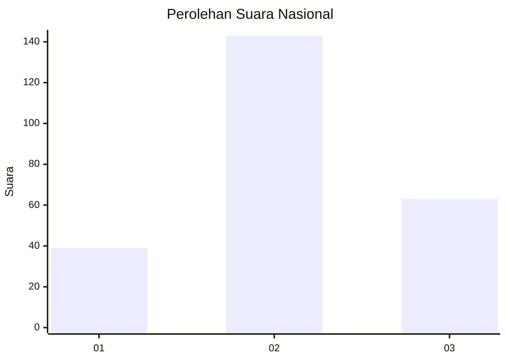
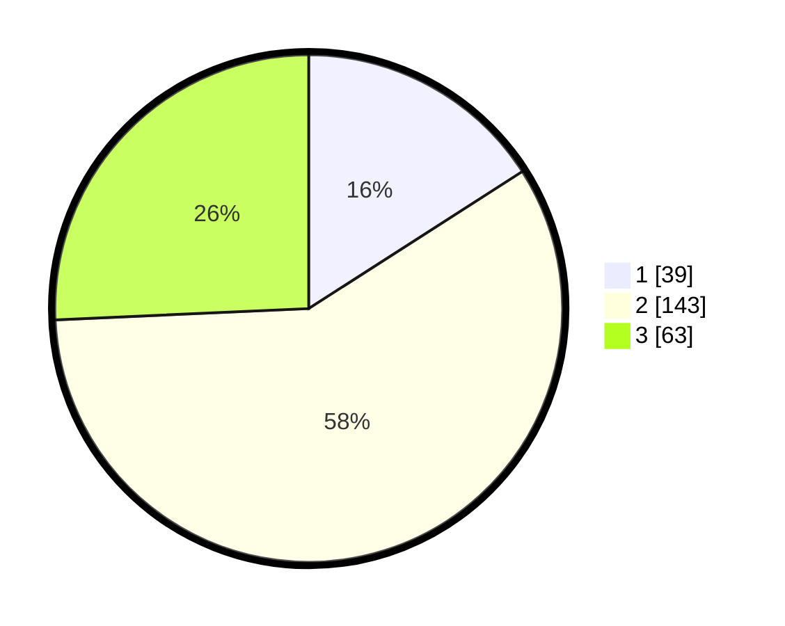

# Hasil

## Grafik

## Tabel

| No. | Nama Paslon    | Suara | Suara (raw) | Persentase |
|:--- |:-------------- | -----:| -----------:| ----------:|
| 1   | ANIES MUHAIMIN | 39    | [39][p-1]   | 15,92      |
| 2   | PRABOWO GIBRAN | 143   | [143][p-2]  | 58,37      |
| 3   | GANJAR MAHFUD  | 63    | [63][p-3]   | 25,71      |

[p-1]: https://github.com/gigit-pemilu/pemilu-2024/blob/main/pilpres/hitung-suara/sub/34-di-yogyakarta/sub/01-kulon-progo/sub/02-wates/sub/2007-giripeni/sub/005-tps/sub/paslon-1.txt
[p-2]: https://github.com/gigit-pemilu/pemilu-2024/blob/main/pilpres/hitung-suara/sub/34-di-yogyakarta/sub/01-kulon-progo/sub/02-wates/sub/2007-giripeni/sub/005-tps/sub/paslon-2.txt
[p-3]: https://github.com/gigit-pemilu/pemilu-2024/blob/main/pilpres/hitung-suara/sub/34-di-yogyakarta/sub/01-kulon-progo/sub/02-wates/sub/2007-giripeni/sub/005-tps/sub/paslon-3.txt

## Foto C Plano

https://sirekap-obj-formc.kpu.go.id/3b7b/pemilu/ppwp/34/01/02/20/07/3401022007005-20240214-155040--2bc8f0d1-22fb-495f-ae7a-4e4171af1cfe.jpg

https://sirekap-obj-formc.kpu.go.id/3b7b/pemilu/ppwp/34/01/02/20/07/3401022007005-20240214-155249--b33eb398-3b7e-457e-a734-d40617dee43f.jpg

https://sirekap-obj-formc.kpu.go.id/3b7b/pemilu/ppwp/34/01/02/20/07/3401022007005-20240214-155352--adbc74c5-9b48-4e93-9bb7-77e315cb5cc7.jpg

## Metadata

| Key        | Value               |
| ---------- | ------------------- |
| Time Stamp | 2024-02-24 22:31:28 |

