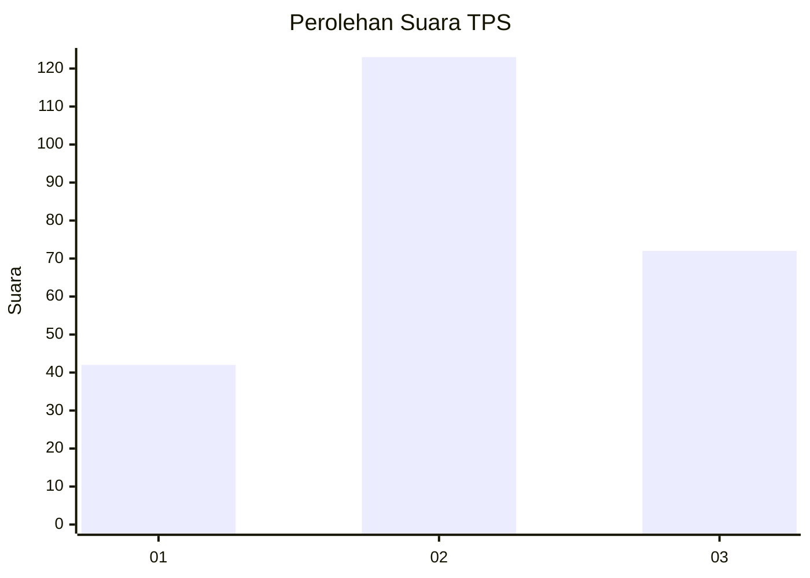
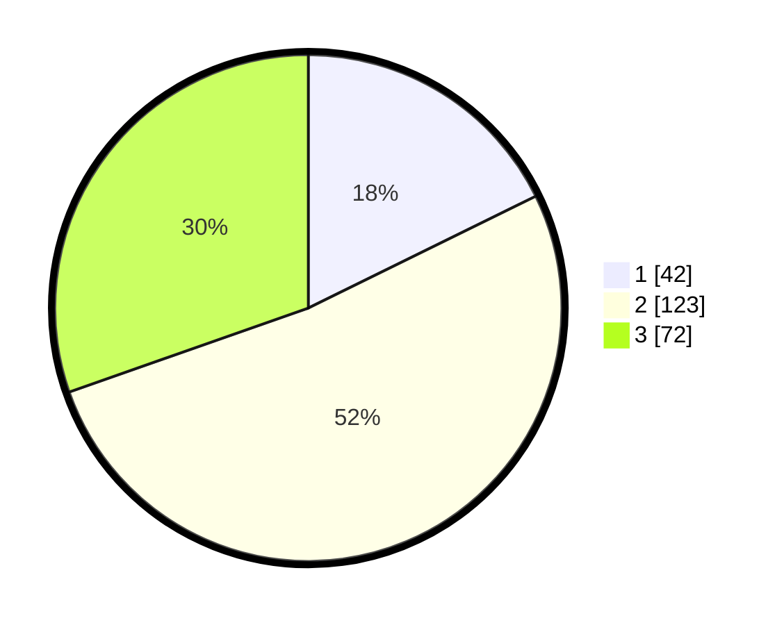

# Hasil

## Grafik

## Tabel

| No. | Nama Paslon    | Suara | Suara (raw) | Persentase |
|:--- |:-------------- | -----:| -----------:| ----------:|
| 1   | ANIES MUHAIMIN | 42    | [42][p-1]   | 17,72      |
| 2   | PRABOWO GIBRAN | 123   | [123][p-2]  | 51,90      |
| 3   | GANJAR MAHFUD  | 72    | [72][p-3]   | 30,38      |

[p-1]: https://github.com/gigit-pemilu/pemilu-2024-34-di-yogyakarta/blob/main/pilpres/hitung-suara/sub/34-di-yogyakarta/sub/01-kulon-progo/sub/02-wates/sub/2007-giripeni/sub/007-tps/sub/paslon-1.txt
[p-2]: https://github.com/gigit-pemilu/pemilu-2024-34-di-yogyakarta/blob/main/pilpres/hitung-suara/sub/34-di-yogyakarta/sub/01-kulon-progo/sub/02-wates/sub/2007-giripeni/sub/007-tps/sub/paslon-2.txt
[p-3]: https://github.com/gigit-pemilu/pemilu-2024-34-di-yogyakarta/blob/main/pilpres/hitung-suara/sub/34-di-yogyakarta/sub/01-kulon-progo/sub/02-wates/sub/2007-giripeni/sub/007-tps/sub/paslon-3.txt

## Foto C Plano

https://sirekap-obj-formc.kpu.go.id/84f4/pemilu/ppwp/34/01/02/20/07/3401022007007-20240214-225534--8eeec7e4-ba96-4036-b170-333813efbaab.jpg

https://sirekap-obj-formc.kpu.go.id/84f4/pemilu/ppwp/34/01/02/20/07/3401022007007-20240214-225702--ec1d2819-1143-4d0d-9dcb-ff906a374658.jpg

https://sirekap-obj-formc.kpu.go.id/84f4/pemilu/ppwp/34/01/02/20/07/3401022007007-20240214-225752--c5d10dc8-be53-4b9e-990d-27a96081e180.jpg

## Metadata

| Key        | Value               |
| ---------- | ------------------- |
| Time Stamp | 2024-02-25 11:00:00 |

