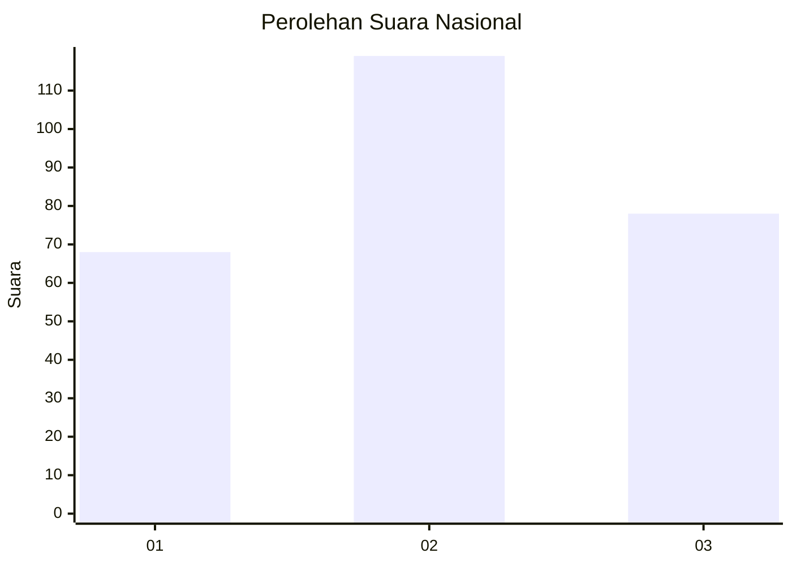
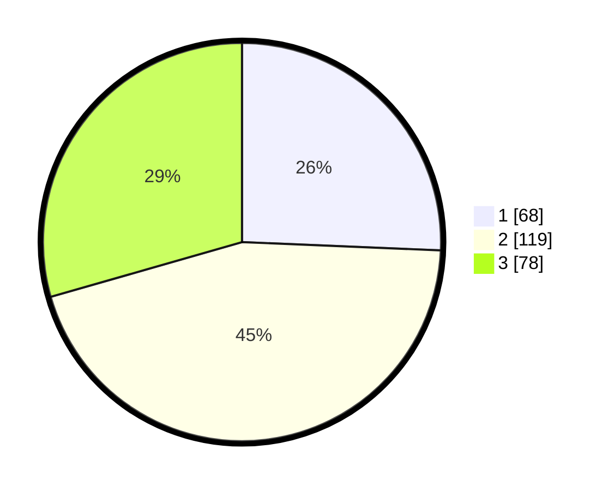

# Hasil

## Grafik

## Tabel

| No. | Nama Paslon    | Suara | Suara (raw) | Persentase |
|:--- |:-------------- | -----:| -----------:| ----------:|
| 1   | ANIES MUHAIMIN | 68    | [68][p-1]   | 25,66      |
| 2   | PRABOWO GIBRAN | 119   | [119][p-2]  | 44,91      |
| 3   | GANJAR MAHFUD  | 78    | [78][p-3]   | 29,43      |

[p-1]: https://github.com/gigit-pemilu/pemilu-2024/blob/main/pilpres/hitung-suara/sub/34-di-yogyakarta/sub/01-kulon-progo/sub/02-wates/sub/2007-giripeni/sub/009-tps/sub/paslon-1.txt
[p-2]: https://github.com/gigit-pemilu/pemilu-2024/blob/main/pilpres/hitung-suara/sub/34-di-yogyakarta/sub/01-kulon-progo/sub/02-wates/sub/2007-giripeni/sub/009-tps/sub/paslon-2.txt
[p-3]: https://github.com/gigit-pemilu/pemilu-2024/blob/main/pilpres/hitung-suara/sub/34-di-yogyakarta/sub/01-kulon-progo/sub/02-wates/sub/2007-giripeni/sub/009-tps/sub/paslon-3.txt

## Foto C Plano

https://sirekap-obj-formc.kpu.go.id/990e/pemilu/ppwp/34/01/02/20/07/3401022007009-20240214-233946--a40aa085-8ec0-4ad4-b7ac-d7dd9f3e150e.jpg

https://sirekap-obj-formc.kpu.go.id/990e/pemilu/ppwp/34/01/02/20/07/3401022007009-20240214-234159--efb48eb6-7ae6-45b1-a1d8-58fc9bd76fff.jpg

https://sirekap-obj-formc.kpu.go.id/990e/pemilu/ppwp/34/01/02/20/07/3401022007009-20240215-215802--6c99161a-f65b-403f-9140-9b33b4f98888.jpg

## Metadata

| Key        | Value               |
| ---------- | ------------------- |
| Time Stamp | 2024-02-15 22:00:27 |

