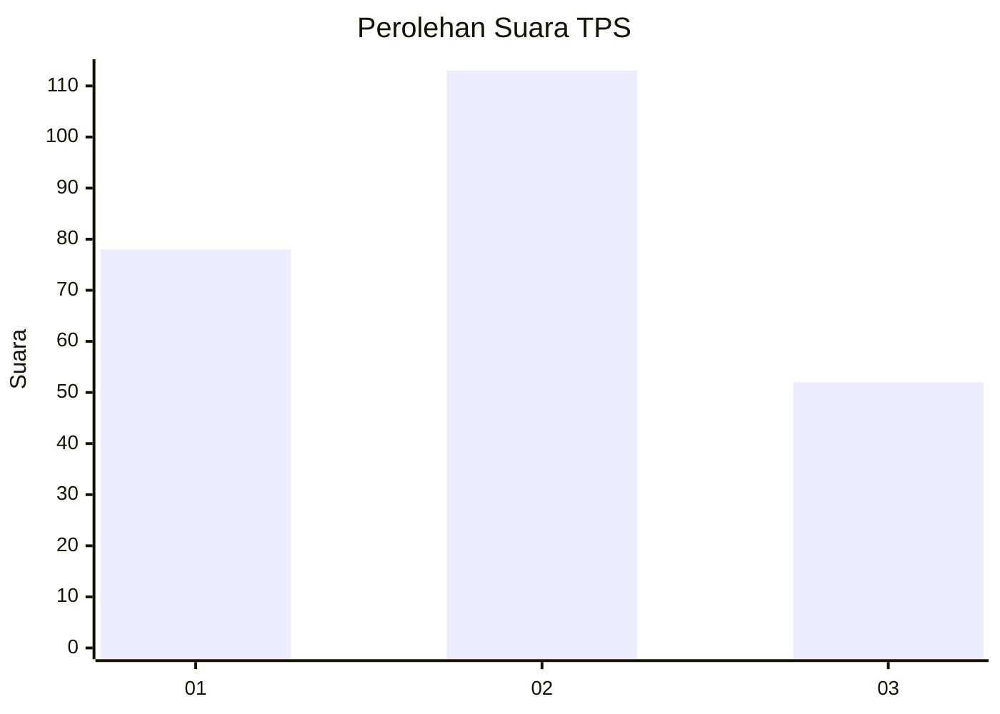
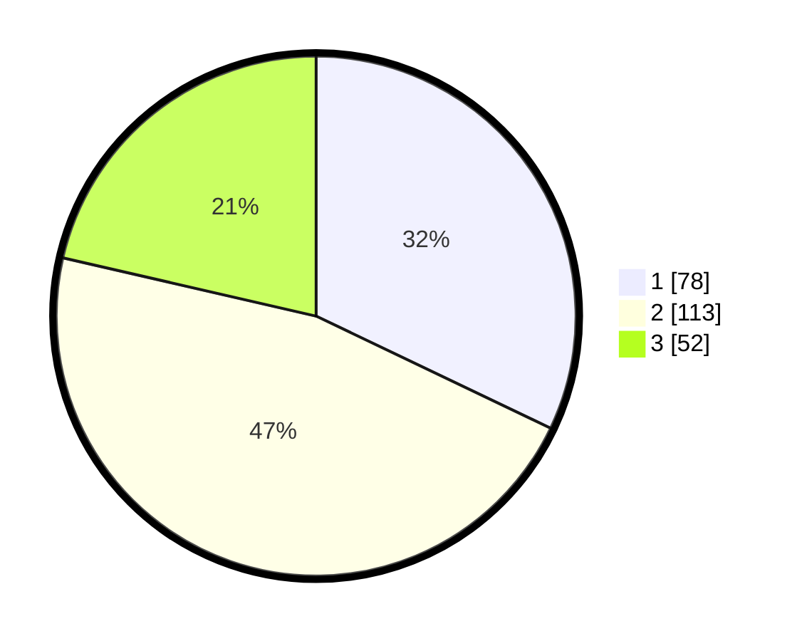

# Hasil

## Grafik

## Tabel

| No. | Nama Paslon    | Suara | Suara (raw) | Persentase |
|:--- |:-------------- | -----:| -----------:| ----------:|
| 1   | ANIES MUHAIMIN | 78    | [78][p-1]   | 32,10      |
| 2   | PRABOWO GIBRAN | 113   | [113][p-2]  | 46,50      |
| 3   | GANJAR MAHFUD  | 52    | [52][p-3]   | 21,40      |

[p-1]: https://github.com/gigit-pemilu/pemilu-2024-34-di-yogyakarta/blob/main/pilpres/hitung-suara/sub/34-di-yogyakarta/sub/01-kulon-progo/sub/02-wates/sub/2007-giripeni/sub/010-tps/sub/paslon-1.txt
[p-2]: https://github.com/gigit-pemilu/pemilu-2024-34-di-yogyakarta/blob/main/pilpres/hitung-suara/sub/34-di-yogyakarta/sub/01-kulon-progo/sub/02-wates/sub/2007-giripeni/sub/010-tps/sub/paslon-2.txt
[p-3]: https://github.com/gigit-pemilu/pemilu-2024-34-di-yogyakarta/blob/main/pilpres/hitung-suara/sub/34-di-yogyakarta/sub/01-kulon-progo/sub/02-wates/sub/2007-giripeni/sub/010-tps/sub/paslon-3.txt

## Foto C Plano

https://sirekap-obj-formc.kpu.go.id/7dcc/pemilu/ppwp/34/01/02/20/07/3401022007010-20240214-212753--855bdd02-9280-4143-8a2b-61a05c8a743e.jpg

https://sirekap-obj-formc.kpu.go.id/7dcc/pemilu/ppwp/34/01/02/20/07/3401022007010-20240214-214738--8fe0e3a9-5832-4daa-9a04-cf7800113a04.jpg

https://sirekap-obj-formc.kpu.go.id/7dcc/pemilu/ppwp/34/01/02/20/07/3401022007010-20240214-214855--ef1b413c-50ce-41d1-b087-149fe7535f47.jpg

## Metadata

| Key        | Value               |
| ---------- | ------------------- |
| Time Stamp | 2024-02-15 20:00:44 |

