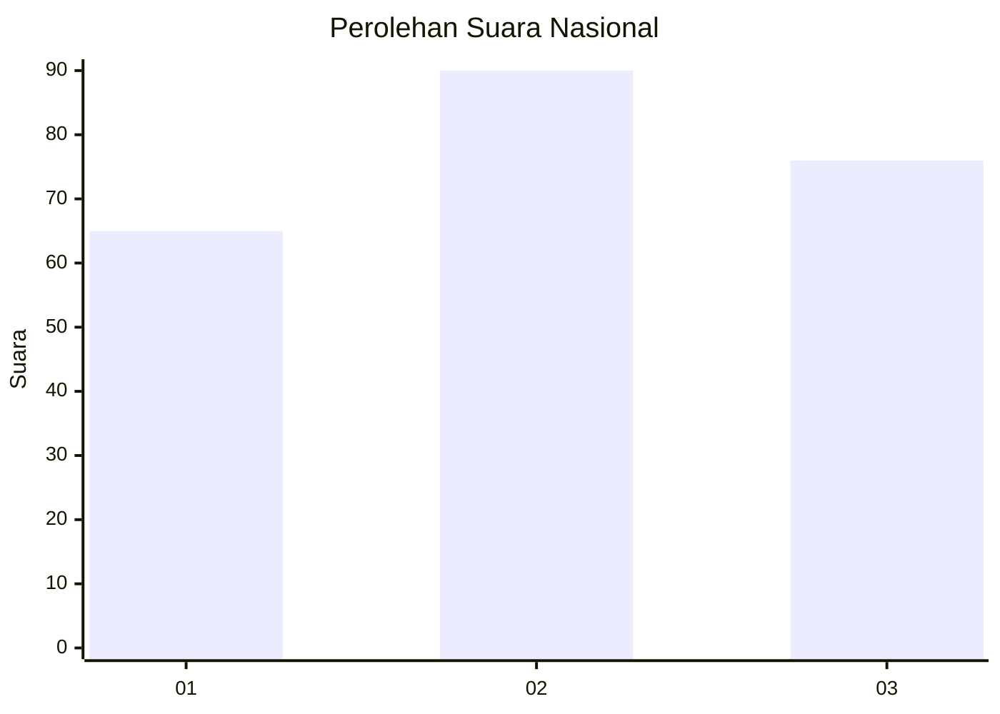
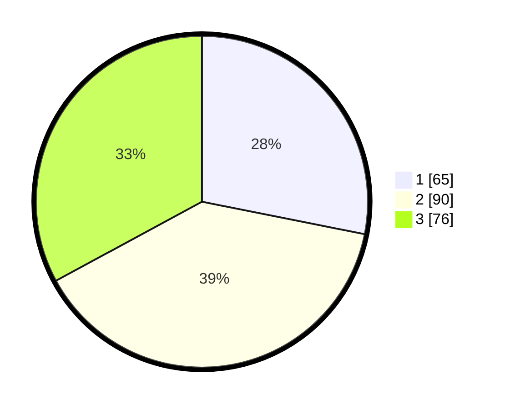

# Hasil

## Grafik

## Tabel

| No. | Nama Paslon    | Suara | Suara (raw) | Persentase |
|:--- |:-------------- | -----:| -----------:| ----------:|
| 1   | ANIES MUHAIMIN | 65    | [65][p-1]   | 28,14      |
| 2   | PRABOWO GIBRAN | 90    | [90][p-2]   | 38,96      |
| 3   | GANJAR MAHFUD  | 76    | [76][p-3]   | 32,90      |

[p-1]: https://github.com/gigit-pemilu/pemilu-2024/blob/main/pilpres/hitung-suara/sub/34-di-yogyakarta/sub/01-kulon-progo/sub/02-wates/sub/2007-giripeni/sub/011-tps/sub/paslon-1.txt
[p-2]: https://github.com/gigit-pemilu/pemilu-2024/blob/main/pilpres/hitung-suara/sub/34-di-yogyakarta/sub/01-kulon-progo/sub/02-wates/sub/2007-giripeni/sub/011-tps/sub/paslon-2.txt
[p-3]: https://github.com/gigit-pemilu/pemilu-2024/blob/main/pilpres/hitung-suara/sub/34-di-yogyakarta/sub/01-kulon-progo/sub/02-wates/sub/2007-giripeni/sub/011-tps/sub/paslon-3.txt

## Foto C Plano

https://sirekap-obj-formc.kpu.go.id/46d4/pemilu/ppwp/34/01/02/20/07/3401022007011-20240214-230720--583c8a29-9fb4-402b-a48b-389bd18c09e0.jpg

https://sirekap-obj-formc.kpu.go.id/46d4/pemilu/ppwp/34/01/02/20/07/3401022007011-20240214-230914--ce0bfd94-06f3-47f3-8edc-ac2112eceb7c.jpg

https://sirekap-obj-formc.kpu.go.id/46d4/pemilu/ppwp/34/01/02/20/07/3401022007011-20240214-231324--c138e888-6fbb-4f96-a874-8a32d5487a59.jpg

## Metadata

| Key        | Value               |
| ---------- | ------------------- |
| Time Stamp | 2024-02-24 22:31:28 |

