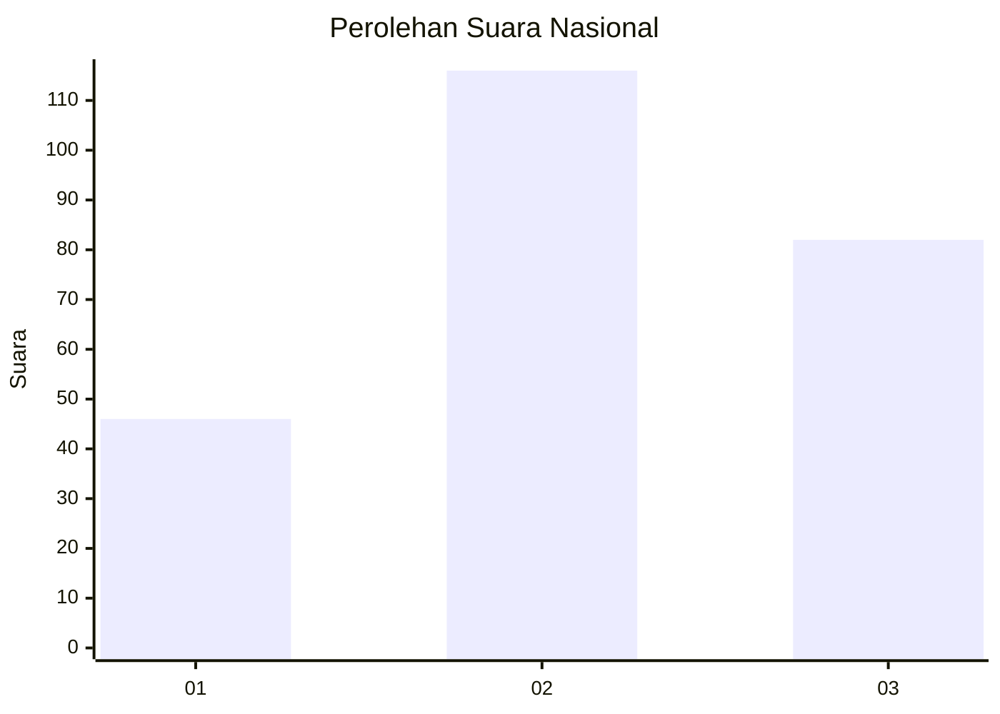
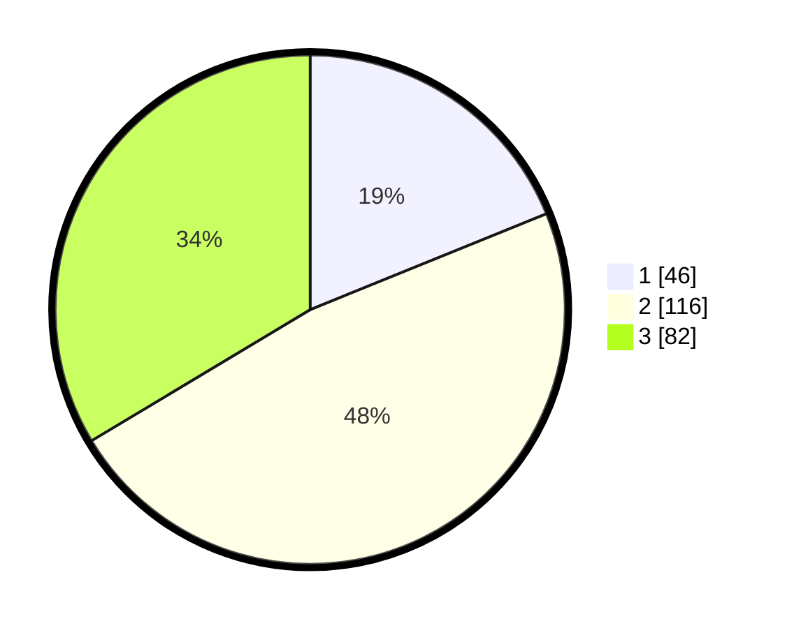

# Hasil

## Grafik

## Tabel

| No. | Nama Paslon    | Suara | Suara (raw) | Persentase |
|:--- |:-------------- | -----:| -----------:| ----------:|
| 1   | ANIES MUHAIMIN | 46    | [46][p-1]   | 18,85      |
| 2   | PRABOWO GIBRAN | 116   | [116][p-2]  | 47,54      |
| 3   | GANJAR MAHFUD  | 82    | [82][p-3]   | 33,61      |

[p-1]: https://github.com/gigit-pemilu/pemilu-2024/blob/main/pilpres/hitung-suara/sub/34-di-yogyakarta/sub/01-kulon-progo/sub/02-wates/sub/2007-giripeni/sub/018-tps/sub/paslon-1.txt
[p-2]: https://github.com/gigit-pemilu/pemilu-2024/blob/main/pilpres/hitung-suara/sub/34-di-yogyakarta/sub/01-kulon-progo/sub/02-wates/sub/2007-giripeni/sub/018-tps/sub/paslon-2.txt
[p-3]: https://github.com/gigit-pemilu/pemilu-2024/blob/main/pilpres/hitung-suara/sub/34-di-yogyakarta/sub/01-kulon-progo/sub/02-wates/sub/2007-giripeni/sub/018-tps/sub/paslon-3.txt

## Foto C Plano

https://sirekap-obj-formc.kpu.go.id/74f5/pemilu/ppwp/34/01/02/20/07/3401022007018-20240215-030243--0521a35a-6c0b-4bc3-954b-a2e9297e4dd9.jpg

https://sirekap-obj-formc.kpu.go.id/74f5/pemilu/ppwp/34/01/02/20/07/3401022007018-20240215-030354--70afaf16-4cbe-46a4-bf45-fd3de2a4ea79.jpg

https://sirekap-obj-formc.kpu.go.id/74f5/pemilu/ppwp/34/01/02/20/07/3401022007018-20240215-030332--a85e8dac-5510-4078-929e-34bab45534ba.jpg

## Metadata

| Key        | Value               |
| ---------- | ------------------- |
| Time Stamp | 2024-02-15 18:30:25 |

