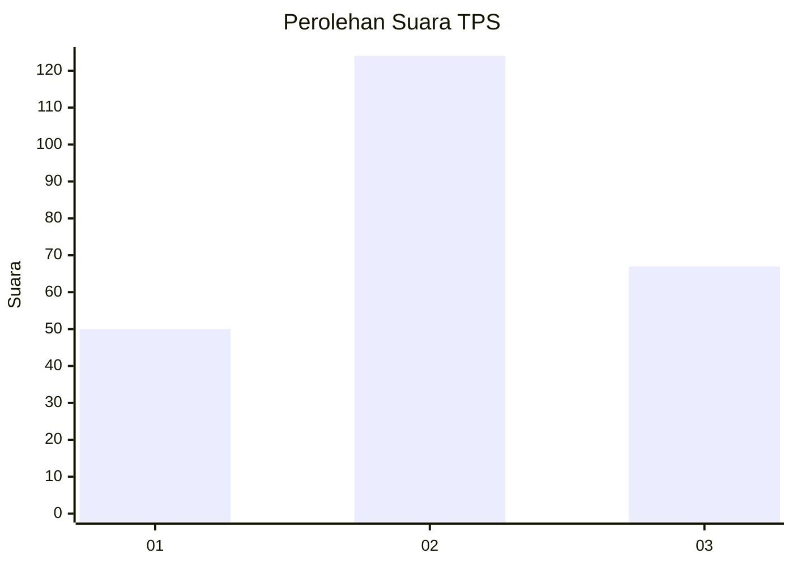
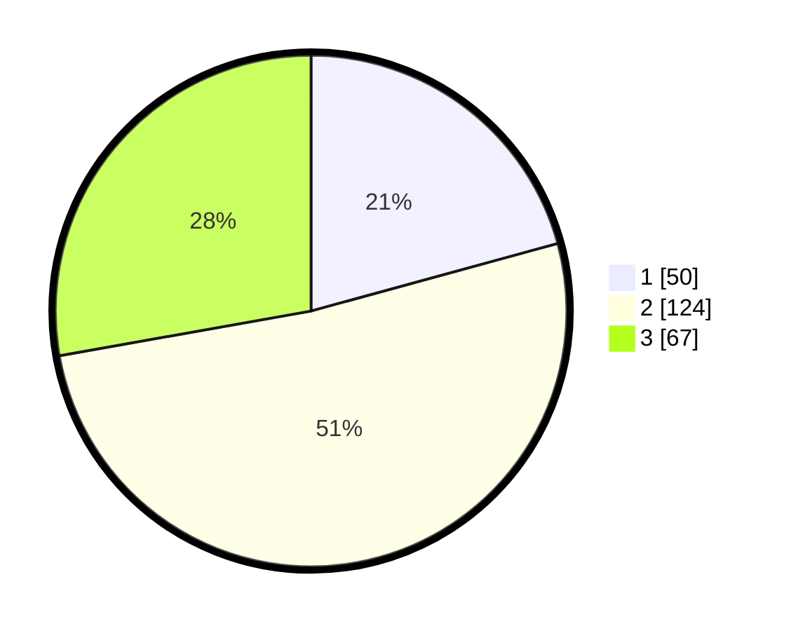

# Hasil

## Grafik

## Tabel

| No. | Nama Paslon    | Suara | Suara (raw) | Persentase |
|:--- |:-------------- | -----:| -----------:| ----------:|
| 1   | ANIES MUHAIMIN | 50    | [50][p-1]   | 20,75      |
| 2   | PRABOWO GIBRAN | 124   | [124][p-2]  | 51,45      |
| 3   | GANJAR MAHFUD  | 67    | [67][p-3]   | 27,80      |

[p-1]: https://github.com/gigit-pemilu/pemilu-2024-34-di-yogyakarta/blob/main/pilpres/hitung-suara/sub/34-di-yogyakarta/sub/01-kulon-progo/sub/02-wates/sub/2007-giripeni/sub/019-tps/sub/paslon-1.txt
[p-2]: https://github.com/gigit-pemilu/pemilu-2024-34-di-yogyakarta/blob/main/pilpres/hitung-suara/sub/34-di-yogyakarta/sub/01-kulon-progo/sub/02-wates/sub/2007-giripeni/sub/019-tps/sub/paslon-2.txt
[p-3]: https://github.com/gigit-pemilu/pemilu-2024-34-di-yogyakarta/blob/main/pilpres/hitung-suara/sub/34-di-yogyakarta/sub/01-kulon-progo/sub/02-wates/sub/2007-giripeni/sub/019-tps/sub/paslon-3.txt

## Foto C Plano

https://sirekap-obj-formc.kpu.go.id/cf25/pemilu/ppwp/34/01/02/20/07/3401022007019-20240215-035203--d44e0d4b-c3e1-47a1-9a8d-da64662bd38f.jpg

https://sirekap-obj-formc.kpu.go.id/cf25/pemilu/ppwp/34/01/02/20/07/3401022007019-20240215-035235--371ff7ea-88cb-4092-8403-036878b559ff.jpg

https://sirekap-obj-formc.kpu.go.id/cf25/pemilu/ppwp/34/01/02/20/07/3401022007019-20240215-035257--9e2b94d1-c940-4a51-9106-c16155b0c30d.jpg

## Metadata

| Key        | Value               |
| ---------- | ------------------- |
| Time Stamp | 2024-02-15 18:30:25 |

