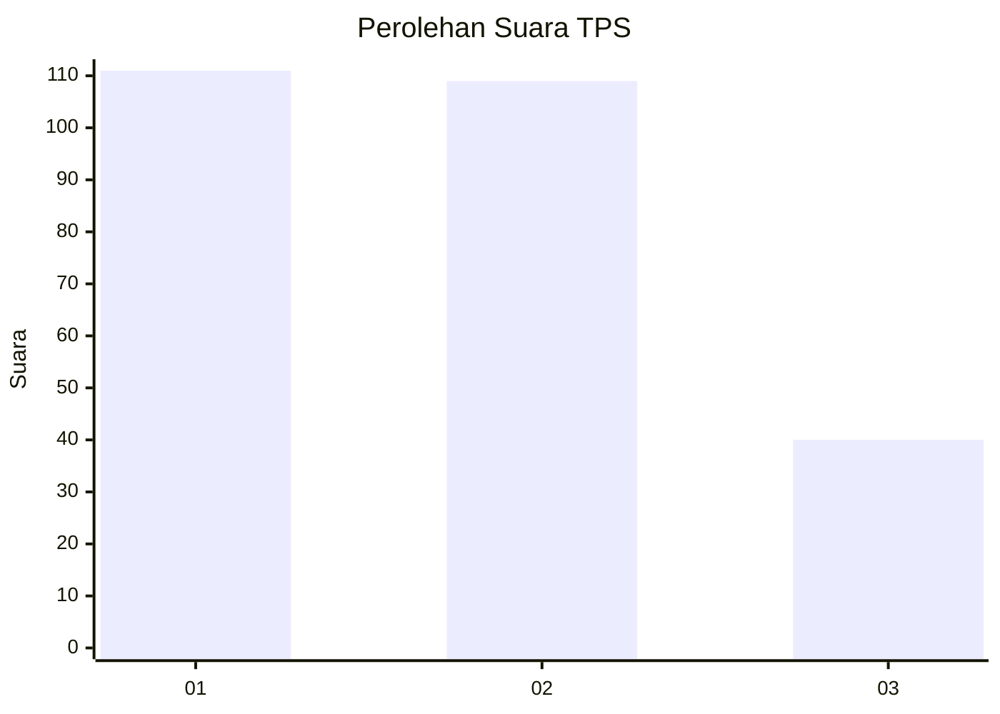
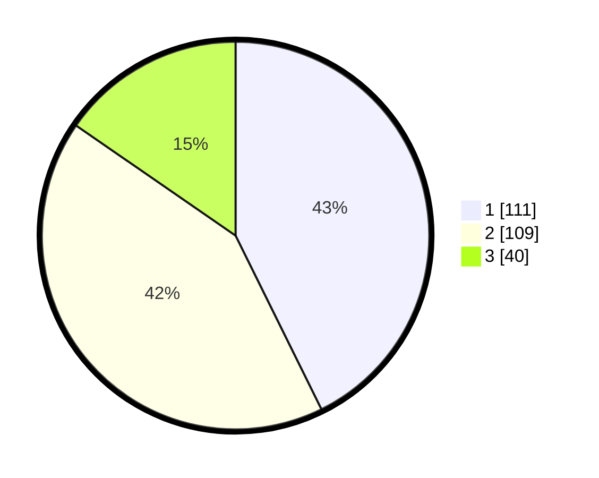

# Hasil

## Grafik

## Tabel

| No. | Nama Paslon    | Suara | Suara (raw) | Persentase |
|:--- |:-------------- | -----:| -----------:| ----------:|
| 1   | ANIES MUHAIMIN | 111   | [111][p-1]  | 42,69      |
| 2   | PRABOWO GIBRAN | 109   | [109][p-2]  | 41,92      |
| 3   | GANJAR MAHFUD  | 40    | [40][p-3]   | 15,38      |

[p-1]: https://github.com/gigit-pemilu/pemilu-2024-34-di-yogyakarta/blob/main/pilpres/hitung-suara/sub/34-di-yogyakarta/sub/01-kulon-progo/sub/02-wates/sub/2007-giripeni/sub/021-tps/sub/paslon-1.txt
[p-2]: https://github.com/gigit-pemilu/pemilu-2024-34-di-yogyakarta/blob/main/pilpres/hitung-suara/sub/34-di-yogyakarta/sub/01-kulon-progo/sub/02-wates/sub/2007-giripeni/sub/021-tps/sub/paslon-2.txt
[p-3]: https://github.com/gigit-pemilu/pemilu-2024-34-di-yogyakarta/blob/main/pilpres/hitung-suara/sub/34-di-yogyakarta/sub/01-kulon-progo/sub/02-wates/sub/2007-giripeni/sub/021-tps/sub/paslon-3.txt

## Foto C Plano

https://sirekap-obj-formc.kpu.go.id/ae9e/pemilu/ppwp/34/01/02/20/07/3401022007021-20240216-124824--bfbfbd83-fd37-429b-b6d9-b9b6d0b0eed6.jpg

https://sirekap-obj-formc.kpu.go.id/ae9e/pemilu/ppwp/34/01/02/20/07/3401022007021-20240216-124828--14e10c6e-c79c-412c-8f8d-34d5fb8961db.jpg

https://sirekap-obj-formc.kpu.go.id/ae9e/pemilu/ppwp/34/01/02/20/07/3401022007021-20240216-124826--ba98ca8b-02f7-4995-8909-72cbc70cd67d.jpg

## Metadata

| Key        | Value               |
| ---------- | ------------------- |
| Time Stamp | 2024-02-19 06:16:00 |

## DATA PEMILIH TETAP

Jumlah pemilih dalam DPT: **297**.
 * L: **149**.
 * P: **148**.

## DATA PENGGUNA HAK PILIH

Jumlah pengguna hak pilih dalam DPT: **258**.
 * L: **130**.
 * P: **128**.

Jumlah pengguna hak pilih dalam DPTb: **7**.
 * L: **1**.
 * P: **6**.

Jumlah pengguna hak pilih dalam DPK: **0**.
 * L: **0**.
 * P: **0**.

Jumlah pengguna hak pilih: **265**.
 * L: **131**.
 * P: **134**.

## JUMLAH SUARA SAH DAN TIDAK SAH

JUMLAH SELURUH SUARA SAH: **260**.

JUMLAH SUARA TIDAK SAH: **5**.

JUMLAH SELURUH SUARA SAH DAN SUARA TIDAK SAH: **265**.

