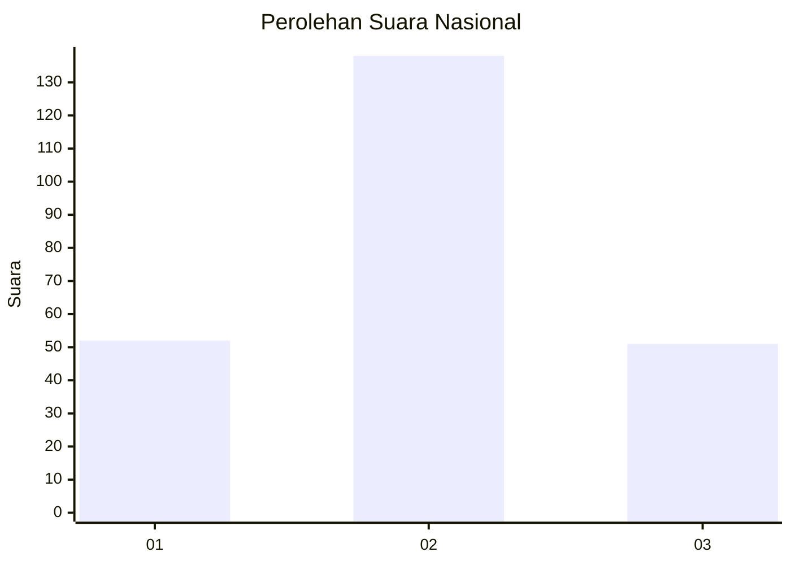
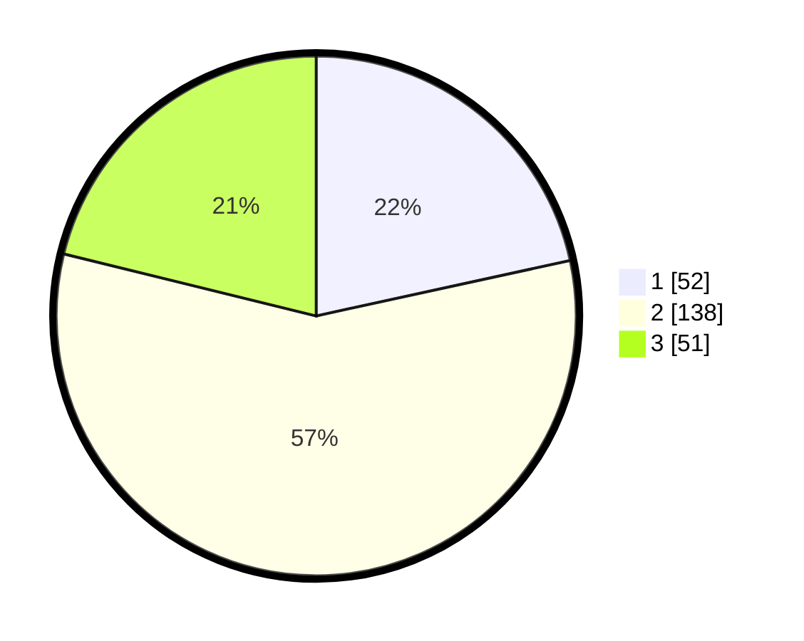

# Hasil

## Grafik

## Tabel

| No. | Nama Paslon    | Suara | Suara (raw) | Persentase |
|:--- |:-------------- | -----:| -----------:| ----------:|
| 1   | ANIES MUHAIMIN | 52    | [52][p-1]   | 21,58      |
| 2   | PRABOWO GIBRAN | 138   | [138][p-2]  | 57,26      |
| 3   | GANJAR MAHFUD  | 51    | [51][p-3]   | 21,16      |

[p-1]: https://github.com/gigit-pemilu/pemilu-2024/blob/main/pilpres/hitung-suara/sub/34-di-yogyakarta/sub/01-kulon-progo/sub/02-wates/sub/2007-giripeni/sub/022-tps/sub/paslon-1.txt
[p-2]: https://github.com/gigit-pemilu/pemilu-2024/blob/main/pilpres/hitung-suara/sub/34-di-yogyakarta/sub/01-kulon-progo/sub/02-wates/sub/2007-giripeni/sub/022-tps/sub/paslon-2.txt
[p-3]: https://github.com/gigit-pemilu/pemilu-2024/blob/main/pilpres/hitung-suara/sub/34-di-yogyakarta/sub/01-kulon-progo/sub/02-wates/sub/2007-giripeni/sub/022-tps/sub/paslon-3.txt

## Foto C Plano

https://sirekap-obj-formc.kpu.go.id/5c53/pemilu/ppwp/34/01/02/20/07/3401022007022-20240215-023517--56ac648c-88c4-4281-8ec2-89a5a805199c.jpg

https://sirekap-obj-formc.kpu.go.id/5c53/pemilu/ppwp/34/01/02/20/07/3401022007022-20240214-155042--0d5c9541-e6fe-4bf7-b1b2-480c31f0da9b.jpg

https://sirekap-obj-formc.kpu.go.id/5c53/pemilu/ppwp/34/01/02/20/07/3401022007022-20240215-023733--b8338cfd-6c21-4c83-b09a-5d4779292c22.jpg

## Metadata

| Key        | Value               |
| ---------- | ------------------- |
| Time Stamp | 2024-02-15 18:30:25 |

