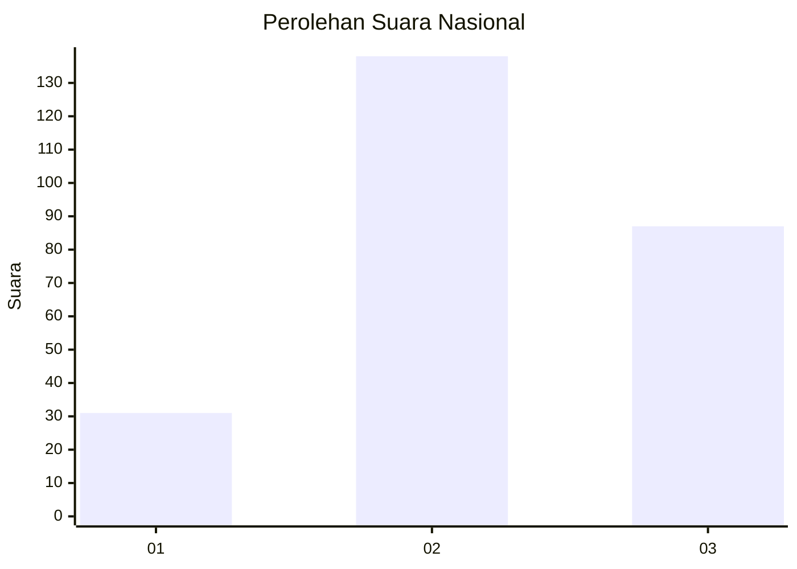
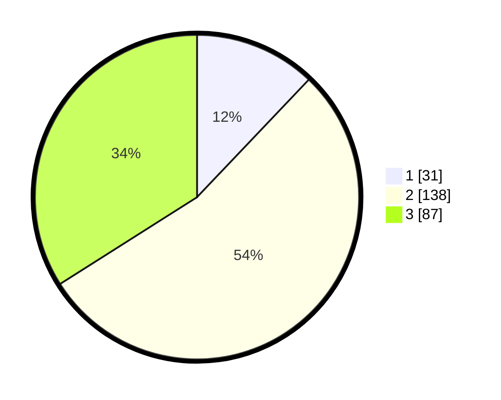

# Hasil

## Grafik

## Tabel

| No. | Nama Paslon    | Suara | Suara (raw) | Persentase |
|:--- |:-------------- | -----:| -----------:| ----------:|
| 1   | ANIES MUHAIMIN | 31    | [31][p-1]   | 12,11      |
| 2   | PRABOWO GIBRAN | 138   | [138][p-2]  | 53,91      |
| 3   | GANJAR MAHFUD  | 87    | [87][p-3]   | 33,98      |

[p-1]: https://github.com/gigit-pemilu/pemilu-2024/blob/main/pilpres/hitung-suara/sub/34-di-yogyakarta/sub/01-kulon-progo/sub/02-wates/sub/2007-giripeni/sub/023-tps/sub/paslon-1.txt
[p-2]: https://github.com/gigit-pemilu/pemilu-2024/blob/main/pilpres/hitung-suara/sub/34-di-yogyakarta/sub/01-kulon-progo/sub/02-wates/sub/2007-giripeni/sub/023-tps/sub/paslon-2.txt
[p-3]: https://github.com/gigit-pemilu/pemilu-2024/blob/main/pilpres/hitung-suara/sub/34-di-yogyakarta/sub/01-kulon-progo/sub/02-wates/sub/2007-giripeni/sub/023-tps/sub/paslon-3.txt

## Foto C Plano

https://sirekap-obj-formc.kpu.go.id/2265/pemilu/ppwp/34/01/02/20/07/3401022007023-20240215-000325--e3215602-5e10-4d94-8a2b-396f32ea3010.jpg

https://sirekap-obj-formc.kpu.go.id/2265/pemilu/ppwp/34/01/02/20/07/3401022007023-20240215-000600--31c4bfba-982d-4f9f-b188-ba29e5ba3d45.jpg

https://sirekap-obj-formc.kpu.go.id/2265/pemilu/ppwp/34/01/02/20/07/3401022007023-20240215-000634--ae816aee-002c-4be6-951e-3ba285bb216a.jpg

## Metadata

| Key        | Value               |
| ---------- | ------------------- |
| Time Stamp | 2024-02-25 17:00:00 |

