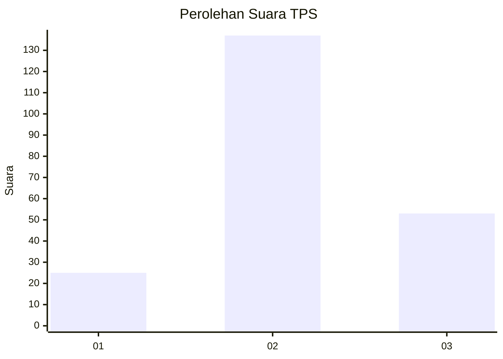
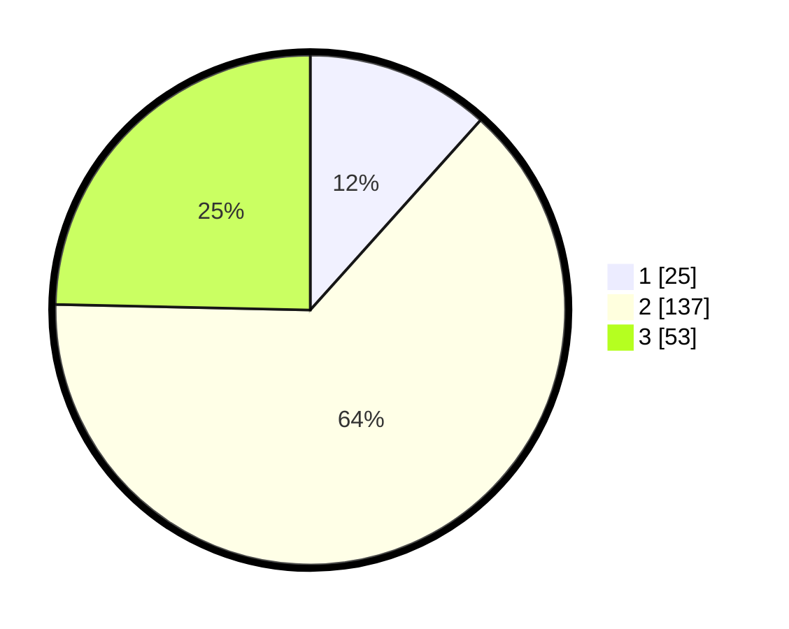

# Hasil

## Grafik

## Tabel

| No. | Nama Paslon    | Suara | Suara (raw) | Persentase |
|:--- |:-------------- | -----:| -----------:| ----------:|
| 1   | ANIES MUHAIMIN | 25    | [25][p-1]   | 11,63      |
| 2   | PRABOWO GIBRAN | 137   | [137][p-2]  | 63,72      |
| 3   | GANJAR MAHFUD  | 53    | [53][p-3]   | 24,65      |

[p-1]: https://github.com/gigit-pemilu/pemilu-2024-34-di-yogyakarta/blob/main/pilpres/hitung-suara/sub/34-di-yogyakarta/sub/01-kulon-progo/sub/03-panjatan/sub/2001-garongan/sub/002-tps/sub/paslon-1.txt
[p-2]: https://github.com/gigit-pemilu/pemilu-2024-34-di-yogyakarta/blob/main/pilpres/hitung-suara/sub/34-di-yogyakarta/sub/01-kulon-progo/sub/03-panjatan/sub/2001-garongan/sub/002-tps/sub/paslon-2.txt
[p-3]: https://github.com/gigit-pemilu/pemilu-2024-34-di-yogyakarta/blob/main/pilpres/hitung-suara/sub/34-di-yogyakarta/sub/01-kulon-progo/sub/03-panjatan/sub/2001-garongan/sub/002-tps/sub/paslon-3.txt

## Foto C Plano

https://sirekap-obj-formc.kpu.go.id/042c/pemilu/ppwp/34/01/03/20/01/3401032001002-20240215-131643--2ea73e39-97c8-4f9f-98b7-be1dd36c25df.jpg

https://sirekap-obj-formc.kpu.go.id/042c/pemilu/ppwp/34/01/03/20/01/3401032001002-20240215-131715--d13e7740-0351-416a-ad7f-58fc380a42e0.jpg

https://sirekap-obj-formc.kpu.go.id/042c/pemilu/ppwp/34/01/03/20/01/3401032001002-20240215-131944--64727258-9c4e-48fa-80c0-a72e1739f779.jpg

## Metadata

| Key        | Value               |
| ---------- | ------------------- |
| Time Stamp | 2024-02-16 10:30:29 |

## DATA PEMILIH TETAP

Jumlah pemilih dalam DPT: **248**.
 * L: **125**.
 * P: **123**.

## DATA PENGGUNA HAK PILIH

Jumlah pengguna hak pilih dalam DPT: **223**.
 * L: **112**.
 * P: **111**.

Jumlah pengguna hak pilih dalam DPTb: **2**.
 * L: **2**.
 * P: **0**.

Jumlah pengguna hak pilih dalam DPK: **4**.
 * L: **2**.
 * P: **2**.

Jumlah pengguna hak pilih: **229**.
 * L: **116**.
 * P: **113**.

## JUMLAH SUARA SAH DAN TIDAK SAH

JUMLAH SELURUH SUARA SAH: **215**.

JUMLAH SUARA TIDAK SAH: **14**.

JUMLAH SELURUH SUARA SAH DAN SUARA TIDAK SAH: **229**.

