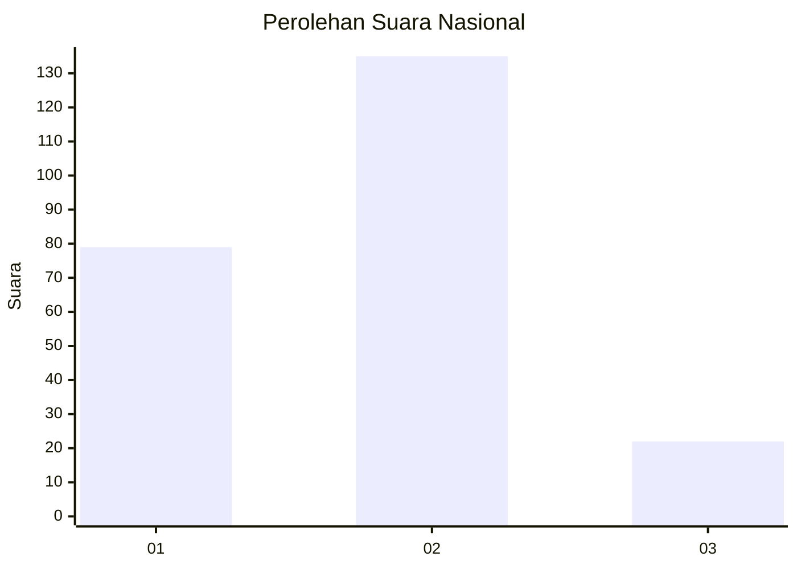
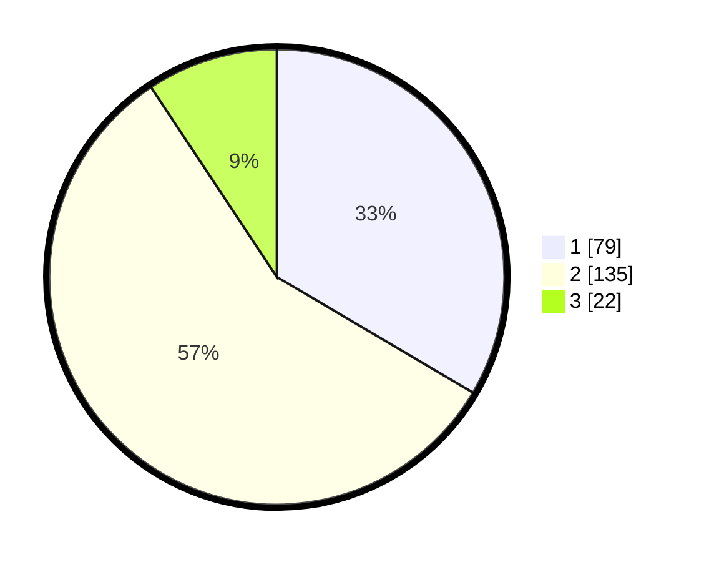

# Hasil

## Grafik

## Tabel

| No. | Nama Paslon    | Suara | Suara (raw) | Persentase |
|:--- |:-------------- | -----:| -----------:| ----------:|
| 1   | ANIES MUHAIMIN | 79    | [79][p-1]   | 33,47      |
| 2   | PRABOWO GIBRAN | 135   | [135][p-2]  | 57,20      |
| 3   | GANJAR MAHFUD  | 22    | [22][p-3]   | 9,32       |

[p-1]: https://github.com/gigit-pemilu/pemilu-2024/blob/main/pilpres/hitung-suara/sub/34-di-yogyakarta/sub/01-kulon-progo/sub/03-panjatan/sub/2001-garongan/sub/006-tps/sub/paslon-1.txt
[p-2]: https://github.com/gigit-pemilu/pemilu-2024/blob/main/pilpres/hitung-suara/sub/34-di-yogyakarta/sub/01-kulon-progo/sub/03-panjatan/sub/2001-garongan/sub/006-tps/sub/paslon-2.txt
[p-3]: https://github.com/gigit-pemilu/pemilu-2024/blob/main/pilpres/hitung-suara/sub/34-di-yogyakarta/sub/01-kulon-progo/sub/03-panjatan/sub/2001-garongan/sub/006-tps/sub/paslon-3.txt

## Foto C Plano

https://sirekap-obj-formc.kpu.go.id/e4b1/pemilu/ppwp/34/01/03/20/01/3401032001006-20240215-143604--c1193b46-1291-4bbc-92ce-34eec7b59e85.jpg

https://sirekap-obj-formc.kpu.go.id/e4b1/pemilu/ppwp/34/01/03/20/01/3401032001006-20240216-013756--d55df25e-3c3a-4fe7-9bca-94d3df88e979.jpg

https://sirekap-obj-formc.kpu.go.id/e4b1/pemilu/ppwp/34/01/03/20/01/3401032001006-20240216-013755--215899f8-86fd-4db7-9ca6-fb3071149f44.jpg

## Metadata

| Key        | Value               |
| ---------- | ------------------- |
| Time Stamp | 2024-02-16 09:00:28 |

## DATA PEMILIH TETAP

Jumlah pemilih dalam DPT: **265**.
 * L: **137**.
 * P: **128**.

## DATA PENGGUNA HAK PILIH

Jumlah pengguna hak pilih dalam DPT: **235**.
 * L: **122**.
 * P: **113**.

Jumlah pengguna hak pilih dalam DPTb: **2**.
 * L: **1**.
 * P: **1**.

Jumlah pengguna hak pilih dalam DPK: **1**.
 * L: **1**.
 * P: **0**.

Jumlah pengguna hak pilih: **238**.
 * L: **124**.
 * P: **114**.

## JUMLAH SUARA SAH DAN TIDAK SAH

JUMLAH SELURUH SUARA SAH: **236**.

JUMLAH SUARA TIDAK SAH: **2**.

JUMLAH SELURUH SUARA SAH DAN SUARA TIDAK SAH: **238**.

