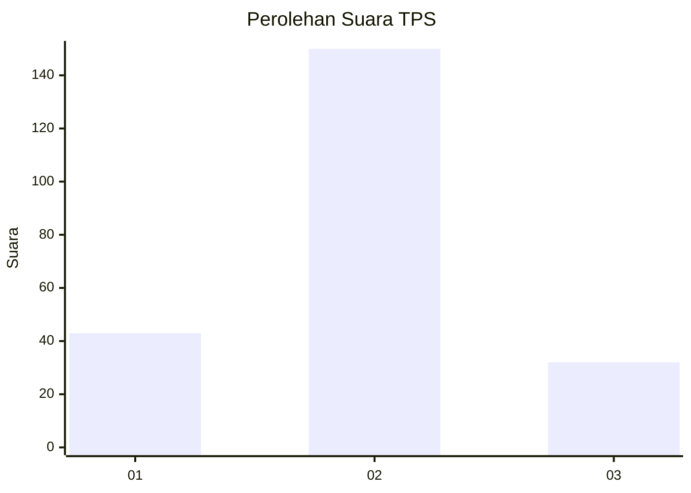
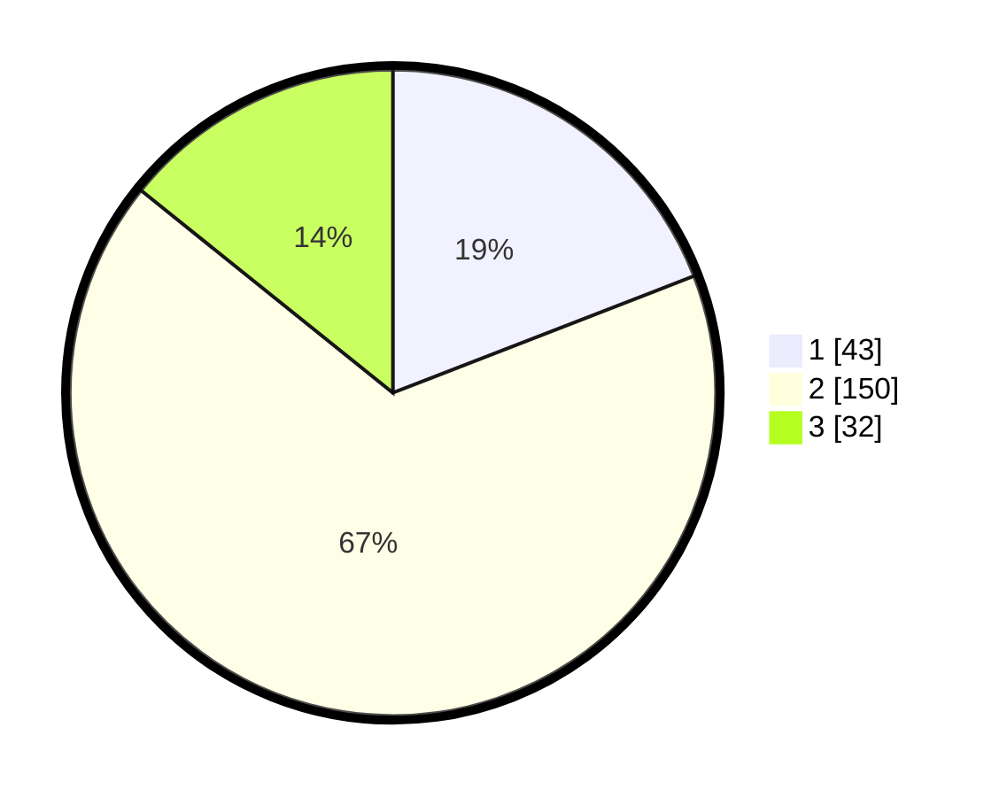

# Hasil

## Grafik

## Tabel

| No. | Nama Paslon    | Suara | Suara (raw) | Persentase |
|:--- |:-------------- | -----:| -----------:| ----------:|
| 1   | ANIES MUHAIMIN | 43    | [43][p-1]   | 19,11      |
| 2   | PRABOWO GIBRAN | 150   | [150][p-2]  | 66,67      |
| 3   | GANJAR MAHFUD  | 32    | [32][p-3]   | 14,22      |

[p-1]: https://github.com/gigit-pemilu/pemilu-2024-34-di-yogyakarta/blob/main/pilpres/hitung-suara/sub/34-di-yogyakarta/sub/01-kulon-progo/sub/03-panjatan/sub/2001-garongan/sub/008-tps/sub/paslon-1.txt
[p-2]: https://github.com/gigit-pemilu/pemilu-2024-34-di-yogyakarta/blob/main/pilpres/hitung-suara/sub/34-di-yogyakarta/sub/01-kulon-progo/sub/03-panjatan/sub/2001-garongan/sub/008-tps/sub/paslon-2.txt
[p-3]: https://github.com/gigit-pemilu/pemilu-2024-34-di-yogyakarta/blob/main/pilpres/hitung-suara/sub/34-di-yogyakarta/sub/01-kulon-progo/sub/03-panjatan/sub/2001-garongan/sub/008-tps/sub/paslon-3.txt

## Foto C Plano

https://sirekap-obj-formc.kpu.go.id/62dc/pemilu/ppwp/34/01/03/20/01/3401032001008-20240215-010235--d5c31fbd-e87f-49e2-9807-c6911c332826.jpg

https://sirekap-obj-formc.kpu.go.id/62dc/pemilu/ppwp/34/01/03/20/01/3401032001008-20240215-010817--1038803e-29c9-4ba8-a516-6a2cb6e3830d.jpg

https://sirekap-obj-formc.kpu.go.id/62dc/pemilu/ppwp/34/01/03/20/01/3401032001008-20240215-012247--c37d1ad8-2f1d-4a1d-bba5-8a796d74eb0f.jpg

## Metadata

| Key        | Value               |
| ---------- | ------------------- |
| Time Stamp | 2024-02-16 11:00:29 |

## DATA PEMILIH TETAP

Jumlah pemilih dalam DPT: **264**.
 * L: **125**.
 * P: **139**.

## DATA PENGGUNA HAK PILIH

Jumlah pengguna hak pilih dalam DPT: **233**.
 * L: **109**.
 * P: **124**.

Jumlah pengguna hak pilih dalam DPTb: **4**.
 * L: **4**.
 * P: **0**.

Jumlah pengguna hak pilih dalam DPK: **0**.
 * L: **0**.
 * P: **0**.

Jumlah pengguna hak pilih: **237**.
 * L: **113**.
 * P: **124**.

## JUMLAH SUARA SAH DAN TIDAK SAH

JUMLAH SELURUH SUARA SAH: **225**.

JUMLAH SUARA TIDAK SAH: **12**.

JUMLAH SELURUH SUARA SAH DAN SUARA TIDAK SAH: **237**.

