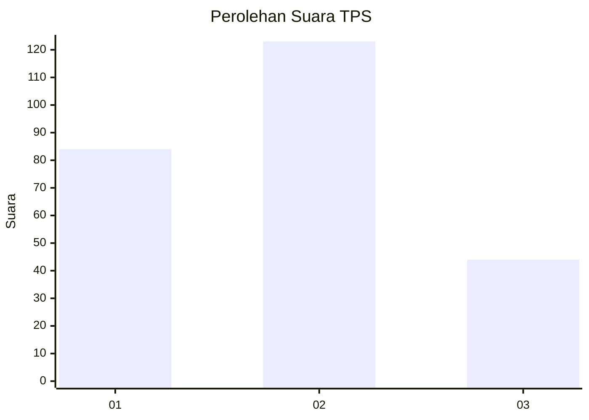
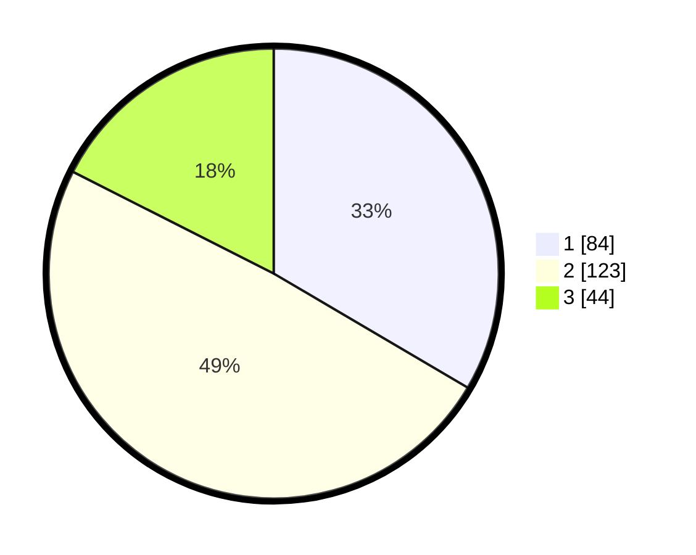

# Hasil

## Grafik

## Tabel

| No. | Nama Paslon    | Suara | Suara (raw) | Persentase |
|:--- |:-------------- | -----:| -----------:| ----------:|
| 1   | ANIES MUHAIMIN | 84    | [84][p-1]   | 33,47      |
| 2   | PRABOWO GIBRAN | 123   | [123][p-2]  | 49,00      |
| 3   | GANJAR MAHFUD  | 44    | [44][p-3]   | 17,53      |

[p-1]: https://github.com/gigit-pemilu/pemilu-2024-34-di-yogyakarta/blob/main/pilpres/hitung-suara/sub/34-di-yogyakarta/sub/01-kulon-progo/sub/03-panjatan/sub/2001-garongan/sub/009-tps/sub/paslon-1.txt
[p-2]: https://github.com/gigit-pemilu/pemilu-2024-34-di-yogyakarta/blob/main/pilpres/hitung-suara/sub/34-di-yogyakarta/sub/01-kulon-progo/sub/03-panjatan/sub/2001-garongan/sub/009-tps/sub/paslon-2.txt
[p-3]: https://github.com/gigit-pemilu/pemilu-2024-34-di-yogyakarta/blob/main/pilpres/hitung-suara/sub/34-di-yogyakarta/sub/01-kulon-progo/sub/03-panjatan/sub/2001-garongan/sub/009-tps/sub/paslon-3.txt

## Foto C Plano

https://sirekap-obj-formc.kpu.go.id/f108/pemilu/ppwp/34/01/03/20/01/3401032001009-20240220-084505--204f1104-d680-456d-a64a-a52e1aed1f66.jpg

https://sirekap-obj-formc.kpu.go.id/f108/pemilu/ppwp/34/01/03/20/01/3401032001009-20240220-084507--4f25c1ee-9c77-4690-ab9d-a8afbab27c64.jpg

https://sirekap-obj-formc.kpu.go.id/f108/pemilu/ppwp/34/01/03/20/01/3401032001009-20240220-084506--646cc8f5-2494-4120-8f9f-485c3a6eda71.jpg

## Metadata

| Key        | Value               |
| ---------- | ------------------- |
| Time Stamp | 2024-02-21 13:00:00 |

## DATA PEMILIH TETAP

Jumlah pemilih dalam DPT: **283**.
 * L: **136**.
 * P: **147**.

## DATA PENGGUNA HAK PILIH

Jumlah pengguna hak pilih dalam DPT: **245**.
 * L: **116**.
 * P: **129**.

Jumlah pengguna hak pilih dalam DPTb: **1**.
 * L: **1**.
 * P: **0**.

Jumlah pengguna hak pilih dalam DPK: **7**.
 * L: **2**.
 * P: **5**.

Jumlah pengguna hak pilih: **253**.
 * L: **119**.
 * P: **134**.

## JUMLAH SUARA SAH DAN TIDAK SAH

JUMLAH SELURUH SUARA SAH: **251**.

JUMLAH SUARA TIDAK SAH: **2**.

JUMLAH SELURUH SUARA SAH DAN SUARA TIDAK SAH: **253**.

