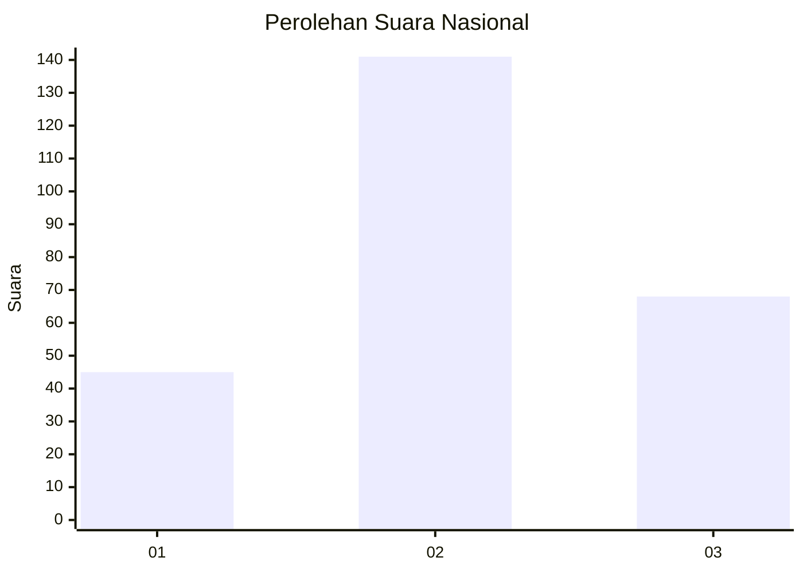
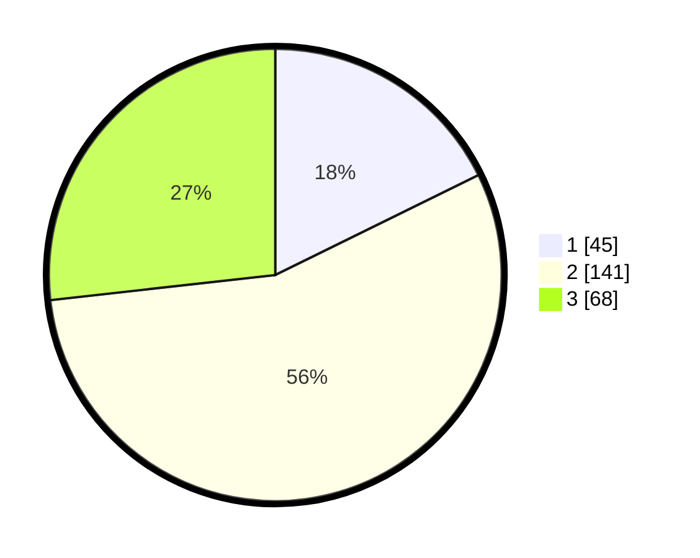

# Hasil

## Grafik

## Tabel

| No. | Nama Paslon    | Suara | Suara (raw) | Persentase |
|:--- |:-------------- | -----:| -----------:| ----------:|
| 1   | ANIES MUHAIMIN | 45    | [45][p-1]   | 17,72      |
| 2   | PRABOWO GIBRAN | 141   | [141][p-2]  | 55,51      |
| 3   | GANJAR MAHFUD  | 68    | [68][p-3]   | 26,77      |

[p-1]: https://github.com/gigit-pemilu/pemilu-2024/blob/main/pilpres/hitung-suara/sub/34-di-yogyakarta/sub/01-kulon-progo/sub/03-panjatan/sub/2005-depok/sub/007-tps/sub/paslon-1.txt
[p-2]: https://github.com/gigit-pemilu/pemilu-2024/blob/main/pilpres/hitung-suara/sub/34-di-yogyakarta/sub/01-kulon-progo/sub/03-panjatan/sub/2005-depok/sub/007-tps/sub/paslon-2.txt
[p-3]: https://github.com/gigit-pemilu/pemilu-2024/blob/main/pilpres/hitung-suara/sub/34-di-yogyakarta/sub/01-kulon-progo/sub/03-panjatan/sub/2005-depok/sub/007-tps/sub/paslon-3.txt

## Foto C Plano

https://sirekap-obj-formc.kpu.go.id/5b85/pemilu/ppwp/34/01/03/20/05/3401032005007-20240224-150954--d024b15a-bbf7-4dd1-8122-7f00980ab45a.jpg

https://sirekap-obj-formc.kpu.go.id/5b85/pemilu/ppwp/34/01/03/20/05/3401032005007-20240215-004722--9593b25e-2146-4caf-b1cb-43d7172fb53d.jpg

https://sirekap-obj-formc.kpu.go.id/5b85/pemilu/ppwp/34/01/03/20/05/3401032005007-20240215-003028--6afd3fc1-e110-4218-af6f-16ecd3b023fb.jpg

## Metadata

| Key        | Value               |
| ---------- | ------------------- |
| Time Stamp | 2024-02-24 22:31:28 |

