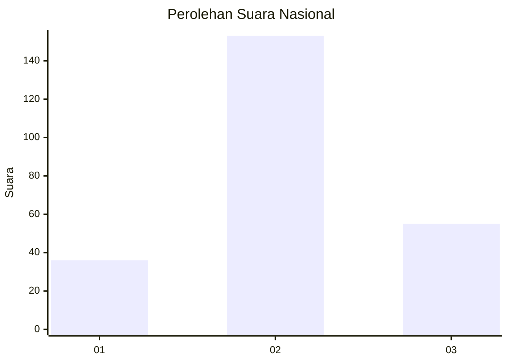
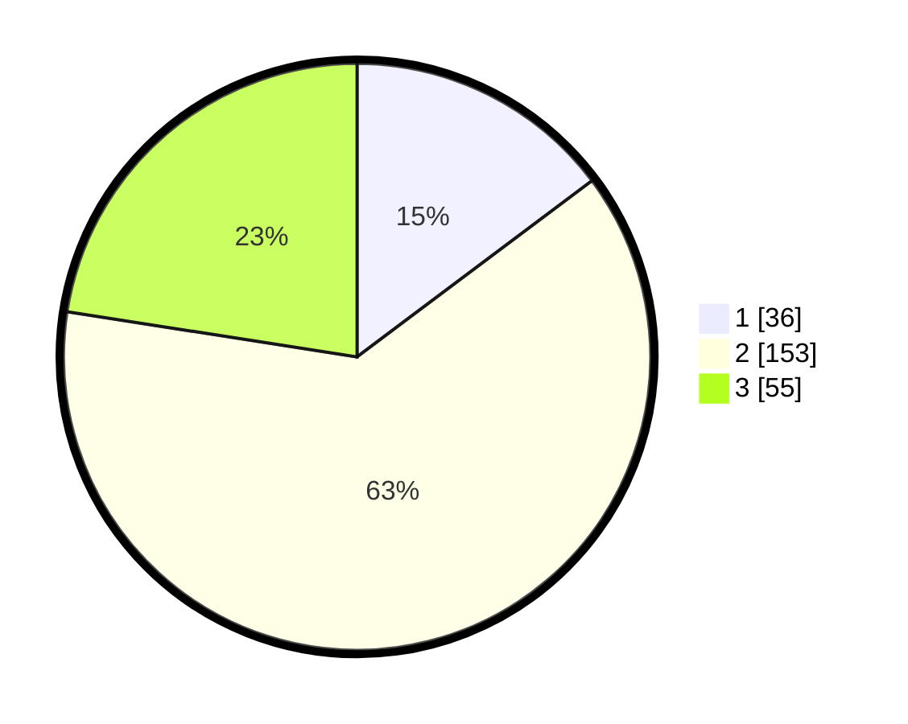

# Hasil

## Grafik

## Tabel

| No. | Nama Paslon    | Suara | Suara (raw) | Persentase |
|:--- |:-------------- | -----:| -----------:| ----------:|
| 1   | ANIES MUHAIMIN | 36    | [36][p-1]   | 14,75      |
| 2   | PRABOWO GIBRAN | 153   | [153][p-2]  | 62,70      |
| 3   | GANJAR MAHFUD  | 55    | [55][p-3]   | 22,54      |

[p-1]: https://github.com/gigit-pemilu/pemilu-2024/blob/main/pilpres/hitung-suara/sub/34-di-yogyakarta/sub/01-kulon-progo/sub/03-panjatan/sub/2005-depok/sub/009-tps/sub/paslon-1.txt
[p-2]: https://github.com/gigit-pemilu/pemilu-2024/blob/main/pilpres/hitung-suara/sub/34-di-yogyakarta/sub/01-kulon-progo/sub/03-panjatan/sub/2005-depok/sub/009-tps/sub/paslon-2.txt
[p-3]: https://github.com/gigit-pemilu/pemilu-2024/blob/main/pilpres/hitung-suara/sub/34-di-yogyakarta/sub/01-kulon-progo/sub/03-panjatan/sub/2005-depok/sub/009-tps/sub/paslon-3.txt

## Foto C Plano

https://sirekap-obj-formc.kpu.go.id/50c1/pemilu/ppwp/34/01/03/20/05/3401032005009-20240215-005549--d71ed0b0-bc1e-46aa-ac35-121a59f42d10.jpg

https://sirekap-obj-formc.kpu.go.id/50c1/pemilu/ppwp/34/01/03/20/05/3401032005009-20240215-005643--9180f62c-c2b4-4eed-9c4c-24e2f51a051c.jpg

https://sirekap-obj-formc.kpu.go.id/50c1/pemilu/ppwp/34/01/03/20/05/3401032005009-20240215-005851--4aa19e15-1f20-4480-847d-ad4b72c3c1e8.jpg

## Metadata

| Key        | Value               |
| ---------- | ------------------- |
| Time Stamp | 2024-02-15 15:00:29 |

