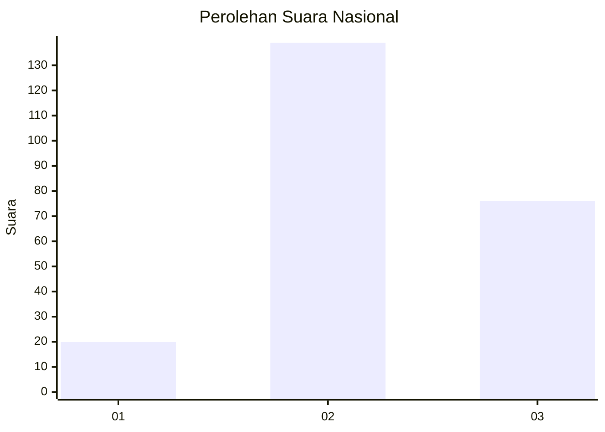
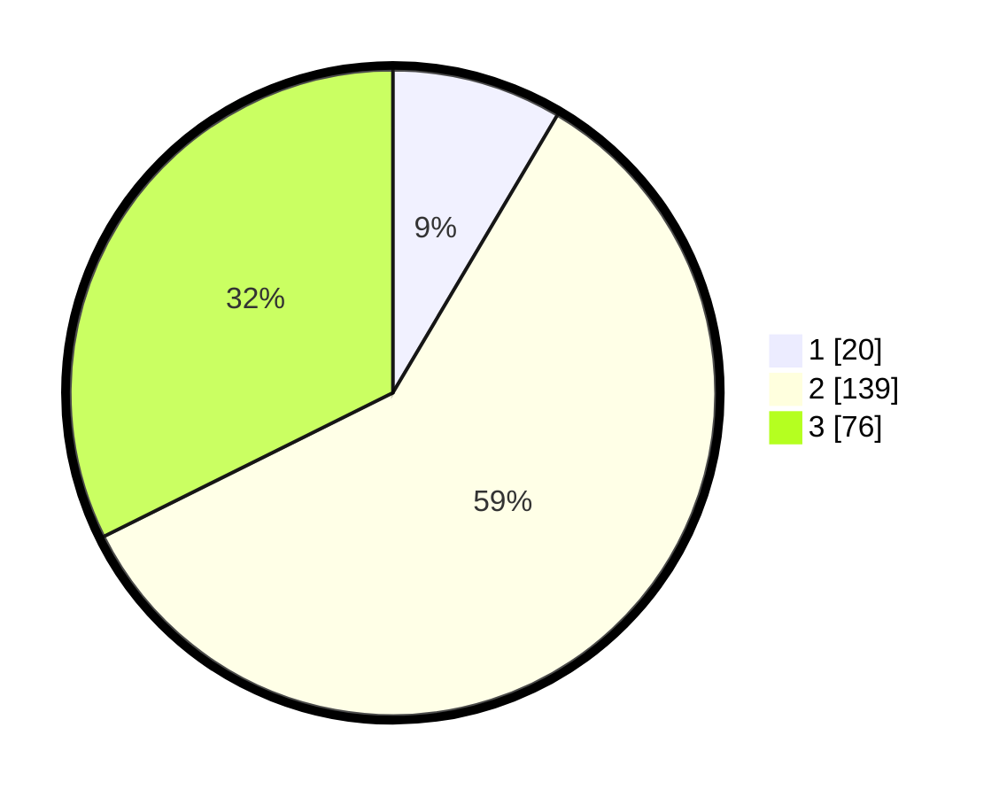

# Hasil

## Grafik

## Tabel

| No. | Nama Paslon    | Suara | Suara (raw) | Persentase |
|:--- |:-------------- | -----:| -----------:| ----------:|
| 1   | ANIES MUHAIMIN | 20    | [20][p-1]   | 8,51       |
| 2   | PRABOWO GIBRAN | 139   | [139][p-2]  | 59,15      |
| 3   | GANJAR MAHFUD  | 76    | [76][p-3]   | 32,34      |

[p-1]: https://github.com/gigit-pemilu/pemilu-2024/blob/main/pilpres/hitung-suara/sub/34-di-yogyakarta/sub/01-kulon-progo/sub/03-panjatan/sub/2006-bojong/sub/008-tps/sub/paslon-1.txt
[p-2]: https://github.com/gigit-pemilu/pemilu-2024/blob/main/pilpres/hitung-suara/sub/34-di-yogyakarta/sub/01-kulon-progo/sub/03-panjatan/sub/2006-bojong/sub/008-tps/sub/paslon-2.txt
[p-3]: https://github.com/gigit-pemilu/pemilu-2024/blob/main/pilpres/hitung-suara/sub/34-di-yogyakarta/sub/01-kulon-progo/sub/03-panjatan/sub/2006-bojong/sub/008-tps/sub/paslon-3.txt

## Foto C Plano

https://sirekap-obj-formc.kpu.go.id/5922/pemilu/ppwp/34/01/03/20/06/3401032006008-20240214-230714--550d3722-687b-4c04-b2c8-187abcccbda9.jpg

https://sirekap-obj-formc.kpu.go.id/5922/pemilu/ppwp/34/01/03/20/06/3401032006008-20240214-230948--fd0854f9-0542-4b39-8aec-4293d9ee06a3.jpg

https://sirekap-obj-formc.kpu.go.id/5922/pemilu/ppwp/34/01/03/20/06/3401032006008-20240214-231216--6a38ad20-5285-466a-b892-b8ccc7c6b743.jpg

## Metadata

| Key        | Value               |
| ---------- | ------------------- |
| Time Stamp | 2024-02-15 21:01:18 |

