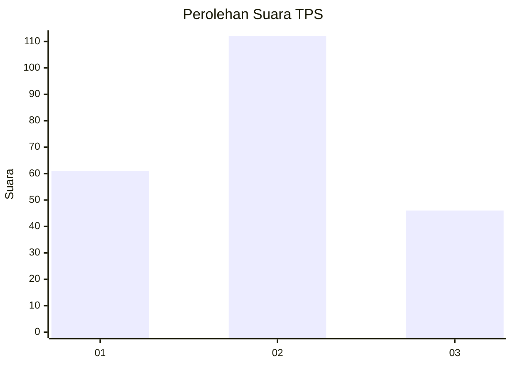
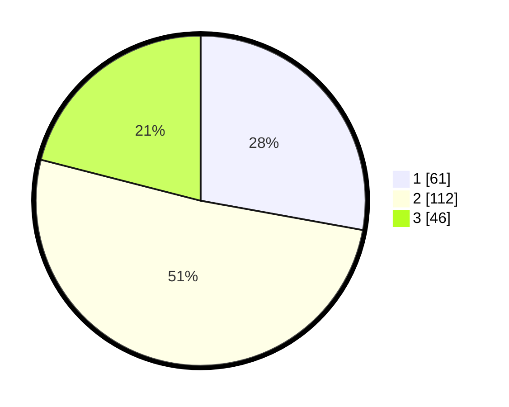

# Hasil

## Grafik

## Tabel

| No. | Nama Paslon    | Suara | Suara (raw) | Persentase |
|:--- |:-------------- | -----:| -----------:| ----------:|
| 1   | ANIES MUHAIMIN | 61    | [61][p-1]   | 27,85      |
| 2   | PRABOWO GIBRAN | 112   | [112][p-2]  | 51,14      |
| 3   | GANJAR MAHFUD  | 46    | [46][p-3]   | 21,00      |

[p-1]: https://github.com/gigit-pemilu/pemilu-2024-34-di-yogyakarta/blob/main/pilpres/hitung-suara/sub/34-di-yogyakarta/sub/01-kulon-progo/sub/03-panjatan/sub/2007-tayuban/sub/004-tps/sub/paslon-1.txt
[p-2]: https://github.com/gigit-pemilu/pemilu-2024-34-di-yogyakarta/blob/main/pilpres/hitung-suara/sub/34-di-yogyakarta/sub/01-kulon-progo/sub/03-panjatan/sub/2007-tayuban/sub/004-tps/sub/paslon-2.txt
[p-3]: https://github.com/gigit-pemilu/pemilu-2024-34-di-yogyakarta/blob/main/pilpres/hitung-suara/sub/34-di-yogyakarta/sub/01-kulon-progo/sub/03-panjatan/sub/2007-tayuban/sub/004-tps/sub/paslon-3.txt

## Foto C Plano

https://sirekap-obj-formc.kpu.go.id/dd14/pemilu/ppwp/34/01/03/20/07/3401032007004-20240215-022228--ba776666-aa0c-473d-9268-b50b59f12a1e.jpg

https://sirekap-obj-formc.kpu.go.id/dd14/pemilu/ppwp/34/01/03/20/07/3401032007004-20240215-022359--d9d214d9-5977-4f70-b017-47ed8e1f1b59.jpg

https://sirekap-obj-formc.kpu.go.id/dd14/pemilu/ppwp/34/01/03/20/07/3401032007004-20240215-022552--bdca8f6e-4bef-4610-8ad9-4b229e24d34b.jpg

## Metadata

| Key        | Value               |
| ---------- | ------------------- |
| Time Stamp | 2024-02-15 21:01:18 |

