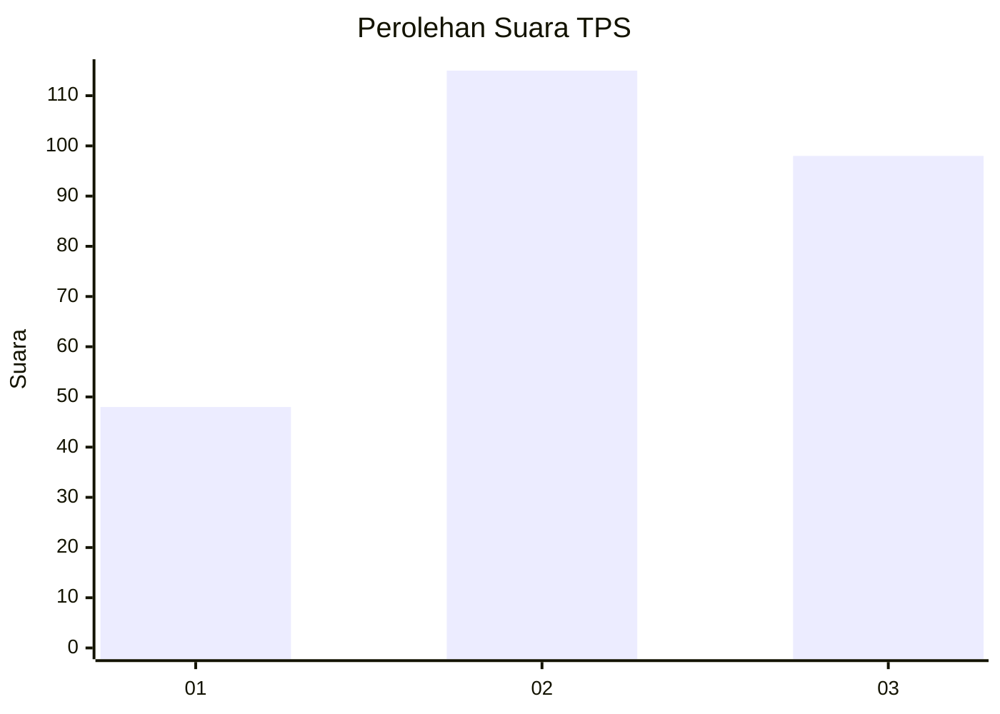
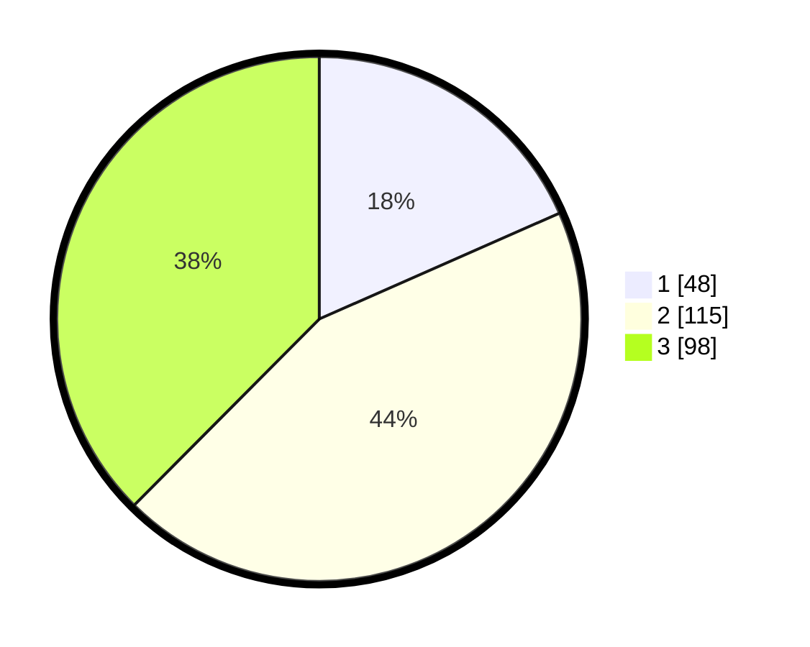

# Hasil

## Grafik

## Tabel

| No. | Nama Paslon    | Suara | Suara (raw) | Persentase |
|:--- |:-------------- | -----:| -----------:| ----------:|
| 1   | ANIES MUHAIMIN | 48    | [48][p-1]   | 18,39      |
| 2   | PRABOWO GIBRAN | 115   | [115][p-2]  | 44,06      |
| 3   | GANJAR MAHFUD  | 98    | [98][p-3]   | 37,55      |

[p-1]: https://github.com/gigit-pemilu/pemilu-2024-34-di-yogyakarta/blob/main/pilpres/hitung-suara/sub/34-di-yogyakarta/sub/01-kulon-progo/sub/03-panjatan/sub/2008-gotakan/sub/002-tps/sub/paslon-1.txt
[p-2]: https://github.com/gigit-pemilu/pemilu-2024-34-di-yogyakarta/blob/main/pilpres/hitung-suara/sub/34-di-yogyakarta/sub/01-kulon-progo/sub/03-panjatan/sub/2008-gotakan/sub/002-tps/sub/paslon-2.txt
[p-3]: https://github.com/gigit-pemilu/pemilu-2024-34-di-yogyakarta/blob/main/pilpres/hitung-suara/sub/34-di-yogyakarta/sub/01-kulon-progo/sub/03-panjatan/sub/2008-gotakan/sub/002-tps/sub/paslon-3.txt

## Foto C Plano

https://sirekap-obj-formc.kpu.go.id/585d/pemilu/ppwp/34/01/03/20/08/3401032008002-20240216-082633--464bce73-dddd-40bd-aacb-15632dc88bbd.jpg

https://sirekap-obj-formc.kpu.go.id/585d/pemilu/ppwp/34/01/03/20/08/3401032008002-20240216-082651--51995c8c-42e7-48d8-ba2a-1fca8e313a0b.jpg

https://sirekap-obj-formc.kpu.go.id/585d/pemilu/ppwp/34/01/03/20/08/3401032008002-20240216-082640--13470d40-1736-4e0b-b8b7-f61ae90dd96d.jpg

## Metadata

| Key        | Value               |
| ---------- | ------------------- |
| Time Stamp | 2024-02-16 10:00:28 |

## DATA PEMILIH TETAP

Jumlah pemilih dalam DPT: **293**.
 * L: **141**.
 * P: **152**.

## DATA PENGGUNA HAK PILIH

Jumlah pengguna hak pilih dalam DPT: **250**.
 * L: **118**.
 * P: **132**.

Jumlah pengguna hak pilih dalam DPTb: **3**.
 * L: **2**.
 * P: **1**.

Jumlah pengguna hak pilih dalam DPK: **10**.
 * L: **3**.
 * P: **7**.

Jumlah pengguna hak pilih: **263**.
 * L: **123**.
 * P: **140**.

## JUMLAH SUARA SAH DAN TIDAK SAH

JUMLAH SELURUH SUARA SAH: **261**.

JUMLAH SUARA TIDAK SAH: **2**.

JUMLAH SELURUH SUARA SAH DAN SUARA TIDAK SAH: **263**.

