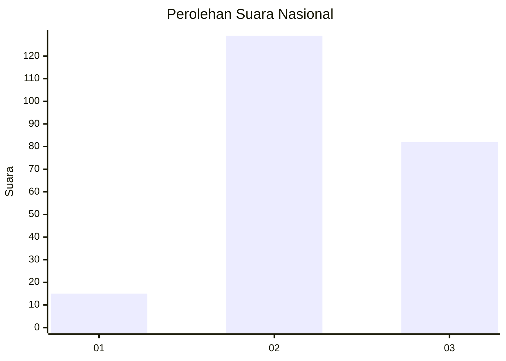
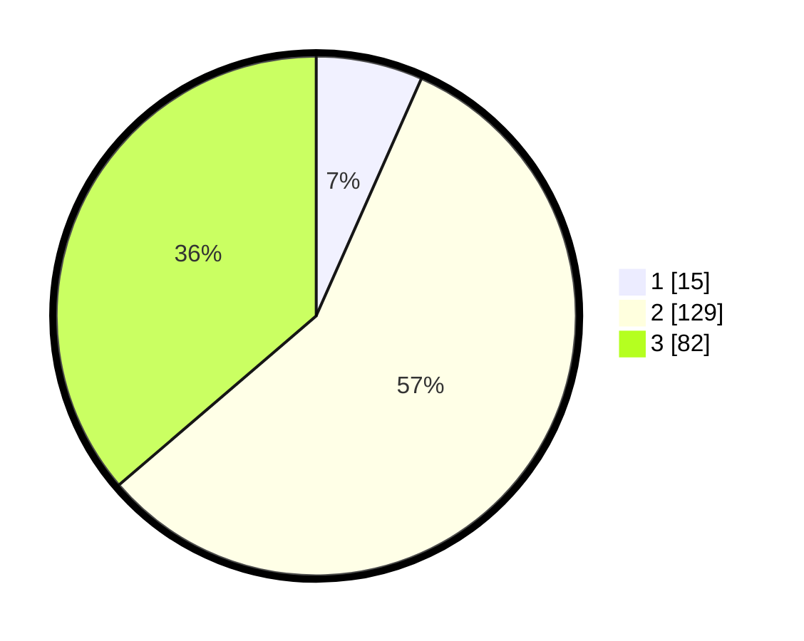

# Hasil

## Grafik

## Tabel

| No. | Nama Paslon    | Suara | Suara (raw) | Persentase |
|:--- |:-------------- | -----:| -----------:| ----------:|
| 1   | ANIES MUHAIMIN | 15    | [15][p-1]   | 6,64       |
| 2   | PRABOWO GIBRAN | 129   | [129][p-2]  | 57,08      |
| 3   | GANJAR MAHFUD  | 82    | [82][p-3]   | 36,28      |

[p-1]: https://github.com/gigit-pemilu/pemilu-2024/blob/main/pilpres/hitung-suara/sub/34-di-yogyakarta/sub/01-kulon-progo/sub/03-panjatan/sub/2008-gotakan/sub/008-tps/sub/paslon-1.txt
[p-2]: https://github.com/gigit-pemilu/pemilu-2024/blob/main/pilpres/hitung-suara/sub/34-di-yogyakarta/sub/01-kulon-progo/sub/03-panjatan/sub/2008-gotakan/sub/008-tps/sub/paslon-2.txt
[p-3]: https://github.com/gigit-pemilu/pemilu-2024/blob/main/pilpres/hitung-suara/sub/34-di-yogyakarta/sub/01-kulon-progo/sub/03-panjatan/sub/2008-gotakan/sub/008-tps/sub/paslon-3.txt

## Foto C Plano

https://sirekap-obj-formc.kpu.go.id/1369/pemilu/ppwp/34/01/03/20/08/3401032008008-20240215-023325--8ae10d8d-ed68-4d39-b862-a7f58f69c790.jpg

https://sirekap-obj-formc.kpu.go.id/1369/pemilu/ppwp/34/01/03/20/08/3401032008008-20240215-023400--e7658858-c4f1-47aa-943c-d3af9f4da1b3.jpg

https://sirekap-obj-formc.kpu.go.id/1369/pemilu/ppwp/34/01/03/20/08/3401032008008-20240215-023507--c9a2a6b0-bb0c-43c3-b150-044ccf671aa3.jpg

## Metadata

| Key        | Value               |
| ---------- | ------------------- |
| Time Stamp | 2024-02-15 15:00:29 |

