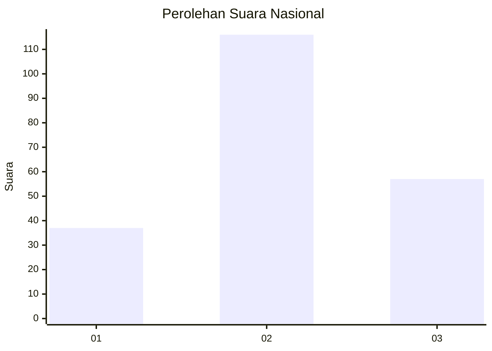
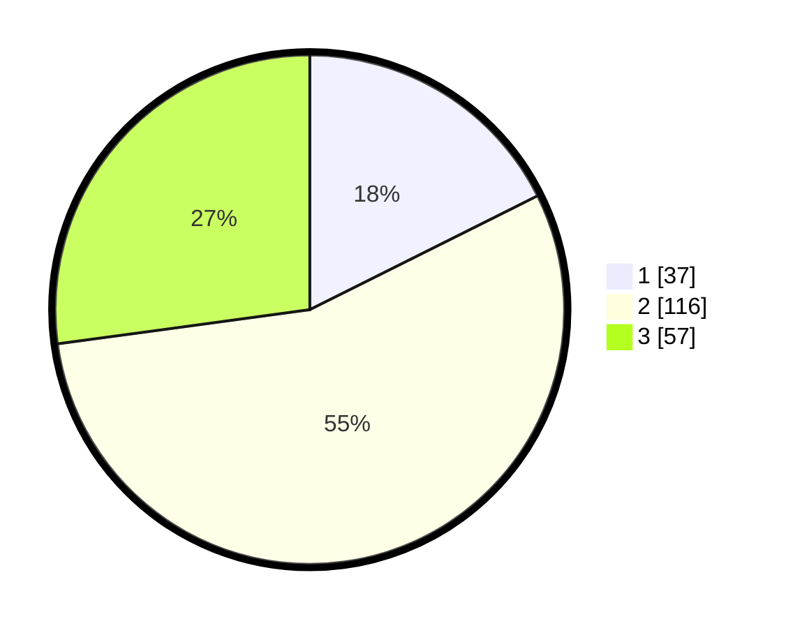

# Hasil

## Grafik

## Tabel

| No. | Nama Paslon    | Suara | Suara (raw) | Persentase |
|:--- |:-------------- | -----:| -----------:| ----------:|
| 1   | ANIES MUHAIMIN | 37    | [37][p-1]   | 17,62      |
| 2   | PRABOWO GIBRAN | 116   | [116][p-2]  | 55,24      |
| 3   | GANJAR MAHFUD  | 57    | [57][p-3]   | 27,14      |

[p-1]: https://github.com/gigit-pemilu/pemilu-2024/blob/main/pilpres/hitung-suara/sub/34-di-yogyakarta/sub/01-kulon-progo/sub/03-panjatan/sub/2009-panjatan/sub/002-tps/sub/paslon-1.txt
[p-2]: https://github.com/gigit-pemilu/pemilu-2024/blob/main/pilpres/hitung-suara/sub/34-di-yogyakarta/sub/01-kulon-progo/sub/03-panjatan/sub/2009-panjatan/sub/002-tps/sub/paslon-2.txt
[p-3]: https://github.com/gigit-pemilu/pemilu-2024/blob/main/pilpres/hitung-suara/sub/34-di-yogyakarta/sub/01-kulon-progo/sub/03-panjatan/sub/2009-panjatan/sub/002-tps/sub/paslon-3.txt

## Foto C Plano

https://sirekap-obj-formc.kpu.go.id/92ee/pemilu/ppwp/34/01/03/20/09/3401032009002-20240214-235858--5e01ea28-e7d4-4cc8-a30e-6f6177e4162b.jpg

https://sirekap-obj-formc.kpu.go.id/92ee/pemilu/ppwp/34/01/03/20/09/3401032009002-20240215-000134--3d16ca7f-048a-4b34-8135-caa9af8078ac.jpg

## Metadata

| Key        | Value               |
| ---------- | ------------------- |
| Time Stamp | 2024-02-25 12:00:00 |

