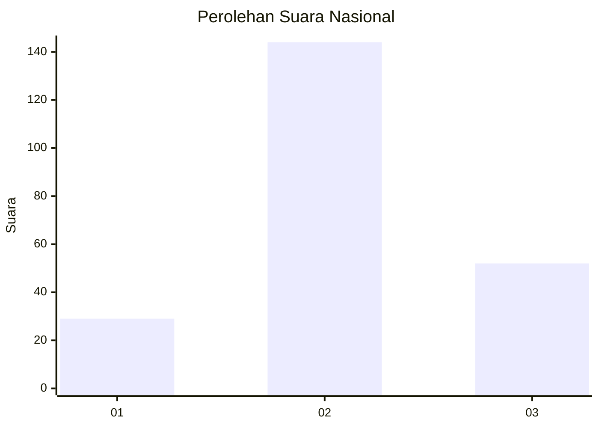
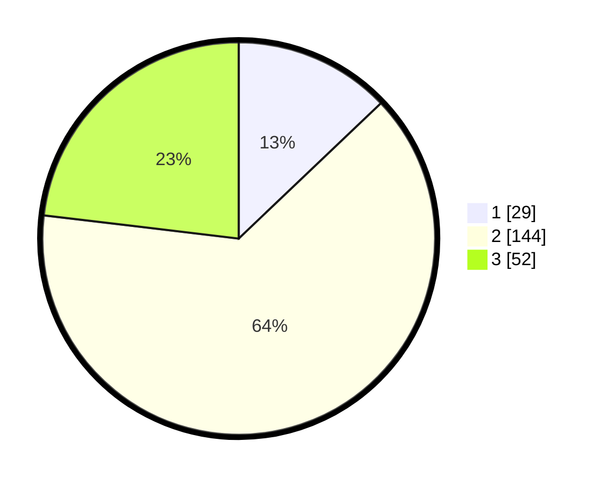

# Hasil

## Grafik

## Tabel

| No. | Nama Paslon    | Suara | Suara (raw) | Persentase |
|:--- |:-------------- | -----:| -----------:| ----------:|
| 1   | ANIES MUHAIMIN | 29    | [29][p-1]   | 12,89      |
| 2   | PRABOWO GIBRAN | 144   | [144][p-2]  | 64,00      |
| 3   | GANJAR MAHFUD  | 52    | [52][p-3]   | 23,11      |

[p-1]: https://github.com/gigit-pemilu/pemilu-2024/blob/main/pilpres/hitung-suara/sub/34-di-yogyakarta/sub/01-kulon-progo/sub/03-panjatan/sub/2010-cerme/sub/007-tps/sub/paslon-1.txt
[p-2]: https://github.com/gigit-pemilu/pemilu-2024/blob/main/pilpres/hitung-suara/sub/34-di-yogyakarta/sub/01-kulon-progo/sub/03-panjatan/sub/2010-cerme/sub/007-tps/sub/paslon-2.txt
[p-3]: https://github.com/gigit-pemilu/pemilu-2024/blob/main/pilpres/hitung-suara/sub/34-di-yogyakarta/sub/01-kulon-progo/sub/03-panjatan/sub/2010-cerme/sub/007-tps/sub/paslon-3.txt

## Foto C Plano

https://sirekap-obj-formc.kpu.go.id/d6b0/pemilu/ppwp/34/01/03/20/10/3401032010007-20240215-040825--bbc2d624-17b8-42b1-baa5-1c92845ec7f2.jpg

https://sirekap-obj-formc.kpu.go.id/d6b0/pemilu/ppwp/34/01/03/20/10/3401032010007-20240215-040842--e98ad7da-921b-4119-96bb-763bfc124f51.jpg

https://sirekap-obj-formc.kpu.go.id/d6b0/pemilu/ppwp/34/01/03/20/10/3401032010007-20240215-040852--9773ccbc-d2d5-4079-b5ae-68f74b24520d.jpg

## Metadata

| Key        | Value               |
| ---------- | ------------------- |
| Time Stamp | 2024-02-15 15:00:29 |

