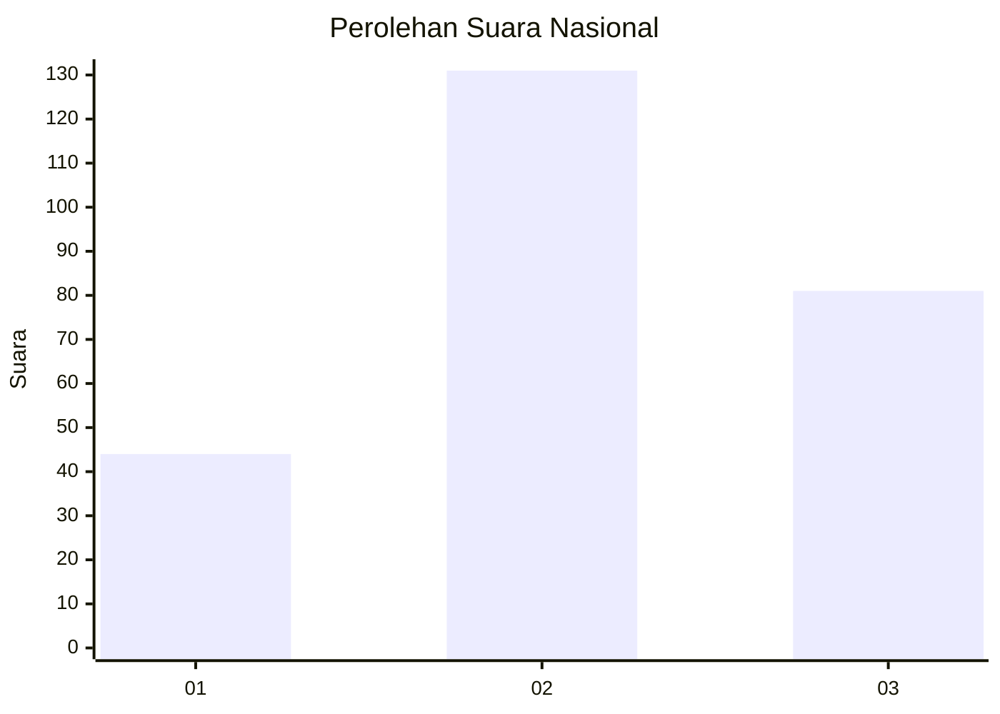
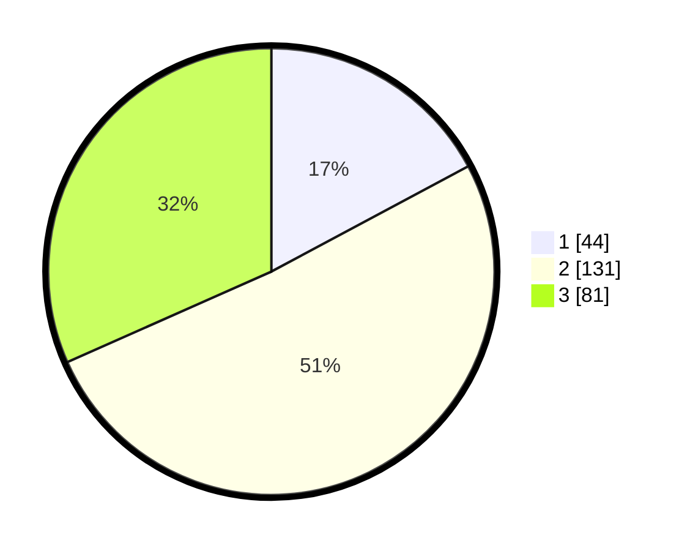

# Hasil

## Grafik

## Tabel

| No. | Nama Paslon    | Suara | Suara (raw) | Persentase |
|:--- |:-------------- | -----:| -----------:| ----------:|
| 1   | ANIES MUHAIMIN | 44    | [44][p-1]   | 17,19      |
| 2   | PRABOWO GIBRAN | 131   | [131][p-2]  | 51,17      |
| 3   | GANJAR MAHFUD  | 81    | [81][p-3]   | 31,64      |

[p-1]: https://github.com/gigit-pemilu/pemilu-2024/blob/main/pilpres/hitung-suara/sub/34-di-yogyakarta/sub/01-kulon-progo/sub/03-panjatan/sub/2010-cerme/sub/009-tps/sub/paslon-1.txt
[p-2]: https://github.com/gigit-pemilu/pemilu-2024/blob/main/pilpres/hitung-suara/sub/34-di-yogyakarta/sub/01-kulon-progo/sub/03-panjatan/sub/2010-cerme/sub/009-tps/sub/paslon-2.txt
[p-3]: https://github.com/gigit-pemilu/pemilu-2024/blob/main/pilpres/hitung-suara/sub/34-di-yogyakarta/sub/01-kulon-progo/sub/03-panjatan/sub/2010-cerme/sub/009-tps/sub/paslon-3.txt

## Foto C Plano

https://sirekap-obj-formc.kpu.go.id/2124/pemilu/ppwp/34/01/03/20/10/3401032010009-20240214-192438--33976edd-cf01-43e1-91e5-6ec6f2c2d490.jpg

https://sirekap-obj-formc.kpu.go.id/2124/pemilu/ppwp/34/01/03/20/10/3401032010009-20240214-192448--62f61806-b5c5-429f-8f75-40e15d658269.jpg

https://sirekap-obj-formc.kpu.go.id/2124/pemilu/ppwp/34/01/03/20/10/3401032010009-20240214-192504--601ae1af-2567-4c49-afff-ca5cd184c92c.jpg

## Metadata

| Key        | Value               |
| ---------- | ------------------- |
| Time Stamp | 2024-02-15 21:01:18 |

