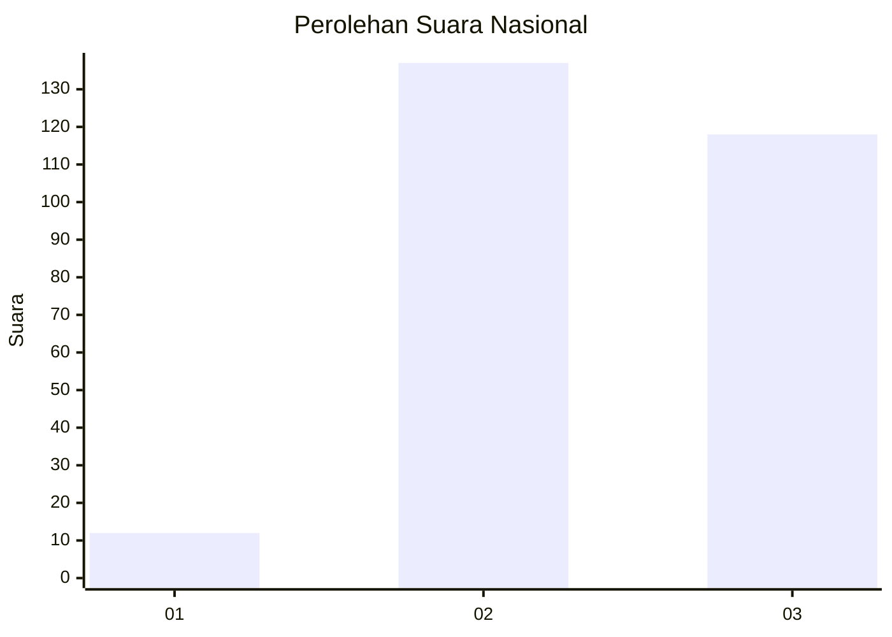
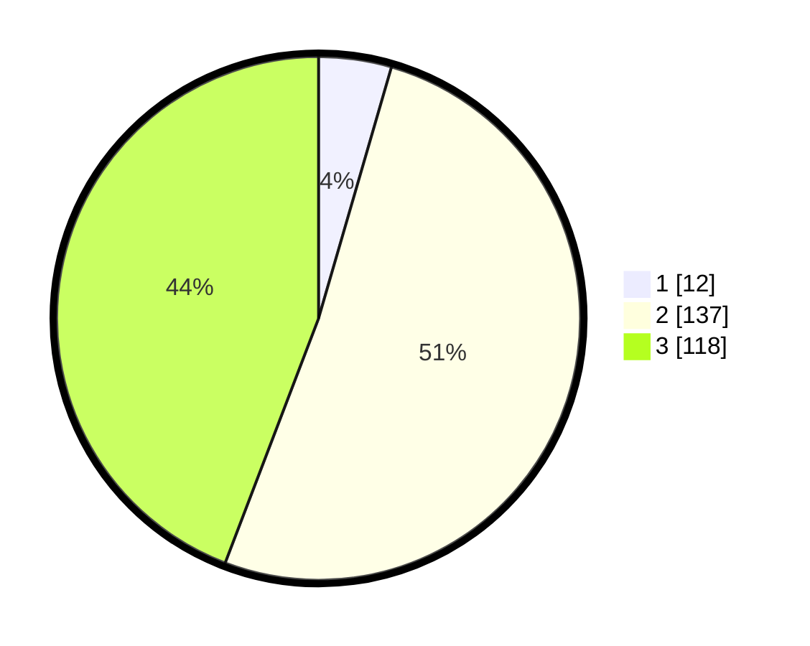

# Hasil

## Grafik

## Tabel

| No. | Nama Paslon    | Suara | Suara (raw) | Persentase |
|:--- |:-------------- | -----:| -----------:| ----------:|
| 1   | ANIES MUHAIMIN | 12    | [12][p-1]   | 4,49       |
| 2   | PRABOWO GIBRAN | 137   | [137][p-2]  | 51,31      |
| 3   | GANJAR MAHFUD  | 118   | [118][p-3]  | 44,19      |

[p-1]: https://github.com/gigit-pemilu/pemilu-2024/blob/main/pilpres/hitung-suara/sub/34-di-yogyakarta/sub/01-kulon-progo/sub/03-panjatan/sub/2011-krembangan/sub/010-tps/sub/paslon-1.txt
[p-2]: https://github.com/gigit-pemilu/pemilu-2024/blob/main/pilpres/hitung-suara/sub/34-di-yogyakarta/sub/01-kulon-progo/sub/03-panjatan/sub/2011-krembangan/sub/010-tps/sub/paslon-2.txt
[p-3]: https://github.com/gigit-pemilu/pemilu-2024/blob/main/pilpres/hitung-suara/sub/34-di-yogyakarta/sub/01-kulon-progo/sub/03-panjatan/sub/2011-krembangan/sub/010-tps/sub/paslon-3.txt

## Foto C Plano

https://sirekap-obj-formc.kpu.go.id/fc6c/pemilu/ppwp/34/01/03/20/11/3401032011010-20240214-195847--8c287f09-2aac-46a8-97e3-b93079971bf4.jpg

https://sirekap-obj-formc.kpu.go.id/fc6c/pemilu/ppwp/34/01/03/20/11/3401032011010-20240214-195943--c9008f2a-062f-4b56-9957-3ea4d7ab0f9c.jpg

https://sirekap-obj-formc.kpu.go.id/fc6c/pemilu/ppwp/34/01/03/20/11/3401032011010-20240214-200116--6dd23d3f-6430-44fb-b0e3-a89a48ae753b.jpg

## Metadata

| Key        | Value               |
| ---------- | ------------------- |
| Time Stamp | 2024-02-15 21:30:27 |

