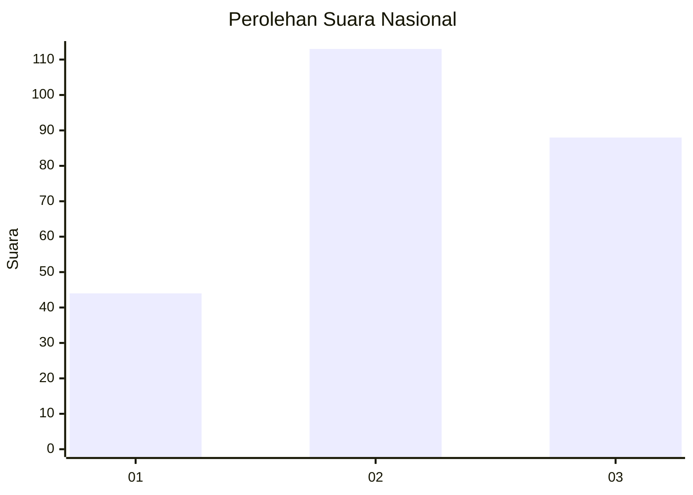
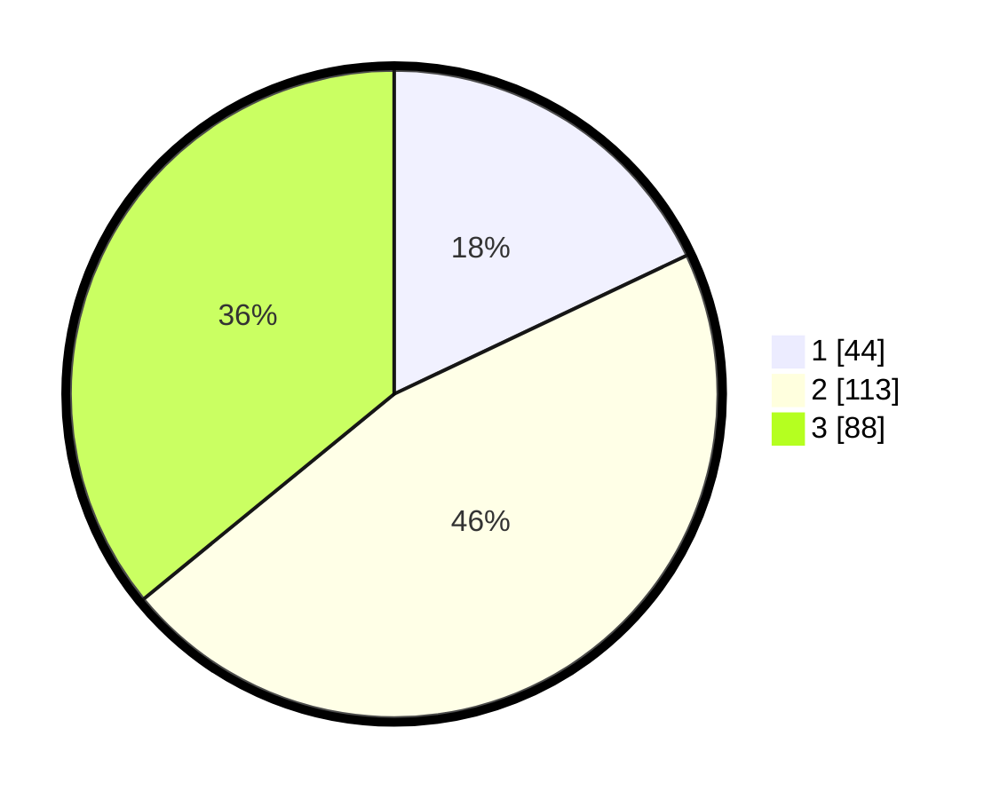

# Hasil

## Grafik

## Tabel

| No. | Nama Paslon    | Suara | Suara (raw) | Persentase |
|:--- |:-------------- | -----:| -----------:| ----------:|
| 1   | ANIES MUHAIMIN | 44    | [44][p-1]   | 17,96      |
| 2   | PRABOWO GIBRAN | 113   | [113][p-2]  | 46,12      |
| 3   | GANJAR MAHFUD  | 88    | [88][p-3]   | 35,92      |

[p-1]: https://github.com/gigit-pemilu/pemilu-2024/blob/main/pilpres/hitung-suara/sub/34-di-yogyakarta/sub/01-kulon-progo/sub/03-panjatan/sub/2011-krembangan/sub/014-tps/sub/paslon-1.txt
[p-2]: https://github.com/gigit-pemilu/pemilu-2024/blob/main/pilpres/hitung-suara/sub/34-di-yogyakarta/sub/01-kulon-progo/sub/03-panjatan/sub/2011-krembangan/sub/014-tps/sub/paslon-2.txt
[p-3]: https://github.com/gigit-pemilu/pemilu-2024/blob/main/pilpres/hitung-suara/sub/34-di-yogyakarta/sub/01-kulon-progo/sub/03-panjatan/sub/2011-krembangan/sub/014-tps/sub/paslon-3.txt

## Foto C Plano

https://sirekap-obj-formc.kpu.go.id/767a/pemilu/ppwp/34/01/03/20/11/3401032011014-20240215-020451--8fca7ee6-198f-4048-a346-05aa8cab594e.jpg

https://sirekap-obj-formc.kpu.go.id/767a/pemilu/ppwp/34/01/03/20/11/3401032011014-20240215-020202--19cd85c1-c8a8-453a-a652-a79002c2d2c1.jpg

https://sirekap-obj-formc.kpu.go.id/767a/pemilu/ppwp/34/01/03/20/11/3401032011014-20240215-020053--2841e370-9b70-4964-bae3-81a12ddba9c2.jpg

## Metadata

| Key        | Value               |
| ---------- | ------------------- |
| Time Stamp | 2024-02-15 15:00:29 |

