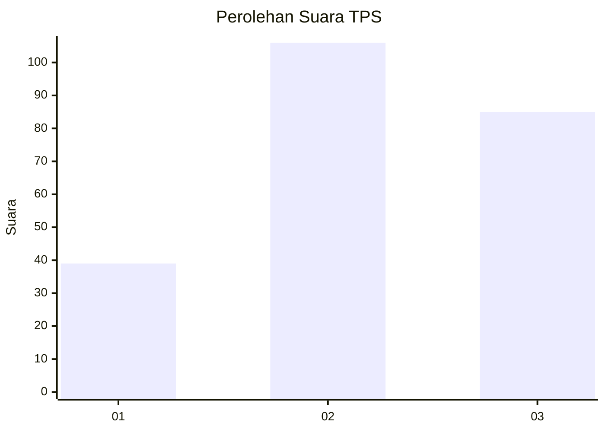
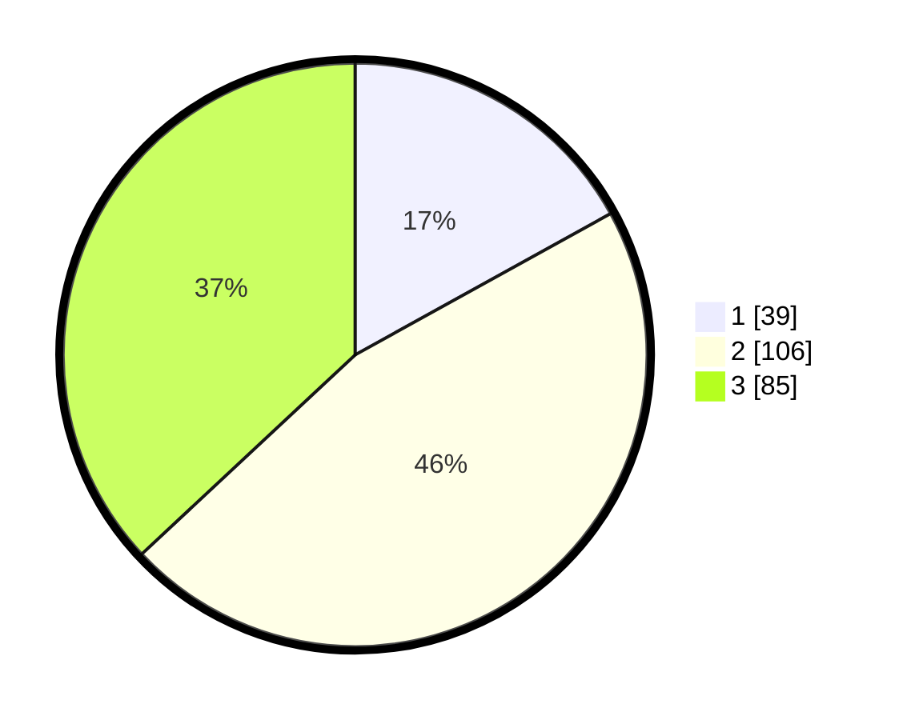

# Hasil

## Grafik

## Tabel

| No. | Nama Paslon    | Suara | Suara (raw) | Persentase |
|:--- |:-------------- | -----:| -----------:| ----------:|
| 1   | ANIES MUHAIMIN | 39    | [39][p-1]   | 16,96      |
| 2   | PRABOWO GIBRAN | 106   | [106][p-2]  | 46,09      |
| 3   | GANJAR MAHFUD  | 85    | [85][p-3]   | 36,96      |

[p-1]: https://github.com/gigit-pemilu/pemilu-2024-34-di-yogyakarta/blob/main/pilpres/hitung-suara/sub/34-di-yogyakarta/sub/01-kulon-progo/sub/04-galur/sub/2001-banaran/sub/001-tps/sub/paslon-1.txt
[p-2]: https://github.com/gigit-pemilu/pemilu-2024-34-di-yogyakarta/blob/main/pilpres/hitung-suara/sub/34-di-yogyakarta/sub/01-kulon-progo/sub/04-galur/sub/2001-banaran/sub/001-tps/sub/paslon-2.txt
[p-3]: https://github.com/gigit-pemilu/pemilu-2024-34-di-yogyakarta/blob/main/pilpres/hitung-suara/sub/34-di-yogyakarta/sub/01-kulon-progo/sub/04-galur/sub/2001-banaran/sub/001-tps/sub/paslon-3.txt

## Foto C Plano

https://sirekap-obj-formc.kpu.go.id/f34f/pemilu/ppwp/34/01/04/20/01/3401042001001-20240216-150115--4345a27b-8c1f-458d-a182-47316229dfa1.jpg

https://sirekap-obj-formc.kpu.go.id/f34f/pemilu/ppwp/34/01/04/20/01/3401042001001-20240216-150116--24b4d808-a156-4de8-aa44-2cd226e01c89.jpg

https://sirekap-obj-formc.kpu.go.id/f34f/pemilu/ppwp/34/01/04/20/01/3401042001001-20240216-150115--4be5b87b-ec3c-447d-b187-f01e0c99954a.jpg

## Metadata

| Key        | Value               |
| ---------- | ------------------- |
| Time Stamp | 2024-02-19 06:16:00 |

## DATA PEMILIH TETAP

Jumlah pemilih dalam DPT: **278**.
 * L: **137**.
 * P: **141**.

## DATA PENGGUNA HAK PILIH

Jumlah pengguna hak pilih dalam DPT: **237**.
 * L: **118**.
 * P: **119**.

Jumlah pengguna hak pilih dalam DPTb: **2**.
 * L: **1**.
 * P: **1**.

Jumlah pengguna hak pilih dalam DPK: **3**.
 * L: **0**.
 * P: **3**.

Jumlah pengguna hak pilih: **242**.
 * L: **119**.
 * P: **123**.

## JUMLAH SUARA SAH DAN TIDAK SAH

JUMLAH SELURUH SUARA SAH: **230**.

JUMLAH SUARA TIDAK SAH: **12**.

JUMLAH SELURUH SUARA SAH DAN SUARA TIDAK SAH: **242**.

