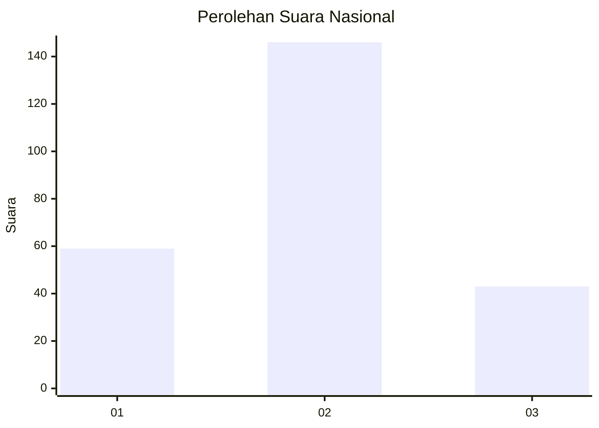
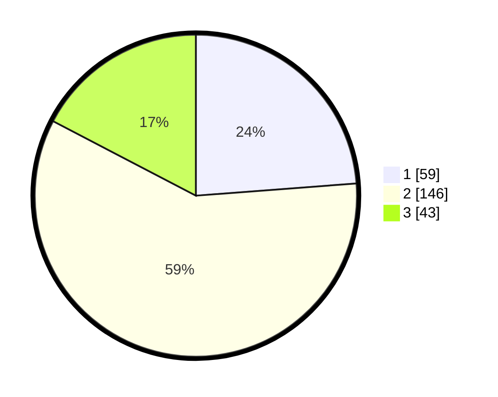

# Hasil

## Grafik

## Tabel

| No. | Nama Paslon    | Suara | Suara (raw) | Persentase |
|:--- |:-------------- | -----:| -----------:| ----------:|
| 1   | ANIES MUHAIMIN | 59    | [59][p-1]   | 23,79      |
| 2   | PRABOWO GIBRAN | 146   | [146][p-2]  | 58,87      |
| 3   | GANJAR MAHFUD  | 43    | [43][p-3]   | 17,34      |

[p-1]: https://github.com/gigit-pemilu/pemilu-2024/blob/main/pilpres/hitung-suara/sub/34-di-yogyakarta/sub/01-kulon-progo/sub/04-galur/sub/2001-banaran/sub/002-tps/sub/paslon-1.txt
[p-2]: https://github.com/gigit-pemilu/pemilu-2024/blob/main/pilpres/hitung-suara/sub/34-di-yogyakarta/sub/01-kulon-progo/sub/04-galur/sub/2001-banaran/sub/002-tps/sub/paslon-2.txt
[p-3]: https://github.com/gigit-pemilu/pemilu-2024/blob/main/pilpres/hitung-suara/sub/34-di-yogyakarta/sub/01-kulon-progo/sub/04-galur/sub/2001-banaran/sub/002-tps/sub/paslon-3.txt

## Foto C Plano

https://sirekap-obj-formc.kpu.go.id/1b11/pemilu/ppwp/34/01/04/20/01/3401042001002-20240214-202316--a1009211-f686-43bf-ab4a-8b3b47fd8b3c.jpg

https://sirekap-obj-formc.kpu.go.id/1b11/pemilu/ppwp/34/01/04/20/01/3401042001002-20240214-213027--3501b8e8-be9f-4955-a51d-1d342a384102.jpg

https://sirekap-obj-formc.kpu.go.id/1b11/pemilu/ppwp/34/01/04/20/01/3401042001002-20240214-213204--de9998f4-a173-49f9-aa00-ec952da400b8.jpg

## Metadata

| Key        | Value               |
| ---------- | ------------------- |
| Time Stamp | 2024-02-15 15:00:29 |

## DATA PEMILIH TETAP

Jumlah pemilih dalam DPT: **281**.
 * L: **130**.
 * P: **151**.

## DATA PENGGUNA HAK PILIH

Jumlah pengguna hak pilih dalam DPT: **261**.
 * L: **122**.
 * P: **139**.

Jumlah pengguna hak pilih dalam DPTb: **1**.
 * L: **1**.
 * P: **0**.

Jumlah pengguna hak pilih dalam DPK: **0**.
 * L: **0**.
 * P: **0**.

Jumlah pengguna hak pilih: **262**.
 * L: **123**.
 * P: **139**.

## JUMLAH SUARA SAH DAN TIDAK SAH

JUMLAH SELURUH SUARA SAH: **248**.

JUMLAH SUARA TIDAK SAH: **14**.

JUMLAH SELURUH SUARA SAH DAN SUARA TIDAK SAH: **262**.

