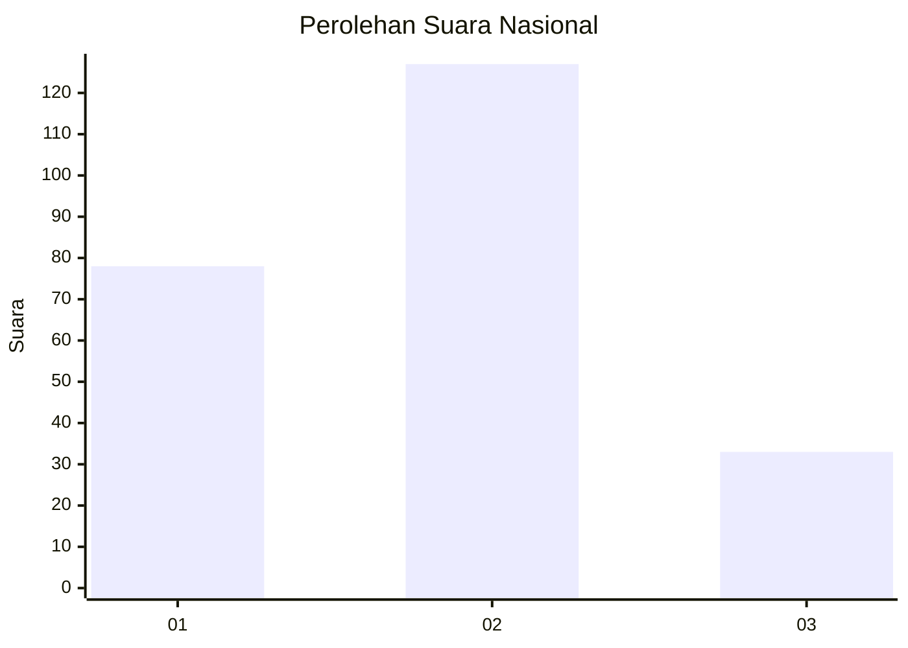
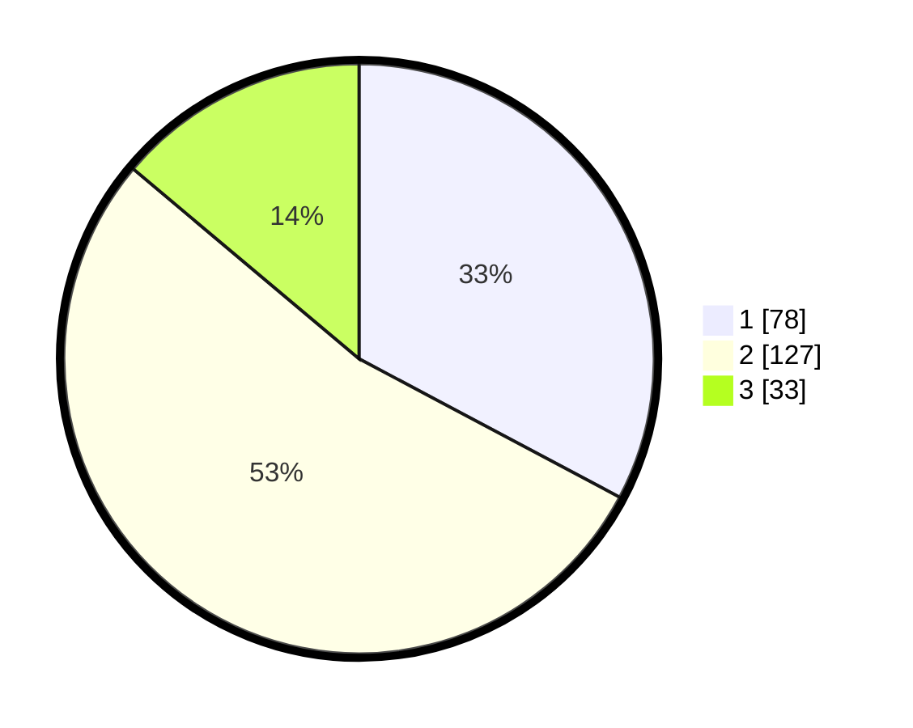

# Hasil

## Grafik

## Tabel

| No. | Nama Paslon    | Suara | Suara (raw) | Persentase |
|:--- |:-------------- | -----:| -----------:| ----------:|
| 1   | ANIES MUHAIMIN | 78    | [78][p-1]   | 32,77      |
| 2   | PRABOWO GIBRAN | 127   | [127][p-2]  | 53,36      |
| 3   | GANJAR MAHFUD  | 33    | [33][p-3]   | 13,87      |

[p-1]: https://github.com/gigit-pemilu/pemilu-2024/blob/main/pilpres/hitung-suara/sub/34-di-yogyakarta/sub/01-kulon-progo/sub/04-galur/sub/2001-banaran/sub/003-tps/sub/paslon-1.txt
[p-2]: https://github.com/gigit-pemilu/pemilu-2024/blob/main/pilpres/hitung-suara/sub/34-di-yogyakarta/sub/01-kulon-progo/sub/04-galur/sub/2001-banaran/sub/003-tps/sub/paslon-2.txt
[p-3]: https://github.com/gigit-pemilu/pemilu-2024/blob/main/pilpres/hitung-suara/sub/34-di-yogyakarta/sub/01-kulon-progo/sub/04-galur/sub/2001-banaran/sub/003-tps/sub/paslon-3.txt

## Foto C Plano

https://sirekap-obj-formc.kpu.go.id/e9e8/pemilu/ppwp/34/01/04/20/01/3401042001003-20240215-010840--33f7af02-0d9a-4243-bb64-78ed831412c5.jpg

https://sirekap-obj-formc.kpu.go.id/e9e8/pemilu/ppwp/34/01/04/20/01/3401042001003-20240215-023304--5ec5e410-0bba-4f51-b971-25228a110f69.jpg

https://sirekap-obj-formc.kpu.go.id/e9e8/pemilu/ppwp/34/01/04/20/01/3401042001003-20240215-020713--8c40f925-fdd6-4731-a29e-a350ee8d48d0.jpg

## Metadata

| Key        | Value               |
| ---------- | ------------------- |
| Time Stamp | 2024-02-15 15:00:29 |

