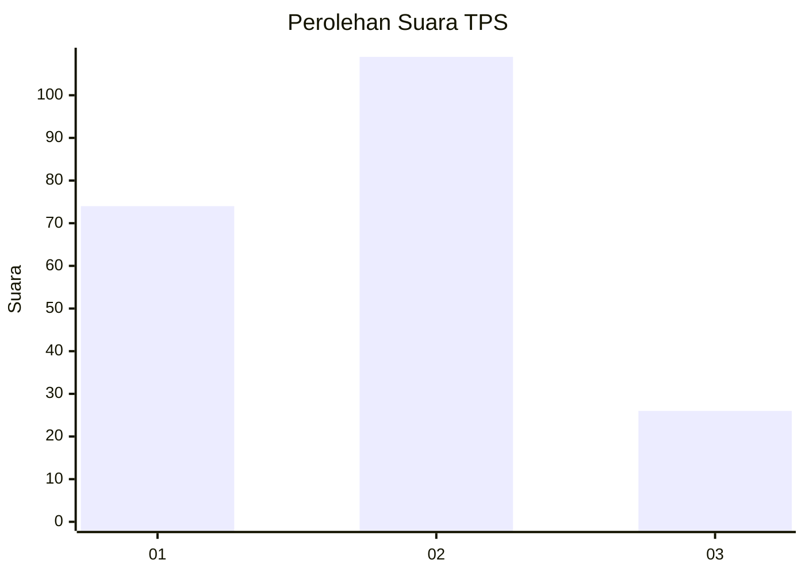
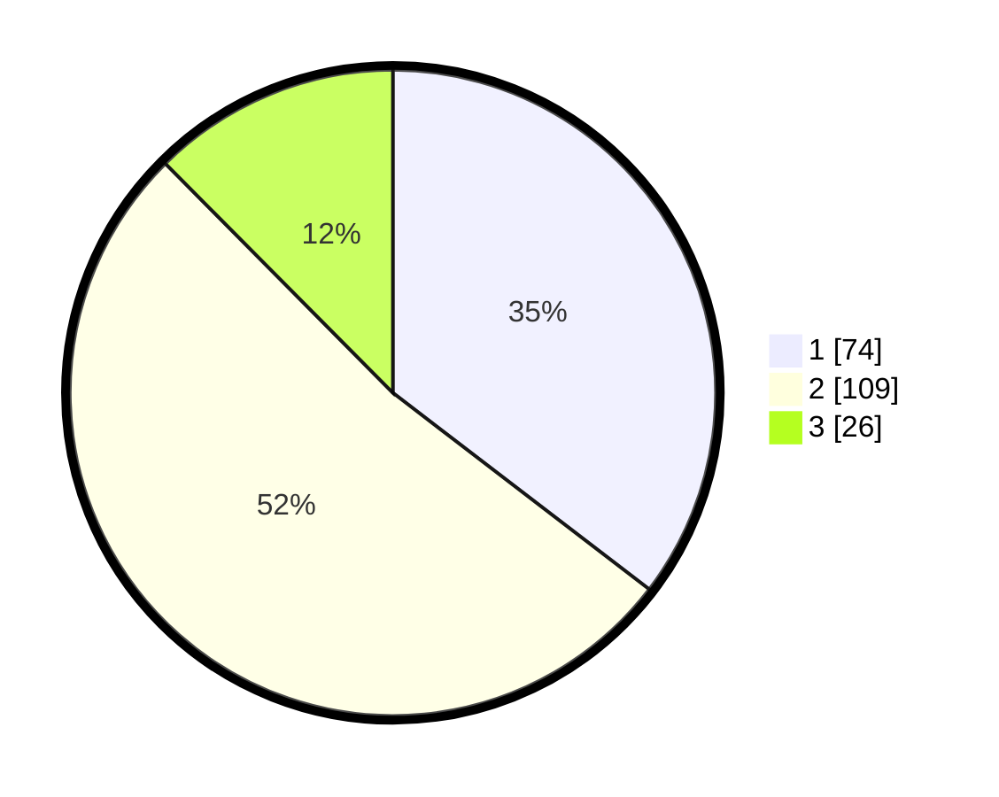

# Hasil

## Grafik

## Tabel

| No. | Nama Paslon    | Suara | Suara (raw) | Persentase |
|:--- |:-------------- | -----:| -----------:| ----------:|
| 1   | ANIES MUHAIMIN | 74    | [74][p-1]   | 35,41      |
| 2   | PRABOWO GIBRAN | 109   | [109][p-2]  | 52,15      |
| 3   | GANJAR MAHFUD  | 26    | [26][p-3]   | 12,44      |

[p-1]: https://github.com/gigit-pemilu/pemilu-2024-34-di-yogyakarta/blob/main/pilpres/hitung-suara/sub/34-di-yogyakarta/sub/01-kulon-progo/sub/04-galur/sub/2001-banaran/sub/004-tps/sub/paslon-1.txt
[p-2]: https://github.com/gigit-pemilu/pemilu-2024-34-di-yogyakarta/blob/main/pilpres/hitung-suara/sub/34-di-yogyakarta/sub/01-kulon-progo/sub/04-galur/sub/2001-banaran/sub/004-tps/sub/paslon-2.txt
[p-3]: https://github.com/gigit-pemilu/pemilu-2024-34-di-yogyakarta/blob/main/pilpres/hitung-suara/sub/34-di-yogyakarta/sub/01-kulon-progo/sub/04-galur/sub/2001-banaran/sub/004-tps/sub/paslon-3.txt

## Foto C Plano

https://sirekap-obj-formc.kpu.go.id/5781/pemilu/ppwp/34/01/04/20/01/3401042001004-20240214-195211--7063939a-02a6-4caf-bbb8-8f4f6cf4f4fc.jpg

https://sirekap-obj-formc.kpu.go.id/5781/pemilu/ppwp/34/01/04/20/01/3401042001004-20240214-195217--2a7990b4-5bd4-464c-8162-868dd4545378.jpg

https://sirekap-obj-formc.kpu.go.id/5781/pemilu/ppwp/34/01/04/20/01/3401042001004-20240214-195224--a6bc4ac3-913e-4a55-a254-d386d8faf5ca.jpg

## Metadata

| Key        | Value               |
| ---------- | ------------------- |
| Time Stamp | 2024-02-15 15:00:29 |

## DATA PEMILIH TETAP

Jumlah pemilih dalam DPT: **258**.
 * L: **125**.
 * P: **133**.

## DATA PENGGUNA HAK PILIH

Jumlah pengguna hak pilih dalam DPT: **216**.
 * L: **106**.
 * P: **110**.

Jumlah pengguna hak pilih dalam DPTb: **1**.
 * L: **1**.
 * P: **0**.

Jumlah pengguna hak pilih dalam DPK: **3**.
 * L: **2**.
 * P: **1**.

Jumlah pengguna hak pilih: **220**.
 * L: **109**.
 * P: **111**.

## JUMLAH SUARA SAH DAN TIDAK SAH

JUMLAH SELURUH SUARA SAH: **209**.

JUMLAH SUARA TIDAK SAH: **11**.

