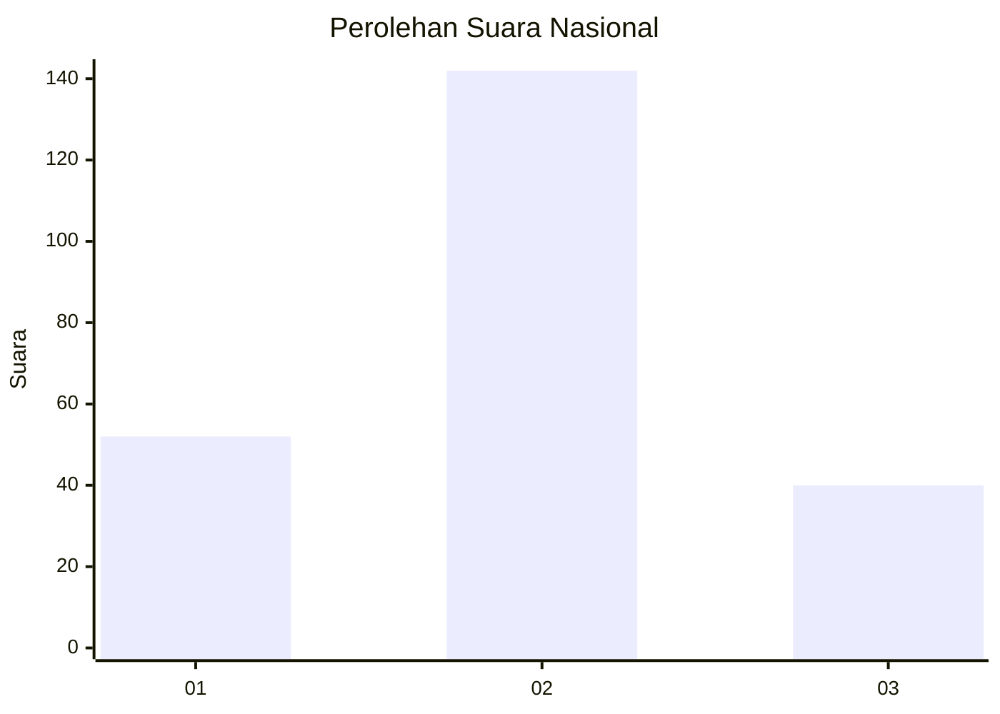

# Hasil

## Grafik

## Tabel

| No. | Nama Paslon    | Suara | Suara (raw) | Persentase |
|:--- |:-------------- | -----:| -----------:| ----------:|
| 1   | ANIES MUHAIMIN | 52    | [52][p-1]   | 22,22      |
| 2   | PRABOWO GIBRAN | 142   | [142][p-2]  | 60,68      |
| 3   | GANJAR MAHFUD  | 40    | [40][p-3]   | 17,09      |

[p-1]: https://github.com/gigit-pemilu/pemilu-2024/blob/main/pilpres/hitung-suara/sub/34-di-yogyakarta/sub/01-kulon-progo/sub/04-galur/sub/2001-banaran/sub/005-tps/sub/paslon-1.txt
[p-2]: https://github.com/gigit-pemilu/pemilu-2024/blob/main/pilpres/hitung-suara/sub/34-di-yogyakarta/sub/01-kulon-progo/sub/04-galur/sub/2001-banaran/sub/005-tps/sub/paslon-2.txt
[p-3]: https://github.com/gigit-pemilu/pemilu-2024/blob/main/pilpres/hitung-suara/sub/34-di-yogyakarta/sub/01-kulon-progo/sub/04-galur/sub/2001-banaran/sub/005-tps/sub/paslon-3.txt

## Foto C Plano

https://sirekap-obj-formc.kpu.go.id/af80/pemilu/ppwp/34/01/04/20/01/3401042001005-20240214-192658--80fe95a7-b296-4cd0-95b9-dee568ab1ad7.jpg

https://sirekap-obj-formc.kpu.go.id/af80/pemilu/ppwp/34/01/04/20/01/3401042001005-20240216-074856--64793a2d-7579-4ded-9b7f-0c171afbb3f8.jpg

https://sirekap-obj-formc.kpu.go.id/af80/pemilu/ppwp/34/01/04/20/01/3401042001005-20240216-074855--8f5ec12a-5ec8-4aaf-8c25-89d94bc5c69c.jpg

## Metadata

| Key        | Value               |
| ---------- | ------------------- |
| Time Stamp | 2024-02-19 06:16:00 |

## DATA PEMILIH TETAP

Jumlah pemilih dalam DPT: **279**.
 * L: **138**.
 * P: **141**.

## DATA PENGGUNA HAK PILIH

Jumlah pengguna hak pilih dalam DPT: **243**.
 * L: **116**.
 * P: **127**.

Jumlah pengguna hak pilih dalam DPTb: **2**.
 * L: **1**.
 * P: **1**.

Jumlah pengguna hak pilih dalam DPK: **0**.
 * L: **0**.
 * P: **0**.

Jumlah pengguna hak pilih: **245**.
 * L: **117**.
 * P: **128**.

## JUMLAH SUARA SAH DAN TIDAK SAH

JUMLAH SELURUH SUARA SAH: **234**.

JUMLAH SUARA TIDAK SAH: **11**.

JUMLAH SELURUH SUARA SAH DAN SUARA TIDAK SAH: **245**.

