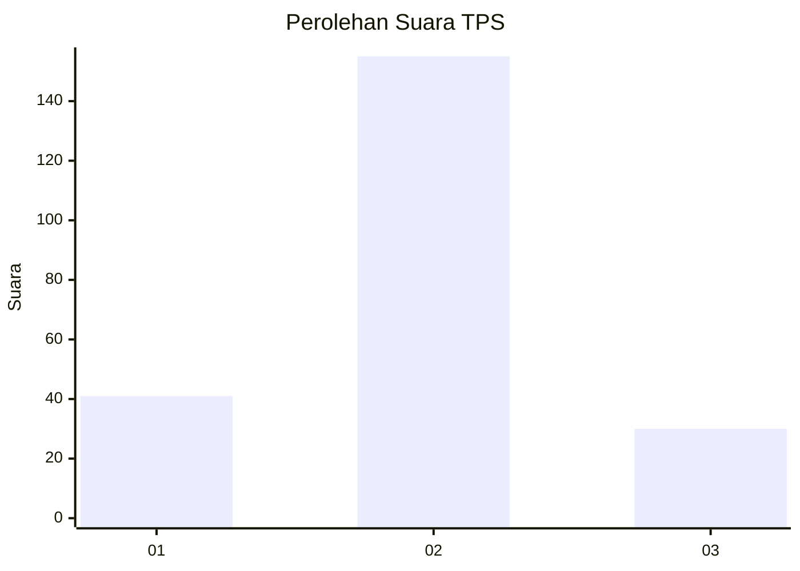
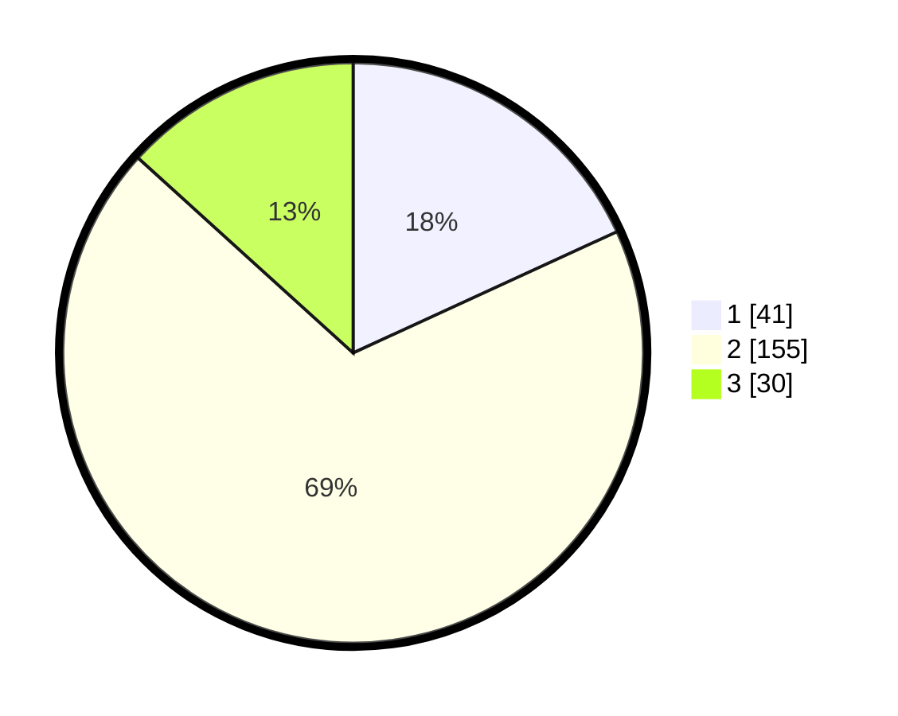

# Hasil

## Grafik

## Tabel

| No. | Nama Paslon    | Suara | Suara (raw) | Persentase |
|:--- |:-------------- | -----:| -----------:| ----------:|
| 1   | ANIES MUHAIMIN | 41    | [41][p-1]   | 18,14      |
| 2   | PRABOWO GIBRAN | 155   | [155][p-2]  | 68,58      |
| 3   | GANJAR MAHFUD  | 30    | [30][p-3]   | 13,27      |

[p-1]: https://github.com/gigit-pemilu/pemilu-2024-34-di-yogyakarta/blob/main/pilpres/hitung-suara/sub/34-di-yogyakarta/sub/01-kulon-progo/sub/04-galur/sub/2001-banaran/sub/007-tps/sub/paslon-1.txt
[p-2]: https://github.com/gigit-pemilu/pemilu-2024-34-di-yogyakarta/blob/main/pilpres/hitung-suara/sub/34-di-yogyakarta/sub/01-kulon-progo/sub/04-galur/sub/2001-banaran/sub/007-tps/sub/paslon-2.txt
[p-3]: https://github.com/gigit-pemilu/pemilu-2024-34-di-yogyakarta/blob/main/pilpres/hitung-suara/sub/34-di-yogyakarta/sub/01-kulon-progo/sub/04-galur/sub/2001-banaran/sub/007-tps/sub/paslon-3.txt

## Foto C Plano

https://sirekap-obj-formc.kpu.go.id/948f/pemilu/ppwp/34/01/04/20/01/3401042001007-20240214-185908--dca1df78-9bee-4dcd-8cd7-b09d05faf163.jpg

https://sirekap-obj-formc.kpu.go.id/948f/pemilu/ppwp/34/01/04/20/01/3401042001007-20240214-185950--579c5e1a-ae68-4926-af69-832f2baa8e88.jpg

https://sirekap-obj-formc.kpu.go.id/948f/pemilu/ppwp/34/01/04/20/01/3401042001007-20240214-190035--1db2534a-28b8-48a0-b14a-d81c6c301709.jpg

## Metadata

| Key        | Value               |
| ---------- | ------------------- |
| Time Stamp | 2024-02-15 15:00:29 |

