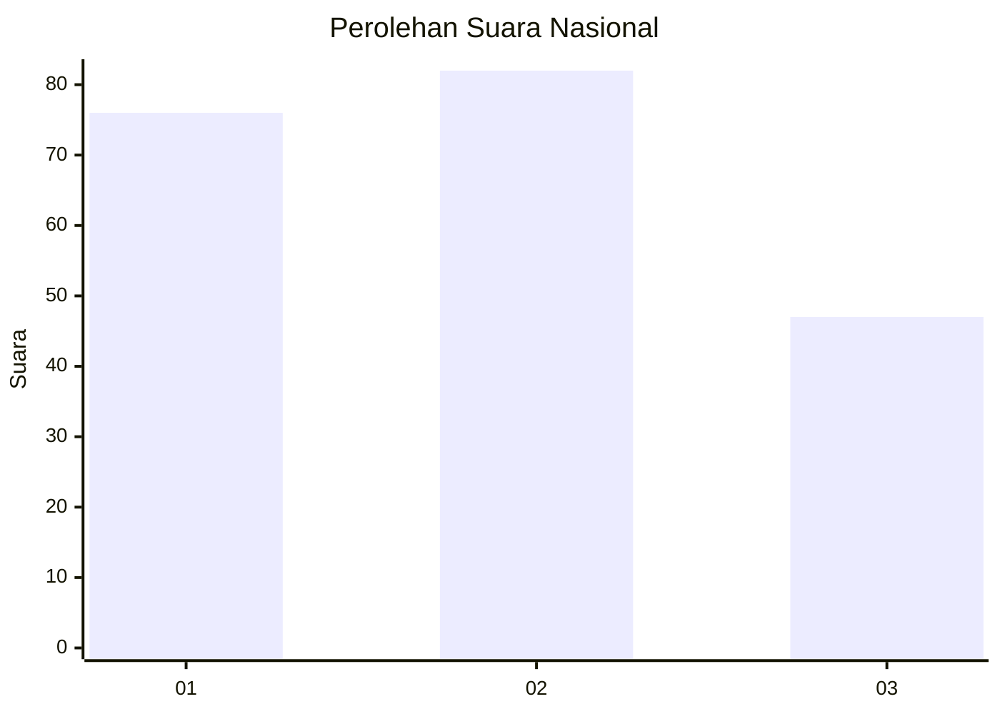
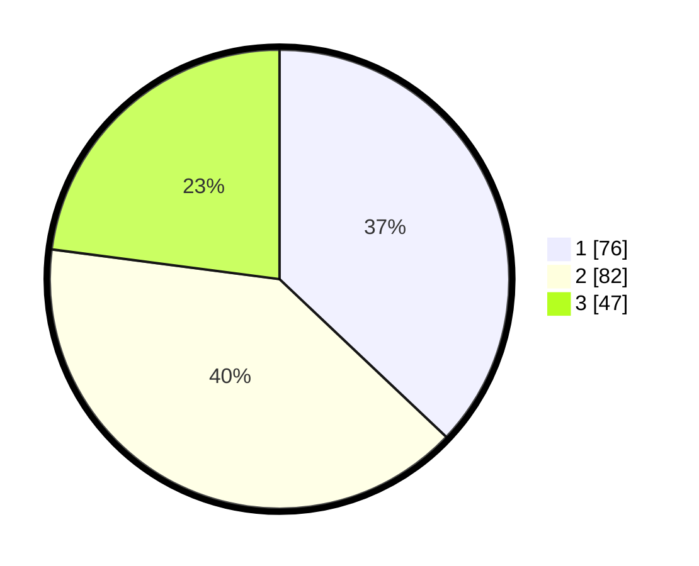

# Hasil

## Grafik

## Tabel

| No. | Nama Paslon    | Suara | Suara (raw) | Persentase |
|:--- |:-------------- | -----:| -----------:| ----------:|
| 1   | ANIES MUHAIMIN | 76    | [76][p-1]   | 37,07      |
| 2   | PRABOWO GIBRAN | 82    | [82][p-2]   | 40,00      |
| 3   | GANJAR MAHFUD  | 47    | [47][p-3]   | 22,93      |

[p-1]: https://github.com/gigit-pemilu/pemilu-2024/blob/main/pilpres/hitung-suara/sub/34-di-yogyakarta/sub/01-kulon-progo/sub/04-galur/sub/2001-banaran/sub/009-tps/sub/paslon-1.txt
[p-2]: https://github.com/gigit-pemilu/pemilu-2024/blob/main/pilpres/hitung-suara/sub/34-di-yogyakarta/sub/01-kulon-progo/sub/04-galur/sub/2001-banaran/sub/009-tps/sub/paslon-2.txt
[p-3]: https://github.com/gigit-pemilu/pemilu-2024/blob/main/pilpres/hitung-suara/sub/34-di-yogyakarta/sub/01-kulon-progo/sub/04-galur/sub/2001-banaran/sub/009-tps/sub/paslon-3.txt

## Foto C Plano

https://sirekap-obj-formc.kpu.go.id/5e4e/pemilu/ppwp/34/01/04/20/01/3401042001009-20240216-041548--b4e7238b-829d-472b-953f-56bec90842c4.jpg

https://sirekap-obj-formc.kpu.go.id/5e4e/pemilu/ppwp/34/01/04/20/01/3401042001009-20240216-041550--fb779820-1c3a-4132-ba6e-124c6fdef0da.jpg

https://sirekap-obj-formc.kpu.go.id/5e4e/pemilu/ppwp/34/01/04/20/01/3401042001009-20240216-041549--094c27f8-a473-47ce-8b86-81282e240ff5.jpg

## Metadata

| Key        | Value               |
| ---------- | ------------------- |
| Time Stamp | 2024-02-19 06:16:00 |

## DATA PEMILIH TETAP

Jumlah pemilih dalam DPT: **227**.
 * L: **106**.
 * P: **121**.

## DATA PENGGUNA HAK PILIH

Jumlah pengguna hak pilih dalam DPT: **201**.
 * L: **93**.
 * P: **108**.

Jumlah pengguna hak pilih dalam DPTb: **12**.
 * L: **9**.
 * P: **3**.

Jumlah pengguna hak pilih dalam DPK: **2**.
 * L: **0**.
 * P: **2**.

Jumlah pengguna hak pilih: **215**.
 * L: **102**.
 * P: **113**.

## JUMLAH SUARA SAH DAN TIDAK SAH

JUMLAH SELURUH SUARA SAH: **205**.

JUMLAH SUARA TIDAK SAH: **10**.

JUMLAH SELURUH SUARA SAH DAN SUARA TIDAK SAH: **215**.

