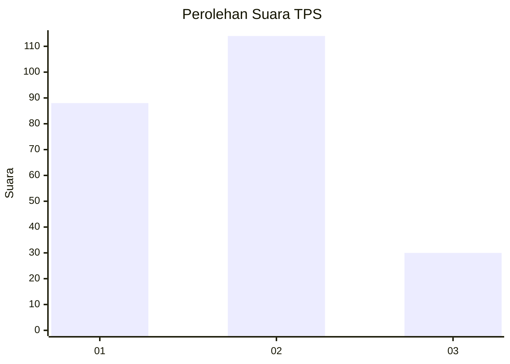
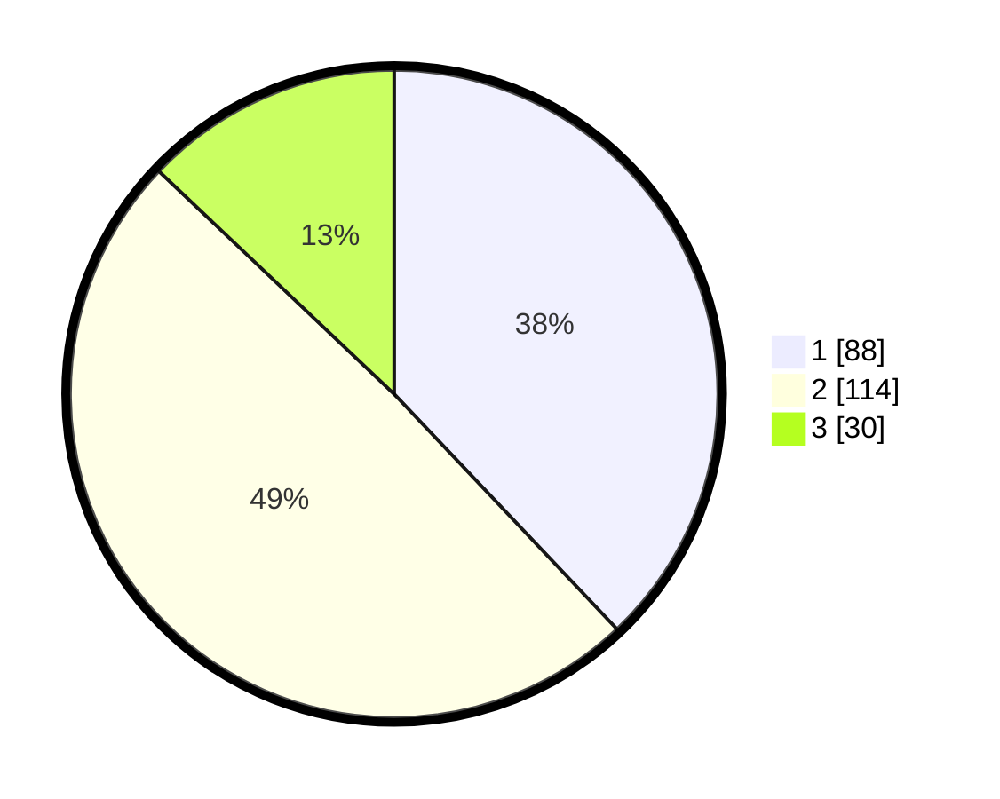

# Hasil

## Grafik

## Tabel

| No. | Nama Paslon    | Suara | Suara (raw) | Persentase |
|:--- |:-------------- | -----:| -----------:| ----------:|
| 1   | ANIES MUHAIMIN | 88    | [88][p-1]   | 37,93      |
| 2   | PRABOWO GIBRAN | 114   | [114][p-2]  | 49,14      |
| 3   | GANJAR MAHFUD  | 30    | [30][p-3]   | 12,93      |

[p-1]: https://github.com/gigit-pemilu/pemilu-2024-34-di-yogyakarta/blob/main/pilpres/hitung-suara/sub/34-di-yogyakarta/sub/01-kulon-progo/sub/04-galur/sub/2001-banaran/sub/014-tps/sub/paslon-1.txt
[p-2]: https://github.com/gigit-pemilu/pemilu-2024-34-di-yogyakarta/blob/main/pilpres/hitung-suara/sub/34-di-yogyakarta/sub/01-kulon-progo/sub/04-galur/sub/2001-banaran/sub/014-tps/sub/paslon-2.txt
[p-3]: https://github.com/gigit-pemilu/pemilu-2024-34-di-yogyakarta/blob/main/pilpres/hitung-suara/sub/34-di-yogyakarta/sub/01-kulon-progo/sub/04-galur/sub/2001-banaran/sub/014-tps/sub/paslon-3.txt

## Foto C Plano

https://sirekap-obj-formc.kpu.go.id/b677/pemilu/ppwp/34/01/04/20/01/3401042001014-20240214-184608--697ca2db-ac93-4f1b-8c28-248abf4b7c7e.jpg

https://sirekap-obj-formc.kpu.go.id/b677/pemilu/ppwp/34/01/04/20/01/3401042001014-20240214-184628--e8370afb-1723-4c16-b6e9-03a160d5e2e5.jpg

https://sirekap-obj-formc.kpu.go.id/b677/pemilu/ppwp/34/01/04/20/01/3401042001014-20240214-184650--df6aea41-02fe-439b-a80c-e8e9fc816c43.jpg

## Metadata

| Key        | Value               |
| ---------- | ------------------- |
| Time Stamp | 2024-02-15 15:00:29 |

