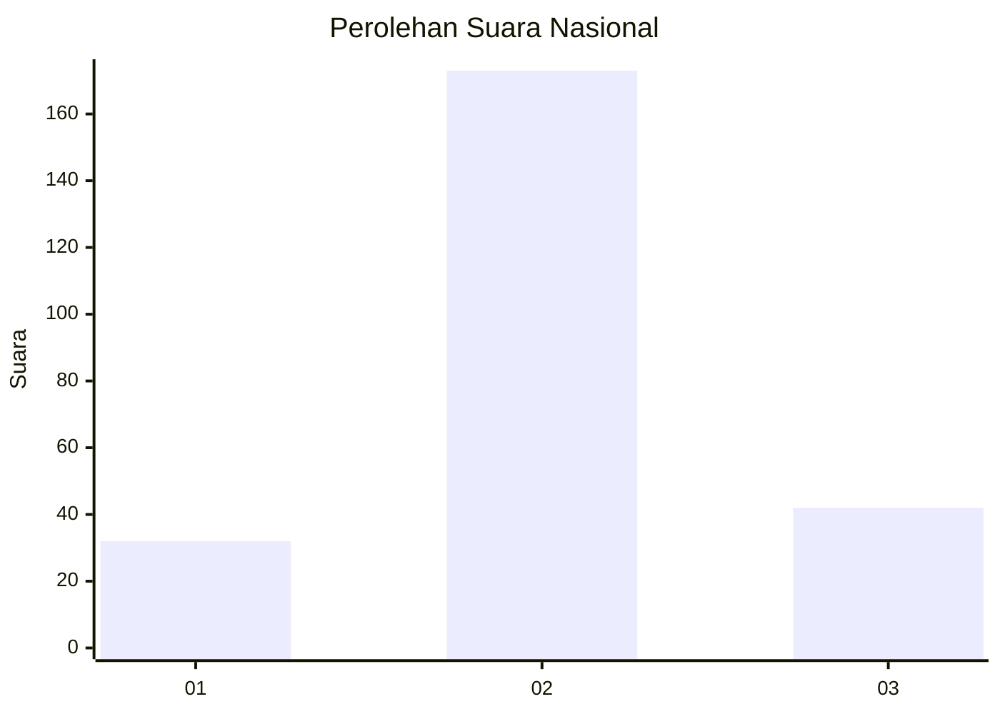
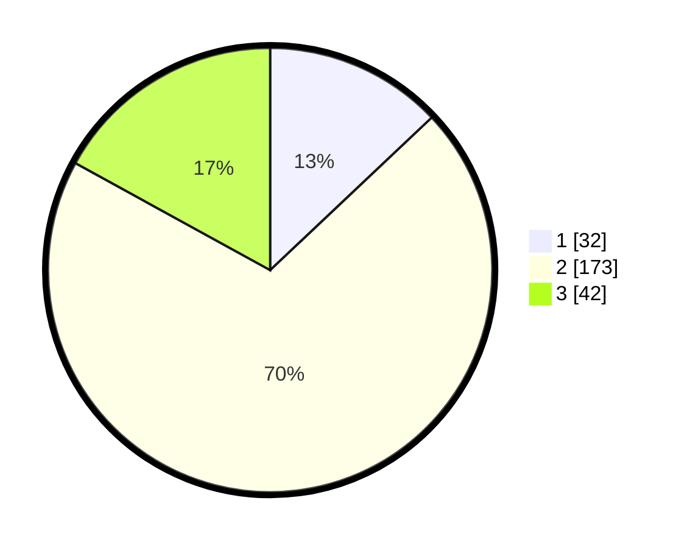

# Hasil

## Grafik

## Tabel

| No. | Nama Paslon    | Suara | Suara (raw) | Persentase |
|:--- |:-------------- | -----:| -----------:| ----------:|
| 1   | ANIES MUHAIMIN | 32    | [32][p-1]   | 12,96      |
| 2   | PRABOWO GIBRAN | 173   | [173][p-2]  | 70,04      |
| 3   | GANJAR MAHFUD  | 42    | [42][p-3]   | 17,00      |

[p-1]: https://github.com/gigit-pemilu/pemilu-2024/blob/main/pilpres/hitung-suara/sub/34-di-yogyakarta/sub/01-kulon-progo/sub/04-galur/sub/2001-banaran/sub/016-tps/sub/paslon-1.txt
[p-2]: https://github.com/gigit-pemilu/pemilu-2024/blob/main/pilpres/hitung-suara/sub/34-di-yogyakarta/sub/01-kulon-progo/sub/04-galur/sub/2001-banaran/sub/016-tps/sub/paslon-2.txt
[p-3]: https://github.com/gigit-pemilu/pemilu-2024/blob/main/pilpres/hitung-suara/sub/34-di-yogyakarta/sub/01-kulon-progo/sub/04-galur/sub/2001-banaran/sub/016-tps/sub/paslon-3.txt

## Foto C Plano

https://sirekap-obj-formc.kpu.go.id/a414/pemilu/ppwp/34/01/04/20/01/3401042001016-20240215-005817--7a223e32-d567-45ea-8451-5024bd9bf7f8.jpg

https://sirekap-obj-formc.kpu.go.id/a414/pemilu/ppwp/34/01/04/20/01/3401042001016-20240215-010144--d8efeee5-8457-4181-8c87-194ae5101d5d.jpg

https://sirekap-obj-formc.kpu.go.id/a414/pemilu/ppwp/34/01/04/20/01/3401042001016-20240215-010331--a5095da1-0f7d-4665-b8af-9b62111bc42a.jpg

## Metadata

| Key        | Value               |
| ---------- | ------------------- |
| Time Stamp | 2024-02-15 15:00:29 |

