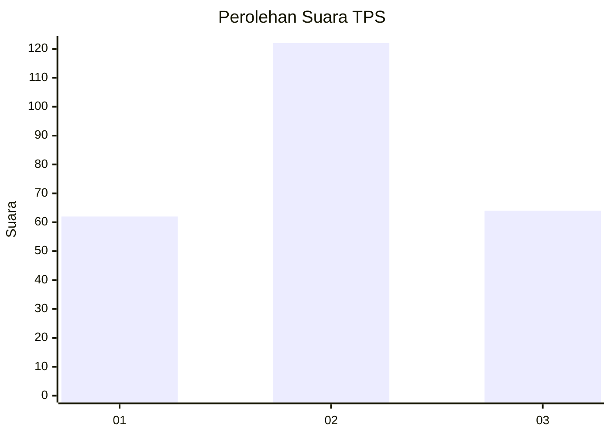
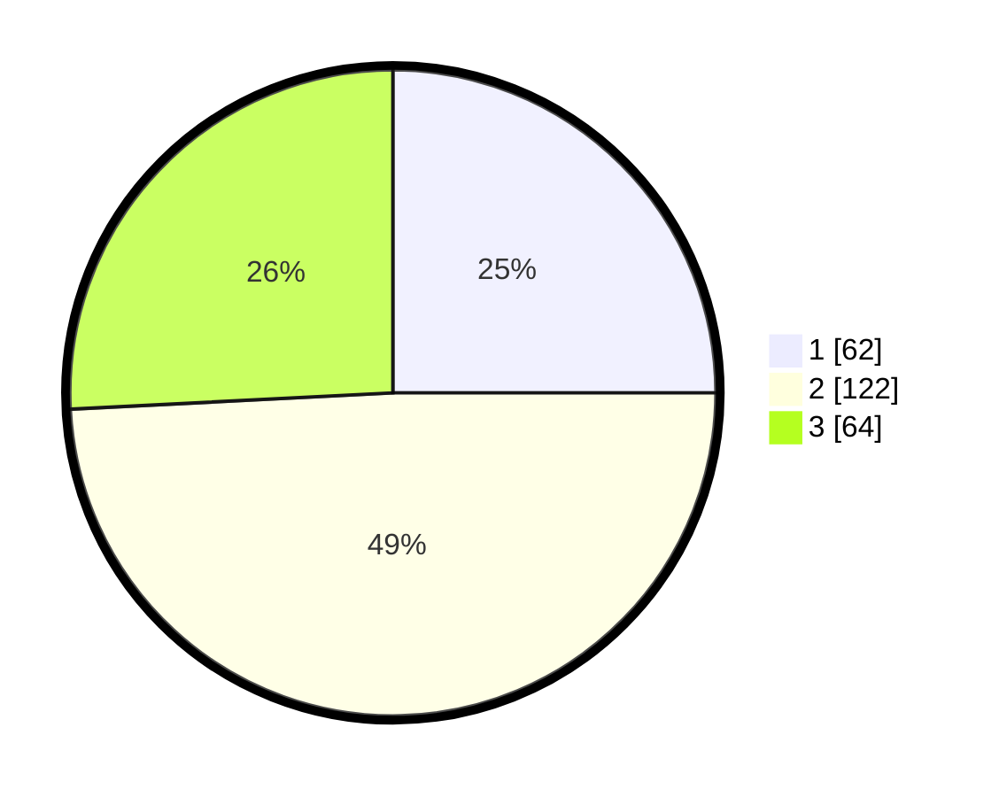

# Hasil

## Grafik

## Tabel

| No. | Nama Paslon    | Suara | Suara (raw) | Persentase |
|:--- |:-------------- | -----:| -----------:| ----------:|
| 1   | ANIES MUHAIMIN | 62    | [62][p-1]   | 25,00      |
| 2   | PRABOWO GIBRAN | 122   | [122][p-2]  | 49,19      |
| 3   | GANJAR MAHFUD  | 64    | [64][p-3]   | 25,81      |

[p-1]: https://github.com/gigit-pemilu/pemilu-2024-34-di-yogyakarta/blob/main/pilpres/hitung-suara/sub/34-di-yogyakarta/sub/01-kulon-progo/sub/04-galur/sub/2002-kranggan/sub/001-tps/sub/paslon-1.txt
[p-2]: https://github.com/gigit-pemilu/pemilu-2024-34-di-yogyakarta/blob/main/pilpres/hitung-suara/sub/34-di-yogyakarta/sub/01-kulon-progo/sub/04-galur/sub/2002-kranggan/sub/001-tps/sub/paslon-2.txt
[p-3]: https://github.com/gigit-pemilu/pemilu-2024-34-di-yogyakarta/blob/main/pilpres/hitung-suara/sub/34-di-yogyakarta/sub/01-kulon-progo/sub/04-galur/sub/2002-kranggan/sub/001-tps/sub/paslon-3.txt

## Foto C Plano

https://sirekap-obj-formc.kpu.go.id/1069/pemilu/ppwp/34/01/04/20/02/3401042002001-20240214-185607--bbc63190-30bd-4316-9039-354a3803675f.jpg

https://sirekap-obj-formc.kpu.go.id/1069/pemilu/ppwp/34/01/04/20/02/3401042002001-20240215-034635--53850a6a-5b3e-451e-8039-c020b7a903e1.jpg

## Metadata

| Key        | Value               |
| ---------- | ------------------- |
| Time Stamp | 2024-02-15 15:00:29 |

